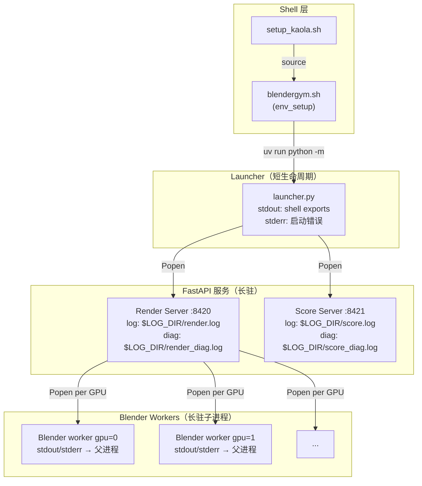

# BlenderGym 环境 Debug 方法论

> `troubleshooting.md` 记录具体的坑和修复（what happened）。
> 本文档记录系统化的排查方法（how to debug）。
> 遇到 env 问题时：先看本文档找排查路径 → 再查 `troubleshooting.md` 看是否已知坑。

---

## 1. 服务架构与日志位置



### 日志去哪找

| 层级 | 日志位置 | 查看方式 |
|------|---------|---------|
| Trainer 主进程 | stdout | `koala logs <任务名> -f` |
| Env worker 子进程 | `/local-ssd/prime-rl-output/logs/env_worker_*.log` | S3 rsync 后在 Mac 查看 |
| Service 应用日志 | `/local-ssd/prime-rl-output/logs/{render,score}.log` | SSH 到 pod 或 S3 rsync |
| Service 诊断日志 | `/local-ssd/prime-rl-output/logs/{render,score}_diag.log` | 同上，含 Uvicorn 启动错误 |
| Blender worker | 继承 render server 的 stdout/stderr（写入 diag log） | 查 `render_diag.log` |
| Sentinel 文件 | `/tmp/blendergym_services/{render,score}.{ready,crash}` | SSH 到 pod 查看 |

---

## 2. Debug Pod 工作流

### 启动 debug pod

```bash
cd ~/Desktop/codes/prime-rl
koala submit --sync-code .:/data/work/prime-rl
ssh <pod名>

cd /data/work/prime-rl
export EXP_NAME=blendergym-9b-dp6
. scripts/setup_kaola.sh --fast
```

### 热更新代码（不重建 pod）

```bash
# Mac 端：推送修改的文件
scp -P <port> path/to/modified_file.py \
    root@<jumpserver>:/data/work/prime-rl/path/to/modified_file.py
```

blendergym 用 editable install（`uv pip install -e`），源文件修改直接生效。验证方法：

```bash
uv run python -c "import blendergym.services.render.persistent_blender as m; print(m.__file__)"
# 应输出 /data/work/prime-rl/environments/blendergym/blendergym/...
```

如果输出 site-packages 路径，则不是 editable，需要重新 `uv pip install -e environments/blendergym`。

### 单独启动某个服务

```bash
# Render Service（单 GPU 测试）
uv run python -m blendergym.services.render.server \
    --port 8420 \
    --blender-bin /local-ssd/blender-4.2.0-linux-x64/blender \
    --gpu-pool 0 --pool-size 1 --log-level debug 2>&1

# Score Service
uv run python -m blendergym.services.score.server \
    --port 8421 --gpu-pool 0 --log-level debug 2>&1
```

---

## 3. 逐层隔离排查法

从最底层开始验证，每层通过后再向上加一层。

### Layer 0: Blender 二进制

```bash
/local-ssd/blender-4.2.0-linux-x64/blender --version
```

失败：Blender 未解压或路径错误。检查 `setup_bg_restore_blender()` 是否执行。

### Layer 1: worker_loop.py 单独在 Blender 里跑

```bash
export BLENDERGYM_WORKER_SOCKET=/tmp/test_worker.sock
export CUDA_VISIBLE_DEVICES=0
export BLENDER_USER_RESOURCES=/tmp/test_blender_user
mkdir -p /tmp/test_blender_user
rm -f /tmp/test_worker.sock

timeout 30 /local-ssd/blender-4.2.0-linux-x64/blender \
    --background --factory-startup \
    --python environments/blendergym/blendergym/services/render/worker_loop.py \
    2>&1
```

预期输出：`[blendergym] cycles samples=... denoiser=... compute=OPTIX`，然后阻塞在 `accept()`。

**常见失败**：
- `ModuleNotFoundError` → `sys.path` 或 `__init__.py` 问题（见第 5 节）
- 无输出直接退出 → Blender 崩溃，检查 GPU driver / CUDA
- `Blender quit` 立即出现 → 脚本有语法错误

### Layer 2: Python Popen 包装

用最小脚本模拟 `PersistentBlender._spawn()` + `BlenderPool.wait_ready()`：

```python
import os, time, subprocess, socket

sock_path = "/tmp/blendergym_blender_0_0.sock"
env = {
    **os.environ,
    "CUDA_VISIBLE_DEVICES": "0",
    "BLENDERGYM_WORKER_SOCKET": sock_path,
    "BLENDER_USER_RESOURCES": "/tmp/blendergym_user_0_0",
    "PYTHONUNBUFFERED": "1",
}
os.makedirs("/tmp/blendergym_user_0_0", exist_ok=True)
if os.path.exists(sock_path):
    os.unlink(sock_path)

p = subprocess.Popen([
    "/local-ssd/blender-4.2.0-linux-x64/blender",
    "--background", "--factory-startup", "--python",
    "environments/blendergym/blendergym/services/render/worker_loop.py",
], env=env)
print(f"PID={p.pid}")

# 模拟 wait_ready：connect + close
for _ in range(60):
    time.sleep(0.5)
    if os.path.exists(sock_path):
        try:
            s = socket.socket(socket.AF_UNIX)
            s.settimeout(2)
            s.connect(sock_path)
            s.close()
            print("Socket connectable")
            break
        except:
            pass

# 检查存活
for i in range(10):
    time.sleep(1)
    rc = p.poll()
    print(f"t={i+1}s poll={rc}")
    if rc is not None:
        if rc < 0:
            import signal
            print(f"Killed by signal {signal.Signals(-rc).name}")
        break
else:
    print("Worker survived 10s")
p.terminate()
```

**关键关注**：Layer 1 正常但 Layer 2 失败 → 问题在 Popen 环境差异（信号处理、fd 继承、进程组等）。

### Layer 3: 完整 Render Server

```bash
uv run python -m blendergym.services.render.server \
    --port 8420 \
    --blender-bin /local-ssd/blender-4.2.0-linux-x64/blender \
    --gpu-pool 0,1 --pool-size 1 --log-level debug 2>&1
```

等待 `Application startup complete` 出现后：

```bash
curl -s http://localhost:8420/health | python3 -m json.tool
```

预期 `"status": "ok"`，所有 GPU 的 `"alive": true`。

### Layer 4: 完整服务链（通过 launcher）

```bash
export GPU_POOL="0,1,2,3,4,5"
export BLENDER_BIN=/local-ssd/blender-4.2.0-linux-x64/blender
LOG_DIR=/local-ssd/prime-rl-output/logs
mkdir -p "$LOG_DIR"
uv run python -m blendergym.services.launcher --log-dir "$LOG_DIR"
```

检查两个服务的 health：

```bash
curl -s http://localhost:8420/health | python3 -m json.tool  # Render
curl -s http://localhost:8421/health | python3 -m json.tool  # Score
```

---

## 4. 常用诊断命令

```bash
# 进程树（含 PPID）
ps -ef | grep -E 'blender|render|score' | grep -v grep

# Zombie 进程检测
ps aux | awk '$8 ~ /Z/ {print}'

# Unix socket 存在性
ls -la /tmp/blendergym_blender_*.sock

# Sentinel 文件
ls -la /tmp/blendergym_services/

# Health probe
curl -s http://localhost:8420/health | python3 -m json.tool
curl -s http://localhost:8421/health | python3 -m json.tool

# GPU 占用
nvidia-smi --query-gpu=index,memory.used,memory.total,utilization.gpu --format=csv

# 检查 Popen 子进程退出码（Python）
# poll() 返回值：None=运行中, 0=正常退出, >0=错误码, <0=被信号杀死（值=信号编号取负）
# 例：poll()=-13 → SIGPIPE, poll()=-9 → SIGKILL

# 诊断日志（launcher 写的）
cat /local-ssd/prime-rl-output/logs/render_diag.log
cat /local-ssd/prime-rl-output/logs/score_diag.log
```

---

## 5. Blender 内嵌 Python 注意事项

Blender `--python <script>` 运行的脚本在 Blender 自带的独立 Python（3.11）中执行，与项目的 venv（Python 3.12）完全隔离。

### PYTHONPATH 无效

Blender 忽略 `PYTHONPATH` 环境变量。`os.environ["PYTHONPATH"]` 能看到值，但 `sys.path` 不包含它。

**解决**：在脚本顶部手动注入：
```python
import sys, os
sys.path.insert(0, "/path/to/package/parent")
```

### `__init__.py` 不能有重依赖

`from blendergym.assets.some_module import X` 会触发 `blendergym/__init__.py`。如果 `__init__.py` 顶层 import 了 `datasets`/`httpx`/`torch` 等 Blender Python 没有的包，整条 import 链失败。

**解决**：`__init__.py` 用 PEP 562 lazy import（`__getattr__`），不在模块加载时拉起重依赖。

### SIGPIPE 不被抑制

标准 CPython 在启动时设 `signal.signal(SIGPIPE, SIG_IGN)`。Blender 主进程保持 `SIG_DFL`（默认终止）。向已断开的 socket 写数据 → SIGPIPE → 进程被杀。

**解决**：长驻网络服务的 `main()` 开头加：
```python
import signal
signal.signal(signal.SIGPIPE, signal.SIG_IGN)
```

### `--python-use-system-env` 的风险

此标志让 Blender 使用系统 PYTHONPATH。但父进程可能继承了 venv 的 site-packages，导致 Blender Python 3.11 加载为 Python 3.12 编译的 C 扩展 → 段错误或不可预测行为。慎用。

---

## 6. 典型失败模式速查表

| 症状 | 可能原因 | 排查步骤 |
|------|---------|---------|
| `koala logs` 显示 `ERROR: Render Service failed to start` | worker 启动崩溃，health check 超时 | SSH 到 pod，Layer 1 测试 |
| `TimeoutError: Worker gpu=X idx=Y not ready after 120s` | Blender 子进程在 `bind()`/`listen()` 前崩溃 | 查 `render_diag.log`；Layer 1 单独跑 worker |
| Health 返回 `"status": "degraded"`，某 GPU `"alive": false` | Worker 启动后崩溃（但 `wait_ready` 已通过） | `ps -ef` 检查 zombie；Layer 2 测试信号问题 |
| 训练卡在 `Starting training loop` 不动 | 第一步 inference + render 耗时长（OPTIX JIT ~6min） | 等待 10-15min；检查 `nvidia-smi` GPU 利用率 |
| `ModuleNotFoundError` 在 Blender 日志中 | Blender Python 无法 import blendergym | 检查 `sys.path` 注入；检查 `__init__.py` 是否 lazy |
| Worker poll() 返回 -13 | SIGPIPE 杀死进程 | 检查 `signal.SIGPIPE` 是否被忽略 |
| `RuntimeError: Existing processes found on GPUs` | 服务进程在 `check_gpus_available` 前占用了 GPU | 检查 CLIP/Blender 是否提前加载模型到 GPU |
| Render 请求超时（`httpx.ReadTimeout`） | Blender 渲染卡死或 OPTIX 首次编译 | 检查 OPTIX cache（`/root/.nv/ComputeCache`）是否存在 |
| Score 请求返回 500 | CLIP 模型加载失败或 GPU OOM | 查 `score_diag.log`；`nvidia-smi` 检查显存 |
