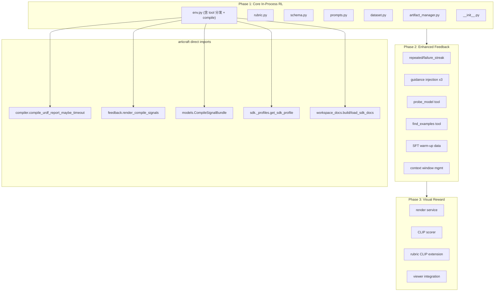
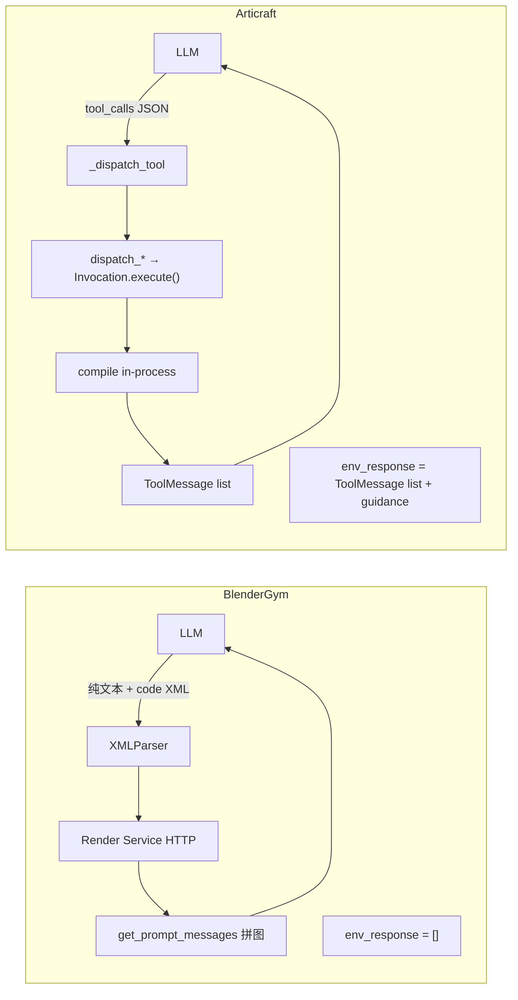
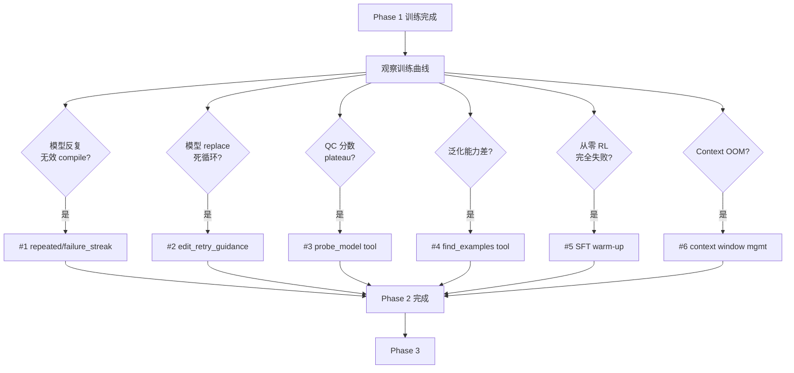
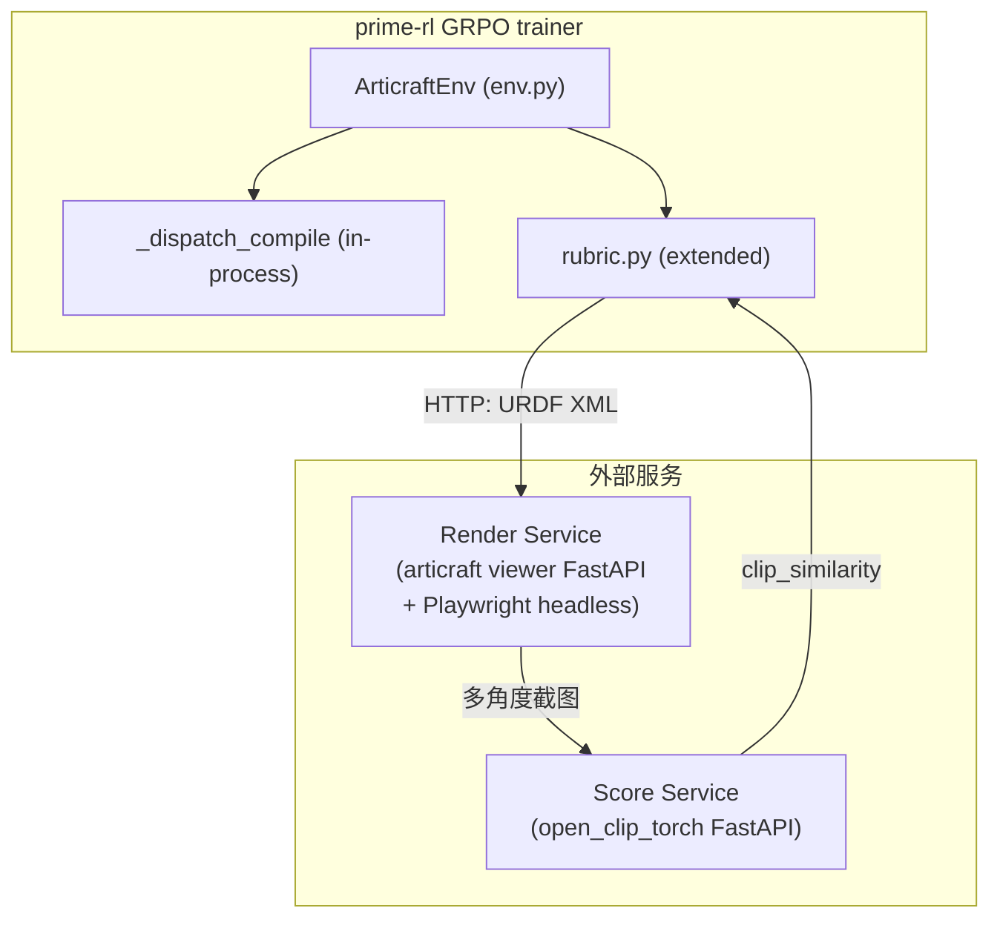

# Articraft Environment 三阶段集成计划

## 全局架构概览



---

## Phase 1: Core In-Process RL Pipeline

### 1.1 目标与验证标准

**目标**: 实现最小可用的 `ArticraftEnv`，全 in-process（无外部服务），reward 纯基于 compiler QC signals。

**验证里程碑** (6 个递进 Step):
- Step 1: MockClient 端到端 rollout (本地 MacBook)
- Step 2: 接真模型 eval (OpenAI API / KAOLA vLLM)
- Step 3: Dataset loader 从 articraft records 提取 prompts
- Step 4: TOML 训练配置
- Step 5: KAOLA setup 脚本完善
- Step 6: 端到端 RL 训练

**验证通过标准**:
- env 能完成 setup -> tool 执行 -> compile -> 终止 -> reward 全流程
- reward 值域 [0, 1]，10+ 档连续值
- 4 个 tool 行为与 articraft 推理时一致
- TITO completion_mask 正确：assistant `[T...]` + env `[F...]` 交替

### 1.2 代码脚手架

```
environments/articraft/
+-- pyproject.toml                     # 新建 ~40 行
+-- articraft_env/
|   +-- __init__.py                    # 新建 ~30 行  PEP 562 lazy imports
|   +-- env.py                         # 新建 ~250 行 ArticraftEnv（verifiers 适配 + tool dispatch 内嵌）
|   +-- rubric.py                      # 新建 ~100 行 Reward 计算 + @vf.cleanup
|   +-- schema.py                      # 新建 ~60 行  Task/TurnRecord/Rollout
|   +-- prompts.py                     # 新建 ~80 行  System prompt + Turn 0 messages
|   +-- dataset.py                     # 新建 ~100 行 Records -> HF Dataset
|   +-- artifact_manager.py            # 新建 ~100 行 Rollout 文件生命周期
+-- tests/
|   +-- test_rollout.py                # 新建 ~80 行  MockClient 验证
configs/articraft/
+-- rl_articraft_kaola.toml            # 新建 ~80 行
scripts/envs/
    articraft.sh                       # 修改（补充 dataset 恢复 + env 安装）
```

**模块职责与复用策略**:

```
┌─────────────────────────────────────────────────────────────────────┐
│ env.py — verifiers 适配层 + tool dispatch + compile 逻辑            │
│  - ArticraftEnv(vf.MultiTurnEnv)                                   │
│  - setup_state / env_response（终止逻辑 + tool dispatch 内嵌）      │
│  - _dispatch_tool：replace 拦截 + Pydantic 报错 + build_invocation │
│  - _dispatch_compile：直接调 compile_urdf_report_maybe_timeout     │
│    + Rollout 字段做 freshness cache（不用 CompileFeedbackLoop）     │
├─────────────────────────────────────────────────────────────────────┤
│ schema.py — Task/TurnRecord/Rollout（含 freshness 字段和方法）      │
│  - edit_revision / last_compile_revision：直接字段                  │
│  - code_is_fresh() / mark_code_mutated(tool_name)：含 MUTATING 过滤 │
│  - virtual_workspace：per-rollout VirtualWorkspace 实例            │
├─────────────────────────────────────────────────────────────────────┤
│ rubric.py / prompts.py / dataset.py / artifact_manager             │
│  — 各自独立                                                         │
│ env 实例共享：sdk_docs_context / tool_registry / artifact_manager   │
└─────────────────────────────────────────────────────────────────────┘
```

**关键决策**:
- **所有 prompt/文案与 articraft 原版完全一致** — 包括 error 消息（replace 拦截、compile 参数拦截、Pydantic 报错）、guidance 注入文案（`<edit_retry_guidance>`、`<exact_geometry_contract>`、`<baseline_qc_guidance>`）、compile_required 提醒、compile 信号渲染输出。不翻译、不简化、不改措辞，确保 RL 训出的模型迁移回 articraft 时行为一致。
- **不使用 CompileFeedbackLoop，改用 Rollout 直接字段** — freshness 逻辑仅 3 行（`code_is_fresh()`），compile 缓存用 `last_compile_bundle_dict` 字段。env.py 的 `_dispatch_compile()` 直接调 `compile_urdf_report_maybe_timeout()` + `render_compile_signals()`。选择此方案的理由：更透明可序列化，不引入 Phase 1 不需要的状态（`_checkpoint_urdf_sig`、`_failure_streak` 等）。详见 **1.3 State 设计方案**。
- **sdk_docs_context 放在 env 实例上** — `load_sdk_docs_reference(repo_root, sdk_package)` 返回的文档字符串不随任务变化，所有 rollout 共享 `self.sdk_docs_context: str`，用于构建 Turn 0 prompt。VirtualWorkspace 是 per-rollout 的（因为 `model_file_path` 不同），放在 `rollout.virtual_workspace`。
- **GuidanceInjector defer 到 Phase 2** — Phase 1 不含 guidance 注入。Phase 2 Feature #2 实现 GuidanceInjector 镜像（接口从 `conversation.append()` 改为返回 `list[UserMessage]`）。文案直接从 `harness_guidance.py` 复制，不改措辞。详见 Diff 2b。
- **tool dispatch 保留在 env.py** — replace 拦截、compile 参数校验、Pydantic 报错等是 `_dispatch_tool` 内的分支逻辑，不需要独立文件。

**总计**: ~820 行新代码 + ~30 行修改。articraft 代码零修改。无 `tools.py`——schema 初始化和 tool 分发全在 `env.py` 中。guidance.py 在 Phase 2 Feature #2 中实现。

### 1.3 State 设计方案

> **本节为最新设计决策，覆盖计划中其他位置关于 `compile_loop: CompileFeedbackLoop`、`state["sdk_docs_context"]` 的旧描述。**

verifiers 的 `vf.State` 继承自 `dict`，是开放容器。Articraft env 的状态分两层管理。

#### 第一层：verifiers 框架管理的 key（env 不操心）

| key | 类型 | 说明 | 写入时机 |
|-----|------|------|---------|
| `prompt` | `Messages` | Turn 0 初始 prompt | setup_state 中重写 |
| `trajectory` | `list[TrajectoryStep]` | 每轮 prompt+completion | 框架每轮 append |
| `completion` | `Messages` | 完整对话（去掉初始 prompt） | rollout 结束 |
| `trajectory_id` | `str` | `uuid4().hex` | init_state |
| `tool_defs` | `list[Tool]` | 工具 schema | init_state |
| `is_completed` / `is_truncated` | `bool` | 终止状态 | @vf.stop |
| `final_env_response` | `Messages \| None` | env 提前终止信号 | env_response |
| `reward` / `metrics` | `float \| dict` | 打分 | score_rollout |
| `usage` | `Mapping[str, float]` | token 统计 | get_model_response |
| `info` | `dict` | 数据集行附加信息 | init_state |
| `example_id` | `int` | 数据集行索引 | init_state |
| `error` | `Error \| None` | 异常信息 | setup_state / 异常 |

env 子类可以读取这些 key（如 `state["trajectory_id"]`、`state["info"]`），也可以在 `setup_state` 中重写 `state["prompt"]`，但不应覆盖其他框架 key。

#### 第二层：`state["rollout"]` — Rollout dataclass（env 管理）

遵循 BlenderGym 约定：**所有环境自定义状态收纳在 `state["rollout"]` 一个命名空间下**，避免与框架 key 冲突。

```python
MUTATING_TOOL_NAMES = frozenset({"apply_patch", "replace", "write_file"})

@dataclass
class Rollout:
    # ──── 不可变：任务与环境上下文 ────
    task: Task                              # 从 dataset info 构建（record_id, prompt_text, ...）
    trajectory_id: str                      # 与 verifiers trajectory_id 一致
    work_dir: Path                          # rollout 独立工作目录
    script_path: Path                       # model.py 路径（artifact_manager 管理）
    virtual_workspace: VirtualWorkspace     # per-rollout（script_path 不同）
    max_turns: int                          # horizon

    # ──── 可变：编译状态追踪（对应 CompileFeedbackLoop 内部状态）────
    edit_revision: int = 0                  # 每次 write_file/replace 成功 +1
    last_compile_revision: int = -1         # compile 成功后设为当前 edit_revision
    last_compile_bundle_dict: dict | None = None   # 仅成功时更新（freshness cache）
    last_compile_attempt_dict: dict | None = None  # 每次 compile 都更新（含失败，reward 用）

    # ──── 可变：终止控制 ────
    compile_required_count: int = 0         # RL 安全阀（防 compile_required 无限注入）

    # ──── 可变：观测指标 ────
    last_compile_latency_ms: float | None = None  # 最近一次 compile 耗时（ms），追踪 tail latency

    # ──── 可变：每轮记录 ────
    turns: list[TurnRecord] = field(default_factory=list)

    # ──── 可变：最终结果 ────
    final_reward: float | None = None

    # ──── 元数据 ────
    metadata: dict | None = None

    # ──── 方法（3 行 freshness 逻辑，不引入 CompileFeedbackLoop）────

    def code_is_fresh(self) -> bool:
        """源码: harness_compile.py L85-89 latest_code_is_fresh()"""
        return self.last_compile_revision == self.edit_revision and self.last_compile_revision >= 0

    def mark_code_mutated(self, tool_name: str):
        """源码: harness_compile.py L91-94 + harness.py L864-865"""
        if tool_name not in MUTATING_TOOL_NAMES:
            return
        self.edit_revision += 1

    def mark_compile_attempt(self, bundle):
        """每次 compile 都更新（成功和失败），用于 reward 计算。RL 新增。"""
        self.last_compile_attempt_dict = bundle.to_dict()

    def mark_compile_success(self, bundle):
        """源码: harness_compile.py L191-192 成功后缓存 report"""
        self.last_compile_revision = self.edit_revision
        self.last_compile_bundle_dict = bundle.to_dict()
        self.compile_required_count = 0
```

#### env 实例上的共享状态

以下状态不随任务变化，放在 env 实例上，所有 rollout 共享：

| 属性 | 类型 | 说明 |
|------|------|------|
| `self.tool_registry` | `ToolRegistry` | 4 个 tool 的注册表 + schema |
| `self.sdk_docs_context` | `str` | `load_sdk_docs_reference(repo_root, sdk_package)` 返回的 SDK 文档上下文字符串（构建 Turn 0 prompt 用） |
| `self.artifact_manager` | `ArticraftArtifactManager` | 文件管理 |
| `self.sdk_package` | `str` | SDK 配置名 |
| `self.articraft_root` | `Path` | articraft 项目根目录 |

> **为什么 `sdk_docs_context` 在 env 而非 state**：`load_sdk_docs_reference(repo_root, sdk_package)` 只依赖 `repo_root` 和 `sdk_package`，不随任务/rollout 变化。所有 rollout 共享同一份文档上下文。注意：articraft 没有 `readable_paths` 这个概念，SDK 文档的加载和 VirtualWorkspace 的路径解析是两条独立管线。

> **为什么 `VirtualWorkspace` 在 rollout 而非 env**：`build_virtual_workspace(repo_root, model_file_path, sdk_package)` 中 `model_file_path` 是 per-rollout 的 `script_path`。虽然 workspace 是 frozen 的，但每个 rollout 有不同的 script_path，所以需要 per-rollout 实例。

#### 字段来源映射（Articraft → RL Rollout）

| RL Rollout 字段 | Articraft 原版位置 | 说明 |
|----------------|-------------------|------|
| `task` | `Record` (storage/models.py ~30 字段) | 精简为 4 字段 |
| `trajectory_id` | `run()` 局部变量 | verifiers 生成 |
| `work_dir` | `SingleRunContext.script_path.parent` | artifact_manager 管理 |
| `script_path` | `self.file_path` (harness.py L206) | artifact_manager 管理 |
| `virtual_workspace` | `self.virtual_workspace` (harness.py L275) | per-rollout 构建 |
| `edit_revision` | `CompileFeedbackLoop._current_edit_revision` | harness_compile.py L48 |
| `last_compile_revision` | `CompileFeedbackLoop._last_successful_compile_revision` | harness_compile.py L49 |
| `last_compile_bundle_dict` | `CompileFeedbackLoop._last_successful_compile_report` | 序列化为 dict 便于存储 |
| `last_compile_attempt_dict` | 无直接对应 | **RL 新增**：失败也存，用于 reward shaping |
| `compile_required_count` | `CompileFeedbackLoop._compile_required_reminder_count` | harness_compile.py L96 |
| `turns` | 无（harness 不逐 turn 记录） | **RL 新增**：per-turn 信号 |
| `final_reward` | `AgentResult.success` | verifiers rubric 管理 |

#### 不在 state 中的 Articraft 状态

| Articraft 状态 | 为什么不需要 | 替代方案 |
|---------------|-------------|---------|
| `conversation: list[dict]` | verifiers `state["trajectory"]` 已管理 | — |
| `CostTracker` / `max_cost_usd` | RL 无 API 费用，用固定 seq_len | — |
| `TraceWriter` / `SingleRunDisplay` | 日志/TUI | verifiers 自带日志 |
| Provider compaction 状态 | vLLM 无 compaction 概念 | — |
| `_seen_find_example_paths` | Phase 1 无 find_examples tool | — |
| `_last_checkpoint_urdf_sig` | Phase 1 不追踪 URDF 内容签名 | — |
| `_consecutive_compile_failure_count` | Phase 1 不追踪连续失败 | Phase 1.5 按需加到 Rollout |
| `_last_compile_failure_sig` | Phase 1 不追踪失败签名 | Phase 1.5 按需加到 Rollout |
| GuidanceInjector `_seen_*` 集合 | Phase 1 不注入 guidance | Phase 1.5 按需加到 Rollout |

#### Phase 1.5+ 可能新增的 Rollout 字段

| 字段 | Phase | 触发条件 | Articraft 来源 |
|------|-------|---------|---------------|
| `last_failure_sig: str \| None` | 1.5 #1 | 模型反复无效 compile | `CompileFeedbackLoop._last_compile_failure_sig` |
| `consecutive_failure_count: int` | 1.5 #1 | 同上 | `CompileFeedbackLoop._consecutive_compile_failure_count` |
| `edit_retry_injected: bool` | 1.5 #2 | replace 死循环 | `GuidanceInjector._seen_tool_error_sigs` |
| `seen_exact_geometry_sigs: set` | 1.5 #2 | 全面启用 guidance | `GuidanceInjector._seen_exact_geometry_contract_sigs` |
| `seen_baseline_qc_sigs: set` | 1.5 #2 | 同上 | `GuidanceInjector._seen_baseline_qc_guidance_sigs` |

#### setup_state / env_response 中的 state 操作

```python
async def setup_state(self, state):
    task = Task.from_info(state["info"])
    work_dir = self.artifact_manager.make_rollout_dir(...)
    script_path = self.artifact_manager.script_path(work_dir)
    script_path.write_text(...)
    workspace = self.artifact_manager.build_workspace(script_path)

    rollout = Rollout(
        task=task,
        trajectory_id=state["trajectory_id"],
        work_dir=work_dir,
        script_path=script_path,
        virtual_workspace=workspace,
        max_turns=self.max_turns,
    )
    state["rollout"] = rollout                     # 唯一写入的自定义 key
    state["prompt"] = build_turn0_messages(
        task.prompt_text,
        sdk_docs_context=self.sdk_docs_context,     # env 实例共享的 SDK 文档上下文
    )
    return state

async def env_response(self, messages, state, **kwargs):
    rollout = require_rollout(state)                # state["rollout"]

    if not tool_calls:
        if rollout.code_is_fresh():                 # Rollout 直接方法
            state["final_env_response"] = []        # 触发框架终止
            return []
        rollout.compile_required_count += 1
        if rollout.compile_required_count > 3:  # 安全阀：rubric 中 bundle_dict is None → reward=0.0
            state["final_env_response"] = []
            return []
        return [UserMessage(content="<compile_required>...")]

    result_messages = []
    for tool_call in tool_calls:
        result = await self._dispatch_tool(
            tool_call.name, tool_call.arguments, rollout
        )
        result_messages.append(ToolMessage(...))
        if result.is_success():
            rollout.mark_code_mutated(tool_call.name)  # 仅 MUTATING_TOOL_NAMES 才 +1

    # ── TurnRecord 记录 ──
    turn = TurnRecord(
        turn=len(rollout.turns),
        tool_calls=[{"name": tc.name} for tc in tool_calls],
        compile_attempted=any(tc.name == "compile_model" for tc in tool_calls),
    )
    rollout.turns.append(turn)

    return result_messages
```

#### 为什么不用 CompileFeedbackLoop

| 考量 | 直接字段（选定） | CompileFeedbackLoop |
|------|-----------------|-------------------|
| 透明度 | Rollout 字段一目了然，状态可直接审查 | 状态封装在 `_` 私有属性中 |
| 可序列化 | dict/int/None，可直接 JSON 序列化 | 需要自定义序列化逻辑 |
| 多余状态 | 只有需要的 4 个字段 | 带着 `_checkpoint_urdf_sig`, `_failure_sig`, `_failure_count` 等 Phase 1 不需要的状态 |
| 代码量 | freshness 逻辑仅 3 行方法 | import + 实例化 + 方法委托 |
| Phase 1.5 升级 | 按需逐个加字段，渐进式 | 一次引入全部状态，不管是否需要 |
| compile 执行 | env.py 直接调 `compile_urdf_report_maybe_timeout` | 通过 CompileFeedbackLoop 间接调用 |

#### Compile 逻辑在 env.py 中的实现（替代 CompileFeedbackLoop.execute_compile_model）

```python
async def _dispatch_compile(self, rollout: Rollout) -> ToolResult:
    """
    对应 harness_compile.py L177-214 execute_compile_model()。
    不通过 CompileFeedbackLoop，直接在 env.py 中实现 freshness cache + 编译调用。
    """
    # ── Freshness cache（harness_compile.py L178-184）──
    if rollout.code_is_fresh() and rollout.last_compile_bundle_dict is not None:
        bundle = CompileSignalBundle.from_dict(rollout.last_compile_bundle_dict)
        cached_text = (
            "Fresh compile already exists for the current code revision; "
            "`compile_model` was not re-run.\n"
            "Treat that compile result as authoritative unless you are about "
            "to edit code for one specific unresolved defect.\n\n"
            + render_compile_signals(bundle)
        )
        return ToolResult(output=cached_text)

    # ── 真正编译（compiler.py L618-626，同步函数需 to_thread）──
    # timeout 由 URDF_COMPILE_TIMEOUT_SECONDS 环境变量控制（RL 设 30s，默认 300s）
    import time
    t0 = time.monotonic()
    try:
        report = await asyncio.to_thread(
            compile_urdf_report_maybe_timeout,
            script_path=str(rollout.script_path),
            sdk_package=self.sdk_package,
        )
        rollout.last_compile_latency_ms = (time.monotonic() - t0) * 1000
        bundle = report.signal_bundle              # CompileReport 已含 signal_bundle
        content = render_compile_signals(bundle)
        rollout.mark_compile_attempt(bundle)
        rollout.mark_compile_success(bundle)
        if report.urdf_xml:
            urdf_path = self.artifact_manager.checkpoint_urdf_path(rollout.work_dir)
            urdf_path.write_text(report.urdf_xml)
        return ToolResult(output=content, compilation=True)

    except Exception as exc:
        rollout.last_compile_latency_ms = (time.monotonic() - t0) * 1000
        bundle = compile_signal_bundle_from_exception(exc)
        content = render_compile_signals(bundle)
        rollout.mark_compile_attempt(bundle)
        return ToolResult(output=content, error=str(exc), compilation=True)
```

### 1.4 模块功能与源码对照

#### `env.py` -- ArticraftEnv (~250 行，verifiers 适配 + tool dispatch + compile 内嵌)

**直接 import 的 articraft 函数/类** (无需改 articraft):
- `agent.tools.write_code.WriteFileTool` -- Tool 类（schema + `build()` → `WriteFileInvocation`）
- `agent.tools.edit_code.ReplaceTool` -- Tool 类（schema + `build()` → `ReplaceInvocation`）
- `agent.tools.read_file.ReadFileTool` -- Tool 类（schema + `build()` → `ReadFileInvocation`）
- `agent.tools.compile_model.CompileModelTool` -- Tool 类（仅用 schema，compile 逻辑由 env.py `_dispatch_compile()` 直接调 `compile_urdf_report_maybe_timeout`）
- `agent.tools.registry.ToolRegistry` -- registry.py（`{name: Tool}` 映射 + `build_invocation()` + `get_tool_schemas()`）
- `agent.tools.base.ToolResult` -- tools/base.py L12-45
- `agent.workspace_docs.build_virtual_workspace` -- workspace_docs.py L80-89（由 artifact_manager.build_workspace 调用）
- `agent.workspace_docs.load_sdk_docs_reference` -- workspace_docs.py L92-110（env.__init__ 调用，存为 self.sdk_docs_context）
- `agent.compiler.compile_urdf_report_maybe_timeout` -- compiler.py L618-626
- `agent.feedback.render_compile_signals` -- feedback.py L1176-1181
- `agent.feedback.compile_signal_bundle_from_exception` -- feedback.py L1142
- `agent.models.CompileSignalBundle` / `CompileReport` -- models.py
- `sdk._profiles.get_sdk_profile` -- _profiles.py

| 方法 | 功能 | articraft 源码参考 | BlenderGym 对比 |
|------|------|--------------------|----------------|
| `__init__()` | 构建 `self.tool_registry` + `get_tool_schemas()` + Rubric + dataset | `harness.py` L249-291 + `tools/registry.py` | BG: 多了 render_client + score_client + parser |
| `setup_state()` | work_dir + scaffold + `artifact_manager.build_workspace()` + Rollout + Turn 0 | `harness.py` L1027-1047 + L275-279 | BG: 预加载图像；AC: 构造 VirtualWorkspace |
| `env_response()` | 终止判断 + tool 执行（Phase 1 无 guidance） | `harness.py` L1245-1314 | BG: 返回空 `[]`; **AC: 返回 tool results** |
| `_dispatch_tool()` | `ToolRegistry.build_invocation()` → `bind_*()` → `execute()` + freshness | `harness.py` L843-860（调用方式完全一致） | BG: 无 (用 XML parser) |
| compile 逻辑 | `_dispatch_compile()` 直接调 `compile_urdf_report_maybe_timeout` + Rollout 字段做 freshness cache | `harness_compile.py` L177-214（逻辑等价，不用该类） | BG: 无 (外部 render 服务) |
| guidance（Phase 2） | Phase 1 不实现。Phase 2 Feature #2 加入 `GuidanceInjector` | `harness_guidance.py` L243-275 | BG: 无 |

**与 BlenderGym 的根本差异**:



#### `rubric.py` -- Reward 计算 (~100 行)

**三维加权 reward**: `final_reward = 0.7 * check_fraction + 0.2 * build_success + 0.1 * compile_attempted`

| reward 函数 | 值域 | 信号来源 | articraft 参考 |
|-------------|------|---------|---------------|
| `check_fraction_reward` | [0.0, 1.0] 连续 10+ 档 | `CompileSignalBundle.signals` | `feedback.py` L1040-1080 |
| `build_success_bonus` | {0, 1} | bundle 中 `group="build"` 的 blocking failures | `compiler.py` L254-296 |
| `compile_attempted_bonus` | {0, 1} | 任意 turn 是否调过 compile_model | 新增 (RL 特有) |

**`compute_reward()` 层级** (从低到高):
- 从未 compile: 0.00
- SyntaxError: 0.05 -> RuntimeError: 0.10 -> 结构非法: 0.15
- Build 成功 + QC 失败: 0.30 ~ 0.80 (按 passed/total 连续变化)
- 全 QC 通过 + warnings: 0.80 ~ 0.90
- 全 QC 通过 + 无 warnings: 0.90 ~ 1.00 (含 turns 效率因子)

#### `schema.py` -- 数据结构 (~80 行)

> 完整 Rollout 定义、字段来源映射和设计决策见 **1.3 State 设计方案**。此处为摘要。

| 类 | articraft 等价物 | 关键字段 |
|----|-----------------|---------|
| `Task` | `storage/models.py` Record（精简为 4 字段） | `record_id`, `prompt_text`, `category_slug`, `sdk_package` |
| `TurnRecord` | 无（RL 新增，harness 不逐 turn 记录） | `turn`, `tool_calls`, `compile_attempted`, `compile_signals` |
| `Rollout` | harness 分散状态的统一容器 | `edit_revision`/`last_compile_revision`（直接字段），`virtual_workspace`，`compile_required_count` |

**Rollout 中的状态追踪与 articraft 对照**:
- `rollout.code_is_fresh()` <-> `harness_compile.py` L85-89 `latest_code_is_fresh()`
- `rollout.mark_code_mutated(tool_name)` <-> `harness.py` L864-865 + `harness_compile.py` L91-94（过滤 `MUTATING_TOOL_NAMES`）
- `rollout.mark_compile_success(bundle)` / `mark_compile_attempt(bundle)` <-> `harness_compile.py` L191-192
- `compile_required_count` — RL 额外安全阀（harness 无此字段，靠 max_turns 兜底）
- compile 执行：env.py `_dispatch_compile()` 直接调 `compile_urdf_report_maybe_timeout()`，不通过 CompileFeedbackLoop

**Freshness 机制详解**:

articraft 用 revision 计数器追踪"代码是否在上次编译后被改过"。这个机制影响两个核心行为：

1) **compile 缓存** — 如果代码没改过就调 compile，直接返回上次的结果，避免浪费编译开销
2) **终止判断** — 模型发纯文本（不调 tool）时，检查代码是否 fresh 来决定是终止还是提示"你还没编译"

**工作原理**（两个计数器，直接作为 Rollout 字段）:

```
edit_revision = 0              # 每次 write_file/replace 成功后 +1
last_compile_revision = -1     # 每次 compile 成功后，记录当时的 edit_revision

code_is_fresh() = (edit_revision == last_compile_revision) and last_compile_revision >= 0
```

**运行时序**（典型 rollout）:

```
                              edit_rev  compile_rev  fresh?
初始                            0         -1         No
write_file 成功                 1         -1         No      ← 代码被改了
compile 成功                    1          1         Yes     ← 编译了最新代码
compile 再调                    1          1         Yes     ← 返回缓存（跳过编译）
replace 成功                    2          1         No      ← 代码又被改了
compile 成功                    2          2         Yes     ← 重新编译
模型发纯文本（无 tool_calls）     2          2         Yes     ← fresh → 触发终止
```

**在 articraft 原版中的位置**:

- **revision +1**: `harness.py` L864-865 在每次 Invocation.execute 成功后调用 `self._mark_code_mutated(func_name)`，内部过滤只有 `MUTATING_TOOL_NAMES = {"write_file", "replace", "apply_patch"}` 才递增
- **freshness 检查**: `harness_compile.py` L85-89 `latest_code_is_fresh()` 比较两个 revision
- **compile 缓存**: `harness_compile.py` L178-184 fresh 时直接返回上次 report
- **终止提示**: `harness_compile.py` L96-114 `append_compile_required_reminder()` 在模型发纯文本且不 fresh 时注入提示

**在 RL 版中的对应**:

- `env_response()` 主循环中 tool 执行成功后调用 `rollout.mark_code_mutated(tool_call.name)`（对应 harness L864-865，内部过滤 `MUTATING_TOOL_NAMES`）
- `_dispatch_compile()` 内部通过 `rollout.code_is_fresh()` 判断是否返回缓存（对应 harness_compile L178-184）
- `env_response()` 中模型无 tool_calls 时检查 `rollout.code_is_fresh()` 决定终止或注入提示（对应 harness L1245-1273）

RL 版不使用 `CompileFeedbackLoop` 类（原因见 1.3 State 设计方案），freshness 相关状态直接作为 Rollout dataclass 字段，逻辑用 3 行方法实现。

#### `prompts.py` -- System Prompt + Turn 0 (~80 行)

**策略**: 所有 prompt 与 articraft 原版完全一致，不精简、不改措辞。seq_len 相应设大（详见 config）。

| 组件 | 来源 | 说明 |
|------|------|------|
| System prompt | `agent/prompts/generated/designer_system_prompt_{provider}.txt` | 直接加载原版 generated 文件（role + link_naming + tools + process + modeling），不删不改。Phase 1 选定一个 provider（推荐 openrouter/anthropic 版，因为用 replace/write_file 而非 apply_patch） |
| Turn 0 SDK docs | `agent/workspace_docs.py` `load_sdk_docs_reference(repo_root, sdk_package)` 返回的 docs context | 3 篇文档全文嵌入（quickstart.md + probe-tooling.md + testing.md，~7000 tokens），与原版一致。由 env `__init__` 调用一次，存为 `self.sdk_docs_context` |
| Runtime guidance | `agent/tools/__init__.py` `build_first_turn_runtime_guidance()` | `<runtime_task_guidance>` 5 条指引，直接复用 |
| Scaffold | `scaffold.py` | 直接读取原版 scaffold 文件内容，作为 `model.py` 初始化内容 |
| Turn 0 消息构建 | `agent/tools/__init__.py` `_build_first_turn_messages()` | 复用原版逻辑：docs context + `prepend_runtime_guidance(user_content, guidance)` |

#### `dataset.py` -- 数据加载 (~100 行)

- 扫描 `articraft/data/records/rec_*/`
- 过滤 cadquery records (31.6%): `_CADQUERY_IMPORT_RE = re.compile(r'\b(import cadquery|from cadquery)\b')`
- 过滤后保留 ~7,387 条纯 SDK 几何记录
- 输出: HF `Dataset` with `{prompt: [], answer: "", info: {record_id, prompt_text, ...}}`

#### `artifact_manager.py` -- 路径管理 + 文件 I/O (~100 行)

仿 BlenderGym `ArtifactManager` 模式，**所有路径由 manager 集中管理**，不在 env.py 中硬编码：

**Phase 1 存储架构**（最简）:

```
{work_root}/                                    # /tmp/articraft_rl/
└── {split}/                                    # train/ 或 eval/
    └── example_{id}__{record_id}/
        └── {traj_id[:12]}/                     # rollout 目录 = work_dir
            ├── model.py                        # 唯一代码文件，被 write_file/replace 反复覆写
            ├── meta.json                       # rollout 元信息（task, reward, turns, ...）
            └── trajectory.json                 # 完整对话轨迹（messages + tool_calls + rewards）
```

与 BlenderGym 的关键差异：**不按 turn 建子目录**。articraft 的 `model.py` 是原地修改的（不是每 turn 一个 code.py），且无渲染图产物。Phase 2+ 可扩展（如保存 URDF XML、per-turn snapshot）。

路径解析（纯函数，无副作用）:
- `rollout_dir()` -> `{work_root}/{split}/example_{id}__{record_id}/{traj_id[:12]}/`
- `script_path(work_dir)` -> `work_dir / MODEL_FILENAME`（`MODEL_FILENAME = "model.py"`）
- `rollout_paths(work_dir)` -> `RolloutPaths(meta_json=..., trajectory_json=...)`

工厂:
- `build_workspace(script_path)` -> 调用 articraft 的 `build_virtual_workspace(repo_root, model_file_path, sdk_package)`，`repo_root` 和 `sdk_package` 在 `__init__` 时传入

文件 I/O:
- `make_rollout_dir()` -> `mkdir -p` + 返回路径
- `save_trajectory()` -> `meta.json` + `trajectory.json`
- `cleanup_rollout()` -> `keep_failed_only` 逻辑 (成功则删除，失败保留调试)

### 1.5 TOML 配置与 BlenderGym 差异

| 维度 | BlenderGym | Articraft Phase 1 |
|------|-----------|-------------------|
| 外部服务 | `render_service_url` + `score_service_url` | 无 (全 in-process) |
| max_turns | 3 | 50 |
| tool_call_parser | 无 (XML parser) | `qwen3_coder` |
| seq_len | 8192 | 32768 (多轮 tool-use 对话更长) |
| VLM | 需要 vision encoder | 无 (纯文本) |
| reasoning_parser | 无 | Phase 1 不启用 (减少变量) |
| compile timeout | N/A | `URDF_COMPILE_TIMEOUT_SECONDS=30`（默认 300s 太长，30s 覆盖 >99% 编译，只杀真正 hang 的） |

### 1.6 验证 Checklist

- [ ] vLLM smoke: `Qwen3.5-9B` + `qwen3_coder` + 4 个 tool schemas -> 返回合法 `tool_calls`
- [ ] vLLM 多行参数: replace tool 的 `old_string`/`new_string` 含多行代码（换行、缩进、引号）时 `tool_calls` 解析正确
- [ ] 单条 rollout: 每 step 有 `tokens` + `completion_logprobs` 非全零 (TITO 成功)
- [ ] `completion_mask` 正确: assistant `[T...]` + env `[F...]` 交替
- [ ] reward 值域正确: 10+ 档连续值，max=1.0
- [ ] freshness cache 工作: 连续 compile 未改代码时返回缓存
- [ ] 终止逻辑: empty response + fresh -> 终止; dirty -> inject `compile_required`
- [ ] compile latency metric 在 W&B 可见，无 >30s outlier（否则调 timeout）
- [ ] trajectory token estimate metric 在 W&B 可见，确认未超 seq_len

---

## Phase 2: Enhanced Feedback & Advanced Tools

### 2.1 目标与触发条件

**目标**: 基于 Phase 1 训练观察，按需启用 articraft 高级特性，提升训练质量。

**不是预设任务表，而是按训练曲线按需启用**:



### 2.2 代码增量 (按 Feature 分)

#### Feature #1: `repeated`/`failure_streak` 编译反馈 (~15 行改动)

**改动文件**: `schema.py` + `env.py`

```
schema.py:
  Rollout:
+   last_failure_sig: str | None = None         # harness_compile.py L54
+   consecutive_failure_count: int = 0           # harness_compile.py L56

env.py:
  _dispatch_compile():
+   sig = hashlib.sha1(json.dumps(bundle.to_dict(), sort_keys=True).encode()).hexdigest()
+   repeated = (sig == rollout.last_failure_sig) if has_failures else False
+   # 传给 render_compile_signals(bundle, repeated=repeated, failure_streak=count)
```

| 行为 | articraft 源码 | 改动位置 |
|------|---------------|---------|
| 签名计算 | `harness_compile.py` L119-123 `_compile_signal_signature()` | `env.py` _dispatch_compile |
| 重复检测 | `harness_compile.py` L125-140 `_render_compile_tool_output()` | `env.py` _dispatch_compile |
| `repeated=True` 追加文案 | `feedback.py` L1176+ | 无改动 (render_compile_signals 自动处理) |
| `streak>=3` 建议 probe | `feedback.py` L1176+ | 无改动 |

#### Feature #2: Guidance Injection x3 (~60 行新增)

**改动文件**: `env.py`

| Guidance | 触发条件 | articraft 源码 | 注入内容 |
|----------|---------|---------------|---------|
| `edit_retry` | replace 失败 + "Could not find" | `harness_guidance.py` L243-275 | `<edit_retry_guidance>` XML |
| `exact_geometry` | mutation 成功 + AST 发现 missing visual names | `harness_guidance.py` L143-179 | `<exact_geometry_contract>` XML |
| `baseline_qc` | mutation 成功 + run_tests 含 compiler-owned QC | `harness_guidance.py` L181-215 | `<baseline_qc_guidance>` XML |

所有 guidance 均为 **one-shot per rollout** + **user message 注入** + **TITO 兼容 (tool 在前 user 在后)**。

#### Feature #3: `probe_model` tool (~50 行新增)

**改动文件**: `env.py`

```
env.py:
  __init__():
    # 在 tools 列表中新增 ProbeModelTool(...)，ToolRegistry 自动注册
    # probe_model 走通用 _dispatch_tool 路径：build_invocation → bind → execute
    # ProbeModelInvocation.execute() 内部启动子进程（agent.tools.probe_model.runner）
```

| 组件 | articraft 源码 | 复用方式 |
|------|---------------|---------|
| Schema | `agent/tools/probe_model/description.py` (36 行) | import `build_probe_model_description()` |
| Runner | `agent/tools/probe_model/runner.py` (195 行) | 子进程调用 (不改) |
| ProbeSession | `agent/tools/probe_model/helpers.py` (1108 行) | runner 内部使用 (不改) |

#### Feature #4: `find_examples` tool (~80 行 + 预处理脚本)

**改动文件**: `env.py` + 新增预处理脚本

```
env.py:
  __init__():
    # 在 tools 列表中新增 FindExamplesTool(...)，ToolRegistry 自动注册
+   self.example_index = build_example_index(articraft_root)  # BM25 index
    # find_examples 走通用 _dispatch_tool 路径：build_invocation → execute
    # FindExamplesInvocation.execute() 内部调用 BM25 搜索
```

| 组件 | articraft 源码 | 复用方式 |
|------|---------------|---------|
| Schema | `agent/tools/find_examples.py` L8-30 | 参考手写 |
| BM25 搜索 | `agent/examples.py` `ExampleSearchIndex` | import 或独立实现 |
| Example corpus | `agent/examples/` 目录 (~50MB) | 上传到 KAOLA |

#### Feature #5: SFT Warm-up (~300 行新增脚本)

仅在 "从零 RL 完全失败" 时启用:

```
scripts/articraft/
+ synthesize_sft_data.py              # 新建 ~300 行
    # 从 ~7,387 条 records 合成单步 trajectory:
    # system_prompt + task_prompt -> write_file(final_code) -> compile -> success
    # 输出 qwen3_coder XML 格式
```

#### Feature #6: Context Window Management (~10-100 行)

**改动文件**: `env.py`

- 简单方案 (~10 行): 估算累计 token，接近阈值直接终止
- 复杂方案 (~100 行): 参考 `agent/providers/compaction_policy.py` 实现 message 压缩

### 2.3 验证 Checklist

- [ ] 启用的 feature 不破坏 Phase 1 baseline reward
- [ ] 训练曲线有改善 (对比 Phase 1 的 W&B metrics)
- [ ] 新增 tools 的 TITO 兼容性 (completion_mask 正确)

---

## Phase 3: CLIP Visual Similarity Reward

### 3.1 目标与前提

**目标**: 引入外部渲染 + CLIP 评分服务，reward 融合结构正确性 (QC) 和语义正确性 (视觉相似度)。

**前提**: Phase 1 完成 + RL 训练有效 + compile 成功率达到可用水平。

**Reward 公式**: `reward = 0.4 * check_fraction + 0.6 * clip_similarity`

### 3.2 新增架构



### 3.3 代码增量

```
environments/articraft/articraft_env/
  rubric.py                            # 修改: 新增 clip_similarity_reward
+ services/
+   render_client.py                   # 新建 ~80 行 (仿 blendergym services/render/client.py)
+   score_client.py                    # 新建 ~60 行 (仿 blendergym services/score/client.py)

articraft/ (viewer 侧)
  viewer/api/                          # 新增截图 endpoint
```

| 组件 | 功能 | 参考 |
|------|------|------|
| Render Service | URDF -> Three.js -> 多角度截图 | 复用 articraft viewer (已有 URDF loader) + Playwright headless |
| CLIP Scorer | render_img vs prompt_text + reference_render | 仿 `blendergym/services/score/clip_scorer.py` |
| Reference Renders | 预渲染 ground-truth solutions | 存储为 `data/records/rec_*/reference_renders/` |

### 3.4 与 BlenderGym 渲染的对比

| 维度 | BlenderGym | Articraft Phase 3 |
|------|-----------|-------------------|
| 渲染器 | Blender subprocess (GPU OptiX) | Three.js headless browser (CPU/WebGL) |
| 渲染耗时 | ~3-5s | ~0.5-1s |
| CLIP 评分方式 | CLIP(render, goal_image) | CLIP(render, prompt_text) + CLIP(render, ref_render) |
| 代码复用 | 从零搭建 | 复用 articraft viewer 已有渲染能力 |

### 3.5 验证 Checklist

- [ ] 渲染服务能正确渲染 compile 成功的 URDF
- [ ] CLIP similarity 在好/差模型间有区分度
- [ ] 融合 reward 比纯 QC reward 训练效果更好

---

## 附录 0: 代码 Diff 对照（articraft 原版 vs RL 版）

以下按文件展示 articraft 原版代码和 RL 版代码的关键差异。每个文件分为「原版」「RL 版」「差异标注」三部分。

---

### Diff 1: Tool Schemas + Invocation 复用 + Compile 逻辑（全在 `env.py` 中）

#### 1a. Tool Schemas + Invocation 复用策略

**策略**: 最大化复用 articraft 的 Tool/Invocation 类体系。schema 从 Tool 类获取，execute 逻辑由 Invocation 类执行，RL 层只做薄包装。

```python
# env.py __init__ 中直接复用 articraft 的 ToolRegistry
from agent.tools.write_code import WriteFileTool
from agent.tools.edit_code import ReplaceTool
from agent.tools.read_file import ReadFileTool
from agent.tools.compile_model import CompileModelTool
from agent.tools.registry import ToolRegistry

tools = [WriteFileTool(), ReplaceTool(), ReadFileTool(editable_model_only=True), CompileModelTool()]
self.tool_registry = ToolRegistry(tools)
# tool_defs=self.tool_registry.get_tool_schemas() 传给 super().__init__()
```

**Invocation 复用的关键洞察**:

`code_region.py` 在文件**没有** `USER_CODE_START` / `USER_CODE_END` marker 时自动降级为全文件可编辑模式（`find_code_region()` 返回 `has_region=False`），所以：
- `WriteCodeInvocation` — `replace_editable_code()` 直接返回新代码（全文件替换）
- `EditCodeInvocation` — `extract_editable_code()` 返回全文（全文件搜索替换）
- Phase 1 不放 marker，Invocation 的行为正好等价于全文件读写，**无需修改 articraft 代码**

**async 处理**: `verifiers` 的 `env_response()` 本身就是 `async def`，所以可以直接 `await` articraft Invocation 的 `build()` 和 `execute()`，与原版 harness 调用方式完全一致。

#### 1b. write_file / replace / read_file — 无包装函数，由 env.py `_dispatch_tool` 统一调用

write_file、replace、read_file 三个 tool 不需要任何包装函数。RL 层直接复用 articraft 的 `Tool.build()` → `Invocation.execute()` 链路，分发逻辑统一放在 `env.py` 的 `_dispatch_tool` 方法中。

**`env.py` 的 `_dispatch_tool` 方法**（完全对照 `harness.py` L843-860）:

```python
async def _dispatch_tool(self, name: str, args: dict, rollout: Rollout) -> ToolResult:
    # ── C: compile_model 参数拦截（对应 harness.py L751-771）──
    if name == "compile_model":
        unexpected = sorted(args.keys())
        if unexpected:
            return ToolResult(error=f"Invalid parameters for {name}. Unexpected parameters: {unexpected}")
        return await self._dispatch_compile(rollout)

    # ── A: replace 空 old_string 拦截（对应 harness.py L786-840）──
    if name == "replace":
        from agent.code_region import extract_editable_code
        try:
            editable = extract_editable_code(rollout.script_path.read_text("utf-8"))
        except Exception:
            editable = None
        old_string_key = "old_string"
        if (args.get(old_string_key) == "" and editable is not None and editable.strip() != ""):
            return ToolResult(error=(
                "old_string cannot be empty unless the editable code section is empty. "
                'Call `read_file(path="model.py")` to copy exact current editable text and retry.'
            ))
        if (editable is not None and editable.strip() == "" and args.get(old_string_key) != ""):
            return ToolResult(error=(
                "Editable code section is empty. Initialize it with "
                "`write_file(content=...)` or with replace using "
                'old_string="" and new_string containing the initial '
                "build_object_model() and run_tests() implementation."
            ))

    # ── 通用路径：ToolRegistry.build_invocation() → 注入上下文 → execute() ──
    try:
        invocation = await self.tool_registry.build_invocation(name, args)  # harness.py L843

        if not invocation:
            return ToolResult(error=f"Tool {name} not found")

        # 注入上下文（复制 harness.py L849-858 的模式）
        if hasattr(invocation, "bind_file_path"):
            invocation.bind_file_path(str(rollout.script_path))
        if hasattr(invocation, "bind_virtual_workspace"):
            invocation.bind_virtual_workspace(rollout.virtual_workspace)

        result = await invocation.execute()                    # 直接 await（与 harness 一致）

        return result

    # ── B: Pydantic ValidationError 友好报错（对应 harness.py L867-886）──
    except Exception as exc:
        from pydantic import ValidationError
        if isinstance(exc, ValidationError):
            errors = exc.errors()
            missing = [err["loc"][0] for err in errors if err["type"] == "missing"]
            invalid = [f"{err['loc'][0]}: {err['msg']}" for err in errors if err["type"] != "missing"]
            parts = [f"Invalid parameters for {name}."]
            if missing:
                parts.append(f"Missing required: {missing}")
            if invalid:
                parts.append(f"Invalid values: {invalid}")
            parts.append(f"Provided: {list(args.keys())}")
            return ToolResult(error=" ".join(parts))
        return ToolResult(error=f"Tool execution error: {str(exc)}")
```

**对比 articraft 原版 harness** (`agent/harness.py` `_execute_tool`，L682-899):

```python
async def _execute_tool(self, tool_call: dict) -> tuple[ToolResult, dict]:
    tool_id = tool_call["id"]
    call_type = str(tool_call.get("type", "function"))
    func_name = self._tool_call_name(tool_call)
    thought_signature = tool_call.get("thought_signature")       # RL 不需要

    if call_type == "custom":                                    # RL 不需要（无 custom tool）
        ...

    function = tool_call.get("function", {})
    func_args_str = str(function.get("arguments") or "")
    try:
        func_args = json.loads(func_args_str)                    # RL 不需要（verifiers 已解析）
    except json.JSONDecodeError as exc:
        return ToolResult(error=f"Invalid JSON: {exc}"), tool_message

    # ── C: compile_model 参数拦截（L751-784）──
    if func_name == "compile_model":
        unexpected = sorted(func_args.keys())
        if unexpected:
            return ToolResult(error=f"Unexpected parameters: {unexpected}"), tool_message
        result = await self._execute_compile_model(tool_call_id=tool_id)
        return result, tool_message

    # ── A: replace 空 old_string 拦截（L786-840）──
    if func_name == "replace":
        editable = extract_editable_code(Path(self.file_path).read_text("utf-8"))
        if func_args.get("old_string") == "" and editable and editable.strip():
            return ToolResult(error='old_string cannot be empty unless ...'), tool_message
        if editable is not None and not editable.strip() and func_args.get("old_string") != "":
            return ToolResult(error='Editable code section is empty ...'), tool_message

    # ── 通用路径（L842-865）──
    try:
        invocation = await self.tool_registry.build_invocation(func_name, func_args)

        if not invocation:
            result = ToolResult(error=f"Tool {func_name} not found", tool_call_id=tool_id)
        else:
            bind_file_path = getattr(invocation, "bind_file_path", None)
            if callable(bind_file_path):
                bind_file_path(self.file_path)                   # ← RL: rollout.script_path
            bind_virtual_workspace = getattr(invocation, "bind_virtual_workspace", None)
            if callable(bind_virtual_workspace):
                bind_virtual_workspace(self.virtual_workspace)   # ← RL: rollout.virtual_workspace
            result = await invocation.execute()
            result.tool_call_id = tool_id
            if result.is_success() and func_name == "find_examples":
                result.output = self._compress_find_examples_output(result.output)  # RL 不需要
            if result.is_success():
                self._mark_code_mutated(func_name)               # ← RL: rollout.mark_code_mutated(tool_call.name)

    # ── B: Pydantic 友好报错（L866-886）──
    except Exception as exc:
        from pydantic import ValidationError
        if isinstance(exc, ValidationError):
            errors = exc.errors()
            missing = [err["loc"][0] for err in errors if err["type"] == "missing"]
            invalid = [f"{err['loc'][0]}: {err['msg']}" for err in errors if err["type"] != "missing"]
            parts = [f"Invalid parameters for {func_name}."]
            if missing:  parts.append(f"Missing required: {missing}")
            if invalid:  parts.append(f"Invalid values: {invalid}")
            parts.append(f"Provided: {list(func_args.keys())}")
            error_msg = " ".join(parts)
        else:
            error_msg = f"Tool execution error: {str(exc)}"
        result = ToolResult(error=error_msg, tool_call_id=tool_id)

    # ── 构建 tool_message（L888-899）── RL 不需要，verifiers 框架负责
    tool_message = {
        "role": "tool", "tool_call_id": tool_id, "name": func_name,
        "content": json.dumps({k: v for k, v in result.to_dict().items() if k != "tool_call_id"}),
    }
    return result, tool_message
```

**逐段对照差异**:

| 段落 | harness `_execute_tool` | RL `_dispatch_tool` | 差异原因 |
|------|------------------------|---------------------|---------|
| JSON 解析 | L713-732: `json.loads(func_args_str)` | 不需要 | verifiers 已将 tool_calls 解析为结构化对象 |
| custom tool | L692-711 | 不需要 | vLLM 不产生 custom tool type |
| C: compile 拦截 | L751-784: → `_execute_compile_model` | → `_dispatch_compile(rollout)` | Rollout 字段做 freshness cache |
| A: replace 拦截 | L786-840: `extract_editable_code` 检查 | 相同逻辑 | 直接移植 |
| build_invocation | L843 | 相同 | — |
| bind_file_path | L854-856: `self.file_path` | `rollout.script_path` | per-rollout 而非单文件 |
| bind_virtual_workspace | L857-859: `self.virtual_workspace` | `rollout.virtual_workspace` | per-rollout |
| find_examples 压缩 | L862-863 | 不需要 | Phase 1 无此 tool |
| mark_code_mutated | L864-865: `self._mark_code_mutated`（在 _execute_tool 内） | `rollout.mark_code_mutated(tool_call.name)`（移到 env_response 主循环，内部过滤 MUTATING_TOOL_NAMES） | Rollout 方法含过滤 |
| B: Pydantic 报错 | L866-886 | 相同逻辑 | 直接移植 |
| thought_signature | L686-690, L897-898 | 不需要 | vLLM 不产生 |
| tool_message 构建 | L888-899: 自己构建 dict | 不需要 | verifiers 框架负责 |

**VirtualWorkspace 构造**（在 `setup_state` 中，~3 行）:

```python
# artifact_manager.py
from agent.workspace_docs import build_virtual_workspace

class ArticraftArtifactManager:
    def __init__(self, work_root, policy, *, articraft_root, sdk_package):
        ...
        self.articraft_root = articraft_root
        self.sdk_package = sdk_package

    def script_path(self, work_dir: Path) -> Path:
        return work_dir / "model.py"

    def checkpoint_urdf_path(self, work_dir: Path) -> Path:
        return work_dir / "checkpoint.urdf"

    def build_workspace(self, script_path: Path) -> VirtualWorkspace:
        return build_virtual_workspace(
            repo_root=self.articraft_root,
            model_file_path=script_path,
            sdk_package=self.sdk_package,
        )
```

**code_region 降级**：Phase 1 的 `model.py` 不包含 `USER_CODE_START`/`USER_CODE_END` marker，`code_region.py` 自动降级为全文件可编辑模式——Invocation 的行为等价于全文件读写，无需额外配置。

#### 1d. compile 逻辑 — Rollout 直接字段 + env.py `_dispatch_compile()`

**策略**: 不使用 `CompileFeedbackLoop`，在 env.py 中直接实现 compile 逻辑。Rollout 字段做 freshness cache，env.py 直接调 `compile_urdf_report_maybe_timeout()`。

> 完整 `_dispatch_compile()` 实现见 **1.3 State 设计方案**。

**articraft 原版** (`agent/harness_compile.py` CompileFeedbackLoop，~175 行):

```python
class CompileFeedbackLoop:
    def __init__(self, *, file_path, sdk_package, runtime_limits, checkpoint_urdf_path):
        self._current_edit_revision = 0
        self._last_successful_compile_revision = None
        self._last_successful_compile_report = None
        self._consecutive_compile_failure_count = 0
        ...

    def latest_code_is_fresh(self) -> bool:          # freshness 判定
    def mark_code_mutated(self, tool_name: str):     # write/replace 后调用
    async def execute_compile_model(self, *, tool_call_id) -> ToolResult:  # 编译（含缓存）
    def append_compile_required_reminder(self, conversation, ...):  # 注入提醒
    def compile_warnings_snapshot(self) -> list[str]:  # 警告快照
```

**RL 版等价实现**: 见 **1.3 State 设计方案** 中的 `Rollout` 定义和 `_dispatch_compile()` 完整代码。

**差异**:

| 维度 | articraft CompileFeedbackLoop | RL env.py + Rollout |
|------|------------------------------|---------------------|
| freshness 状态 | `_current_edit_revision` 等私有属性 | Rollout 公开字段 `edit_revision` / `last_compile_revision` |
| compile 缓存 | `_last_successful_compile_report` | `rollout.last_compile_bundle_dict` (dict 可序列化) |
| compile 执行 | `execute_compile_model()` 方法 | `_dispatch_compile()` 直接调 `compile_urdf_report_maybe_timeout` |
| 连续失败追踪 | `_consecutive_compile_failure_count` | Phase 1 不追踪（Phase 1.5 按需加） |
| URDF 签名 | `_last_checkpoint_urdf_sig` | Phase 1 不追踪 |
| 终止提示 | `append_compile_required_reminder()` | env_response 直接返回 `UserMessage` |
| mark_code_mutated | 在 `_execute_tool` 内调用 | 在 env_response 主循环中调用 `rollout.mark_code_mutated(tool_call.name)`（含 MUTATING 过滤） |

---

### Diff 2: `env.py` — ArticraftEnv vs BlenderGymEnv

**BlenderGymEnv 核心结构** (`blendergym/env.py`):

```python
class BlenderGymEnv(vf.MultiTurnEnv):
    def __init__(self, data_root, task_types, max_turns, work_root, ...):
        self.render_client = RenderClient(render_service_url, ...)     # ← Articraft 无
        self.parser = vf.XMLParser(["code"], answer_field="code")     # ← Articraft 无
        rubric = BlenderGymRubric(score_service_url=..., parser=..., ...)
        super().__init__(dataset=..., system_prompt=SYSTEM_PROMPT, max_turns=..., rubric=rubric, parser=self.parser, ...)

    async def setup_state(self, state):
        task = Task.from_info(state["info"])
        work_dir = mgr.make_rollout_dir(...)
        rollout = Rollout(task=task, ..., goal_image_data_url=..., init_image_data_url=...)
        state["rollout"] = rollout
        return state

    async def get_prompt_messages(self, state):           # ← Articraft 不 override
        if not trajectory: return [system + goal_image + init_image + start_code]
        else: return [prev_prompt + prev_completion + latest_render]

    async def env_response(self, messages, state, **kwargs):
        return []                                         # ← Articraft 返回 tool results!

    async def add_model_response(self, state, prompt_messages, response):
        await super().add_model_response(...)
        code = self.parser.parse_answer(completion)       # ← Articraft 用 vLLM tool_calls
        result = await self.render_client.render(...)     # ← Articraft 无渲染
```

**ArticraftEnv RL 版** (`articraft_env/env.py`):

```python
class ArticraftEnv(vf.MultiTurnEnv):
    def __init__(self, articraft_root, max_turns=50, work_root="/tmp/articraft_rl", ...):
        # 无 render_client, 无 parser, 无 score_service
        tools = [WriteFileTool(), ReplaceTool(), ReadFileTool(editable_model_only=True), CompileModelTool()]
        self.tool_registry = ToolRegistry(tools)              # ← 与 harness.py 同名
        self.artifact_manager = ArticraftArtifactManager(self.work_root, policy)
        rubric = ArticraftRubric(artifact_manager=self.artifact_manager)
        super().__init__(
            dataset=self._train_dataset_builder,
            max_turns=max_turns, rubric=rubric,
            tool_defs=self.tool_registry.get_tool_schemas(), # ← 与 harness.py L291 一致
            **kwargs,
        )

    async def setup_state(self, state):
        task = Task.from_info(state["info"])
        work_dir = self.artifact_manager.make_rollout_dir(...)
        script_path = self.artifact_manager.script_path(work_dir)
        script_path.write_text(_minimal_scaffold_text(self.sdk_package))  # ← 复用 harness._minimal_scaffold_text
        workspace = self.artifact_manager.build_workspace(script_path)  # ← manager 统一管理

        rollout = Rollout(task=task, work_dir=work_dir, script_path=script_path,
                          virtual_workspace=workspace, max_turns=self.max_turns)
        state["rollout"] = rollout
        state["prompt"] = _build_first_turn_messages(           # ← 复用 articraft 原版
            task.prompt_text,
            sdk_docs_context=self.sdk_docs_context,            # env 实例共享（不依赖 per-rollout workspace）
            provider=self.provider,
        )
        return state

    # 不 override get_prompt_messages — 基类 Turn 0 返回 state["prompt"]

    async def env_response(self, messages, state, **kwargs):
        rollout = require_rollout(state)
        last_msg = messages[-1]
        tool_calls = getattr(last_msg, "tool_calls", None) or []

        # ── Freshness 终止机制（对应 harness.py L1245-1273）──
        #
        # 设计决策：RL 版保留 harness 的 freshness 终止语义，理由：
        #   1. rubric 依赖编译产物（URDF）算 reward，不 fresh 就结束 → reward 不准确
        #   2. 与原版 agent 行为一致，RL 训出的模型迁移回 articraft 时终止语义相同
        #   3. 防止模型学到 "不编译就结束" 的逃避策略
        #
        # freshness 判定：edit_revision == compile_revision
        #   - write_file / replace 成功 → edit_revision += 1
        #   - compile_model 成功        → compile_revision = edit_revision
        #   - 两者相等意味着 "最后一次改代码后编译通过了"
        #
        # harness 区分 "空响应"(L1245) 和 "有文本无调用"(L1262)，
        # 但两者都进入 _handle_finish_attempt → 判 freshness。
        # RL 版合并为统一的 not tool_calls 分支（tool_calling 模式下极少出现
        # "有文本无调用"，不需要区分）。
        if not tool_calls:
            if rollout.code_is_fresh():                       # ← Rollout 直接方法
                state["final_env_response"] = []             # ← 触发 verifiers 终止
                return []
            # code 未 fresh → 注入 compile 提醒（对应 _append_compile_required_reminder）
            rollout.compile_required_count += 1
            if rollout.compile_required_count > 3:         # ← RL 安全阀：rubric 中 bundle_dict
                state["final_env_response"] = []           #   is None → reward=0.0（已兜底）
                return []
            return [UserMessage(content=(
                "<compile_required>\n"
                "The latest code has changed since the last successful compile.\n"
                "Run `compile_model` before concluding.\n"
                "</compile_required>"
            ))]

        # ── Tool 执行（对应 harness.py L1275-1298）──
        result_messages = []
        tool_results = []
        for tool_call in tool_calls:
            result = await self._dispatch_tool(tool_call.name, tool_call.arguments, rollout)
            tool_results.append(result)
            result_messages.append(ToolMessage(role="tool", content=result.to_content_str(), tool_call_id=tool_call.id))

            # freshness tracking（对应 harness.py L864-865 + harness_compile.py L91-94）
            if result.is_success():
                rollout.mark_code_mutated(tool_call.name)  # 内部过滤 MUTATING_TOOL_NAMES

        # ── TurnRecord 记录 ──
        turn = TurnRecord(
            turn=len(rollout.turns),
            tool_calls=[{"name": tc.name, "arguments": tc.arguments} for tc in tool_calls],
            compile_attempted=any(tc.name == "compile_model" for tc in tool_calls),
            compile_success=(rollout.code_is_fresh() if any(tc.name == "compile_model" for tc in tool_calls) else None),
            compile_signals=rollout.last_compile_attempt_dict,
        )
        rollout.turns.append(turn)

        # Phase 1 无 guidance（Phase 2 Feature #2 启用）
        return result_messages
```

**与 articraft harness.py 主循环的逐段对应**:

articraft 没有 verifiers，它的 `harness.py` `run()` 方法（L1054-1342）是一个自包含的 `while` 循环，自己管理 LLM 调用和 conversation 列表。RL 版的 `env_response` 对应循环中**每轮 LLM 返回后**的处理逻辑：

```
articraft harness.py run() 主循环             RL ArticraftEnv
─────────────────────────────────────        ──────────────────────────────────
while completed_turns < max_turns:           verifiers 框架驱动循环（max_turns）

  response = await llm.generate(...)         verifiers 调用 vLLM（框架负责）

  text = extract_text(response)              verifiers 传入 messages[-1]
  tool_calls = extract_tool_calls(response)  tool_calls = last_msg.tool_calls

  ┌─ L1245-1258: 空响应（无文本无调用）────     ┌─ env_response: 分支 A ────────────
  │ is_empty = not tool_calls                │ if not tool_calls:
  │            and not text.strip()          │   # 两种情况合并处理
  │ → _handle_finish_attempt():              │   result = _try_finish(rollout)
  │     if fresh → return AgentResult        │   if fresh → return [] (终止)
  │     else → append compile_required       │   else → return [UserMessage(
  │   不计入 completed_turns                  │     "<compile_required>...")]
  │                                          │
  ├─ L1262-1273: 有文本无调用（模型说完了）   │   (harness 区分 empty vs text-only
  │ termination_msg = text + no tool_calls   │    但 RL 版合并处理即可，因为
  │ → _handle_finish_attempt():              │    verifiers tool_calling 模式下
  │     if fresh → return AgentResult        │    "有文本无调用"场景较少)
  │     else → append compile_required       │   (文案与 harness_compile.py
  │   计入 completed_turns                    │    L105-108 完全一致)
  └──────────────────────────────────        └──────────────────────────────────

  ┌─ L1275-1298: Tool 执行 ──────────        ┌─ env_response: Tool 执行 ─────────
  │ for tc in _execute_tool_calls_batch():   │ for tc in tool_calls:
  │   result, msg = _execute_tool(tc)        │   result = await _dispatch_tool(...)
  │   conversation.append(msg)  ← 直接改     │   result_messages.append(ToolMsg)
  │   mark_code_mutated(func_name)           │   rollout.mark_code_mutated(tc.name)
  └──────────────────────────────────        └─   (含 MUTATING_TOOL_NAMES 过滤)──

  ┌─ L1305-1314: Guidance 注入 ──────        ┌─ Phase 1 无 guidance ──────────────
  │ _maybe_inject_edit_code_guidance()       │ return result_messages
  │ _maybe_inject_code_contract_guidance()   │ （Phase 2 Feature #2 启用后：
  │   → conversation.append(user_msg)        │  return result_msgs + guidance_msgs）
  └──────────────────────────────────        └──────────────────────────────────
```

**关键架构差异**:

| 维度 | articraft harness | RL env_response |
|------|------------------|-----------------|
| 循环驱动 | 自己 `while` 循环 + `llm.generate()` | verifiers 框架驱动 |
| conversation 管理 | 自己持有 `list[dict]`，直接 `.append()` | 通过返回值让 verifiers 追加 |
| Tool 执行结果 | `conversation.append(tool_message)` | 返回 `[ToolMessage...]` |
| Guidance 注入 | `conversation.append(user_message)` | 返回 `[..., UserMessage]` |
| 终止 | `return AgentResult(success=True)` | `return []` + `state["final_env_response"]` |
| LLM 调用 | `self.llm.generate_with_tools(system, messages, tools)` | vLLM batch inference（框架负责） |
| Cost tracking | `CostTracker` + `max_cost_usd` 判断 | 无（RL 用固定 seq_len） |
| Compaction | `prepare_next_request` → message 压缩 | Phase 1 不做（Phase 2 Feature #6） |

**与 BlenderGym 的差异总结**:

| 维度 | BlenderGymEnv | ArticraftEnv |
|------|--------------|-------------|
| `__init__` 外部依赖 | render_client + score_client + parser | 无（全 in-process） |
| `tool_defs` | 无 | 4 个 tool schemas 注入 vLLM |
| `setup_state` 初始化 | 图像 base64 编码 | scaffold model.py + VirtualWorkspace |
| `get_prompt_messages` | override 拼图像 | 不 override（Turn 0 在 setup 中构建） |
| `env_response` 返回值 | `[]`（空） | `[ToolMessage...] + [UserMessage?]` |
| 终止机制 | max_turns 自然终止 | freshness 条件 + compile_required 注入 |
| 交互模型 | XML `<code>` 解析 | vLLM 原生 tool_calling |

---

### Diff 2b: `guidance.py` — 镜像 harness_guidance.py，接口适配 verifiers（Phase 2 Feature #2）

> **此节内容属于 Phase 2。Phase 1 不含 guidance 注入。**

**为什么不能直接复用 `GuidanceInjector`**:

`harness_guidance.py` 的 `GuidanceInjector` 接口是 `(conversation: list[dict]) → None`，直接 `.append()` 到 conversation 中。但 verifiers 的 `env_response` 要求**返回消息列表**，不允许直接修改 conversation。

**articraft 原版** (`agent/harness_guidance.py` GuidanceInjector，核心方法):

```python
class GuidanceInjector:
    def maybe_inject_edit_code_guidance(self, conversation, *, tool_calls, tool_results):
        # replace 失败（old_string not found）时注入 <edit_retry_guidance>
        # → conversation.append({"role": "user", "content": "..."})

    def maybe_inject_code_contract_guidance(self, conversation, *, tool_calls, tool_results):
        # 成功 mutation 后扫描代码合约，注入 <exact_geometry_contract> / <baseline_qc_guidance>
        # → conversation.append({"role": "user", "content": "..."})
```

**RL 版** (`articraft_env/guidance.py`，~100 行):

类名保持 `GuidanceInjector`，所有方法名、属性名、文案与原版完全一致。唯一差异是 `_append_guidance_message` 改为收集消息而非直接 append。

```python
from agent.harness_guidance import (
    scan_code_contracts, CodeContractScan,
    MUTATING_TOOL_NAMES, _sha256_text,
)
from agent.tools.base import ToolResult

class GuidanceInjector:
    """镜像 agent/harness_guidance.py GuidanceInjector，接口适配 verifiers。"""

    def __init__(
        self,
        *,
        file_path: str,                              # ← 同原版参数名
        tool_call_name: Callable[[Any], str],         # ← 同原版参数名
    ) -> None:
        self.file_path = file_path                    # ← 同原版属性名
        self.tool_call_name = tool_call_name          # ← 同原版属性名
        self._seen_tool_error_sigs: set[str] = set()
        self._seen_exact_geometry_contract_sigs: set[str] = set()   # ← 同原版
        self._seen_baseline_qc_guidance_sigs: set[str] = set()      # ← 同原版
        self._pending_messages: list[str] = []        # ← 唯一新增：收集而非 append

    def reset(self) -> None:                          # ← 同原版
        self._seen_exact_geometry_contract_sigs = set()
        self._seen_baseline_qc_guidance_sigs = set()

    # ── 唯一接口差异：收集消息而非 append conversation ──
    def _append_guidance_message(self, conversation: None, content: str) -> None:
        # 原版: conversation.append({"role": "user", "content": content})
        # RL 版: 收集到 _pending_messages，由调用方取走
        self._pending_messages.append(content)

    def collect_pending_messages(self) -> list[str]:
        msgs = self._pending_messages
        self._pending_messages = []
        return msgs

    # ── 以下方法与原版完全一致，不改函数名、不改逻辑 ──

    def _scan_current_code_contracts(self) -> CodeContractScan | None:   # ← 同原版
        try:
            text = Path(self.file_path).read_text(encoding="utf-8")
        except OSError:
            return None
        return scan_code_contracts(text)

    def _maybe_inject_exact_geometry_contract_guidance(self, conversation, *, scan):  # ← 同原版
        missing_names = tuple(sorted(set(scan.referenced_exact_names).difference(scan.visual_names)))
        if not missing_names:
            return False
        sig = _sha256_text(json.dumps(missing_names))
        if sig in self._seen_exact_geometry_contract_sigs:
            return False
        self._seen_exact_geometry_contract_sigs.add(sig)
        joined = ", ".join(repr(name) for name in missing_names)
        self._append_guidance_message(conversation, "\n".join([
            "<exact_geometry_contract>",
            f"- Authored exact checks reference names that are not present in the current file: {joined}.",
            "- These names became exact-geometry contracts when `ctx.expect_*` referenced them.",
            "- Before more geometry edits, either restore those visual names or update/remove the dependent exact checks in the same edit.",
            "</exact_geometry_contract>",
        ]))
        return True

    def _maybe_inject_baseline_qc_guidance(self, conversation, *, scan):  # ← 同原版
        # ... 同原版 L181-214 ...

    def _turn_had_successful_mutation(self, tool_calls, tool_results) -> bool:  # ← 同原版
        for tool_call, result in zip(tool_calls, tool_results, strict=False):
            if not result.is_success():
                continue
            if self.tool_call_name(tool_call) in MUTATING_TOOL_NAMES:
                return True
        return False

    def maybe_inject_code_contract_guidance(self, conversation, *, tool_calls, tool_results):  # ← 同原版
        if not self._turn_had_successful_mutation(tool_calls, tool_results):
            return
        scan = self._scan_current_code_contracts()
        if scan is None:
            return
        self._maybe_inject_exact_geometry_contract_guidance(conversation, scan=scan)
        self._maybe_inject_baseline_qc_guidance(conversation, scan=scan)

    def maybe_inject_edit_code_guidance(self, conversation, *, tool_calls, tool_results):  # ← 同原版
        for tool_call, result in zip(tool_calls, tool_results, strict=False):
            func_name = self.tool_call_name(tool_call)       # ← 用 tool_call_name 回调
            if func_name != "replace":
                continue
            if not getattr(result, "error", None):
                continue
            if "Could not find the old_string in the code" not in result.error:
                continue
            sig = f"{func_name}_old_string_not_found"
            if sig in self._seen_tool_error_sigs:
                return
            self._seen_tool_error_sigs.add(sig)
            self._append_guidance_message(conversation, (
                "<edit_retry_guidance>\n"
                f"- Your last {func_name} failed because `old_string` did not match the file exactly.\n"
                '- Do NOT guess. Call `read_file(path="model.py")` again, then pick a smaller exact snippet from the current editable code as `old_string` and retry.\n'
                "- Keep edits surgical.\n"
                "</edit_retry_guidance>"
            ))
            return
```

**env.py 中的调用**:

```python
# env_response 中调用（conversation 参数传 None，不会被使用）
self.guidance_injector.maybe_inject_edit_code_guidance(None, tool_calls=tool_calls, tool_results=tool_results)
self.guidance_injector.maybe_inject_code_contract_guidance(None, tool_calls=tool_calls, tool_results=tool_results)
guidance_contents = self.guidance_injector.collect_pending_messages()
guidance_msgs = [UserMessage(content=c) for c in guidance_contents]
return result_messages + guidance_msgs
```

**差异**:
- 类名保持 `GuidanceInjector`，所有方法名、属性名与原版完全一致
- 唯一差异：`_append_guidance_message` 内部从 `conversation.append()` 改为 `self._pending_messages.append()`
- 去掉了 `trace_writer` 参数（RL 用 verifiers 自带日志）
- `file_path` 在 `setup_state` 时设定（per-rollout），可通过赋值 `self.guidance_injector.file_path = str(script_path)` 更新
- 文案、去重 sig 名称、判断逻辑全部与原版逐行一致

---

### Diff 3: `rubric.py` — BlenderGymRubric vs ArticraftRubric

**BlenderGymRubric** (`blendergym/rubric.py`):

```python
class BlenderGymRubric(vf.Rubric):
    def __init__(self, score_service_url, parser, artifact_manager, reward_weights=None):
        super().__init__(parser=parser)
        self.score_client = ScoreClient(score_service_url)  # ← HTTP 调外部 CLIP 服务
        w = {**DEFAULT_REWARD_WEIGHTS, **(reward_weights or {})}
        self.add_reward_func(self.clip_similarity, weight=w["clip_similarity"])       # 1.0
        self.add_reward_func(self.xml_parse_success, weight=w["xml_parse_success"])   # 0.1
        self.add_reward_func(self.render_success, weight=w["render_success"])         # 0.1
        self.add_reward_func(self.not_truncated, weight=w["not_truncated"])           # 0.1

    async def clip_similarity(self, state, info) -> float:
        reward = await self.score_client.score(str(last_render), str(goal))  # ← HTTP 调用
        return reward

    @vf.cleanup
    async def write_artifacts_handler(self, state):
        mgr.save_trajectory(rollout, metrics=state.get("metrics"))
        mgr.cleanup_rollout(rollout)
```

**ArticraftRubric RL 版** (`articraft_env/rubric.py`):

```python
COMPILER_QC_CHECKS = {"isolated_part", "real_overlap"}

class ArticraftRubric(vf.Rubric):
    def __init__(self, artifact_manager, reward_weights=None):
        super().__init__()                                # ← 无 parser, 无 score_client
        w = {"check_fraction": 0.7, "build_success": 0.2, "compile_attempted": 0.1, **(reward_weights or {})}
        self.add_reward_func(self.check_fraction_reward, weight=w["check_fraction"])
        self.add_reward_func(self.build_success_bonus, weight=w["build_success"])
        self.add_reward_func(self.compile_attempted_bonus, weight=w["compile_attempted"])
        self.add_metric(self.blocking_failure_count)
        self.add_metric(self.warning_count)
        self.add_metric(self.turns_used)
        self.add_metric(self.compile_latency_ms)          # 追踪 tail latency
        self.add_metric(self.trajectory_token_estimate)   # 追踪 context 长度

    async def check_fraction_reward(self, state, info) -> float:
        rollout = require_rollout(state)
        bundle_dict = rollout.last_compile_attempt_dict   # ← 每次 compile 都更新（含失败）
        if bundle_dict is None: return 0.0
        return compute_reward(CompileSignalBundle.from_dict(bundle_dict), ...)

    async def build_success_bonus(self, state, info) -> float:
        # 代码能否执行并构建 ObjectModel（即使 QC 失败）
        bundle = CompileSignalBundle.from_dict(rollout.last_compile_attempt_dict)
        build_fails = [s for s in bundle.signals if s.blocking and s.group == "build"]
        return 0.0 if build_fails else 1.0

    async def compile_attempted_bonus(self, state, info) -> float:
        return 1.0 if any(t.compile_attempted for t in rollout.turns) else 0.0

    async def compile_latency_ms(self, state, info) -> float:
        """追踪 compile tail latency，W&B 观测用。"""
        rollout = require_rollout(state)
        return rollout.last_compile_latency_ms or 0.0

    async def trajectory_token_estimate(self, state, info) -> float:
        """粗略估算 trajectory token 数，追踪 context 压力。"""
        import json
        text = json.dumps(state.get("trajectory", []), default=str)
        return len(text) / 4

    @vf.cleanup
    async def write_artifacts_handler(self, state):       # ← 同 BlenderGym 模式
        mgr.save_trajectory(rollout, metrics=state.get("metrics"))
        mgr.cleanup_rollout(rollout)

def compute_reward(bundle, num_task_test_checks=0, turns_used=0, max_turns=50) -> float:
    if bundle is None: return 0.0
    blocking = [s for s in bundle.signals if s.blocking]
    build_failures = [s for s in blocking if s.group == "build"]
    if build_failures:
        kinds = {s.kind for s in build_failures}
        if "syntax_error" in kinds: return 0.05           # ← 连续化 build failure
        elif "model_valid" not in kinds: return 0.10
        else: return 0.15
    total_qc = len(COMPILER_QC_CHECKS) + num_task_test_checks
    qc_failures = [s for s in blocking if s.group == "qc"]
    qc_score = (total_qc - len(qc_failures)) / total_qc if total_qc > 0 else 1.0
    if qc_score < 1.0: return 0.3 + 0.5 * qc_score       # ← QC 连续值
    warnings = [s for s in bundle.signals if s.severity == "warning"]
    if warnings: return 0.8 + 0.1 * max(0, 1 - len(warnings) / 5)
    efficiency = max(0, 1 - turns_used / max_turns) if max_turns > 0 else 1.0
    return 0.9 + 0.1 * efficiency                         # ← turns 效率因子
```

**核心差异**:

| 维度 | BlenderGymRubric | ArticraftRubric |
|------|-----------------|-----------------|
| 主 reward | CLIP cosine similarity (HTTP) | `compute_reward()` 10+ 档连续值 (in-process) |
| 辅助 reward | xml_parse (0.1) + render (0.1) + not_truncated (0.1) | build_success (0.2) + compile_attempted (0.1) |
| 外部依赖 | ScoreClient HTTP | 无 |
| reward 来源 | 渲染图 vs 目标图 | CompileSignalBundle QC signals |
| `@vf.cleanup` | 相同模式 | 相同模式 |

---

### Diff 4: `schema.py` — articraft 原版 vs RL 版 vs BlenderGym

articraft 原版没有单独的 `schema.py`，数据结构分散在多个文件中。RL 版将它们统一收到一个文件。

**articraft 原版数据结构（分散在多处）**:

```python
# storage/models.py — Record（任务定义，~30 字段）
@dataclass(slots=True, frozen=True)
class Record:
    schema_version: int
    record_id: str
    created_at: str
    updated_at: str
    rating: int | None
    kind: str                          # "create" | "edit"
    prompt_kind: PromptKind
    category_slug: str | None
    source: SourceRef
    sdk_package: str
    provider: str | None
    model_id: str | None
    display: DisplayMetadata           # title + prompt_preview
    artifacts: RecordArtifacts         # prompt_txt, model_py, provenance_json, cost_json
    hashes: RecordHashes
    collections: list[CollectionName]
    active_revision_id: str | None
    lineage: dict | None               # 编辑链
    ...

# agent/models.py — AgentResult（运行结果）
@dataclass(slots=True)
class AgentResult:
    success: bool
    reason: TerminateReason            # GOAL_COMPLETE | CODE_VALID | MAX_TURNS | COST_LIMIT | ERROR
    message: str
    conversation: list[dict]           # 完整对话历史
    final_code: str | None
    urdf_xml: str | None
    compile_warnings: list[str]
    turn_count: int
    tool_call_count: int
    compile_attempt_count: int
    usage: dict[str, int] | None

# agent/models.py — CompileSignalBundle（编译信号，rubric 评分依据）
@dataclass(slots=True, frozen=True)
class CompileSignalBundle:
    status: Literal["success", "failure"]
    summary: str
    signals: tuple[CompileSignal, ...]

# agent/harness_compile.py — CompileFeedbackLoop（运行时状态，非 dataclass）
class CompileFeedbackLoop:
    file_path: str
    sdk_package: str
    _current_edit_revision: int = 0
    _last_successful_compile_revision: int | None = None
    _last_successful_compile_report: CompileReport | None = None
    _compile_attempt_count: int = 0
    _consecutive_compile_failure_count: int = 0
    _last_compile_failure_sig: str | None = None

# （无 TurnRecord 概念 — harness 不逐 turn 记录，只在最后输出 AgentResult）
```

**Articraft RL 版** (`articraft_env/schema.py`):

```python
@dataclass(frozen=True)
class Task:
    record_id: str                            # ← 从 Record.record_id
    prompt_text: str                          # ← 从 Record.display.prompt_preview 或 artifacts.prompt_txt
    category_slug: str | None = None          # ← 从 Record.category_slug
    sdk_package: str = "sdk"                  # ← 从 Record.sdk_package

    @classmethod
    def from_record(cls, record: Record) -> "Task":  # ← 从 articraft Record 转换
        ...

@dataclass
class TurnRecord:
    turn: int
    tool_calls: list[dict]                    # ← harness 无此概念（不逐 turn 记录）
    compile_attempted: bool = False
    compile_success: bool | None = None
    compile_signals: dict | None = None       # ← CompileSignalBundle.to_dict()

@dataclass
class Rollout:
    task: Task
    trajectory_id: str
    work_dir: Path
    max_turns: int
    script_path: Path                         # ← artifact_manager 管理
    virtual_workspace: VirtualWorkspace       # ← per-rollout 构建
    turns: list[TurnRecord] = field(default_factory=list)
    final_reward: float | None = None
    metadata: dict | None = None
    # freshness 状态（对应 CompileFeedbackLoop 内部属性，直接作为字段）
    edit_revision: int = 0                    # ← CompileFeedbackLoop._current_edit_revision
    last_compile_revision: int = -1           # ← CompileFeedbackLoop._last_successful_compile_revision
    last_compile_bundle_dict: dict | None = None   # ← _last_successful_compile_report（序列化）
    last_compile_attempt_dict: dict | None = None  # RL 新增：每次 compile 都存（reward 用）
    compile_required_count: int = 0           # RL 额外安全阀（harness 无此字段）

    def code_is_fresh(self) -> bool: ...
    def mark_code_mutated(self, tool_name: str): ...  # 内部过滤 MUTATING_TOOL_NAMES
    def mark_compile_attempt(self, bundle): ...
    def mark_compile_success(self, bundle): ...
```

**三方对比**:

| 维度 | articraft 原版 | RL 版 | BlenderGym |
|------|---------------|-------|-----------|
| **任务定义** | `Record`（~30 字段，含 artifacts/hashes/lineage） | `Task`（精简为 4 字段，从 Record 转换） | `Task`（文件路径驱动） |
| **运行时状态** | 分散在 `CompileFeedbackLoop` 属性 + harness `self._*` | `Rollout` 直接持有 freshness 字段（`edit_revision`/`last_compile_revision`） | `Rollout`（`start_code_text` + `goal_image_data_url`） |
| **逐 turn 记录** | 无（只有最终 `AgentResult`） | `TurnRecord`（RL 需要 per-turn 信号做 reward shaping） | `TurnRecord`（render 结果） |
| **运行结果** | `AgentResult`（success/reason/conversation/usage） | `Rollout.final_reward`（verifiers 框架管理终止） | `Rollout.final_reward` |
| **编译信号** | `CompileSignalBundle`（直接复用） | `TurnRecord.compile_signals`（存 `bundle.to_dict()`） | 无 |
| **freshness** | `CompileFeedbackLoop` 内部属性 | Rollout 直接字段 + 3 行方法（不用 CompileFeedbackLoop） | 无此概念 |

**关键设计决策**:

- **Task 从 Record 精简**: articraft 的 `Record` 有 ~30 个字段（含 artifacts、hashes、lineage 等），RL 训练只需要 `record_id`、`prompt_text`、`category_slug`、`sdk_package`。`Task.from_record()` 做转换。
- **TurnRecord 是 RL 新增**: articraft 原版不逐 turn 记录，只在最后输出 `AgentResult`。RL 需要 per-turn 的 `compile_signals` 做 reward shaping（Phase 2 的中间奖励依赖这个）。
- **AgentResult 不需要**: verifiers 框架管理终止和对话历史，RL 版只需要 `Rollout.final_reward`。`AgentResult` 中的 `conversation`、`usage`、`turn_count` 等由 verifiers 自动追踪。
- **不使用 CompileFeedbackLoop**: Rollout 直接持有 freshness 字段（`edit_revision`/`last_compile_revision`），`code_is_fresh()` / `mark_code_mutated(tool_name)` 方法含 `MUTATING_TOOL_NAMES` 过滤。更透明可序列化，不引入 Phase 1 不需要的状态（`_checkpoint_urdf_sig`、`_failure_streak` 等）。详见 **1.3 State 设计方案**。

---

### Diff 5: `artifact_manager.py` — BlenderGym vs Articraft 文件管理

**BlenderGym ArtifactManager** (`blendergym/artifact_manager.py`, 250 行):

```python
@dataclass
class ArtifactPolicy:
    save_blender_log: bool = True
    save_response_txt: bool = True
    save_meta_json: bool = True
    save_trajectory_html: bool = True
    keep_failed_only: bool = False
    remove_intermediate_turns: bool = False
    max_rollouts_per_example: int = 0

class ArtifactManager:
    def make_rollout_dir(self, *, traj_id, task_id, split, example_id) -> Path: ...
    def begin_turn(self, rollout_work_dir, turn) -> TurnPaths: ...           # ← 返回 TurnPaths bundle
    def populate_input_symlinks(self, rollout) -> None: ...                  # ← 图片/blend 文件 symlink
    def write_response(self, paths, text) -> None: ...                      # ← 写 response.txt
    def fill_record(self, record, result) -> None: ...                      # ← 填 render 结果
    def save_trajectory(self, rollout, *, metrics) -> None: ...             # ← 调 trajectory_writer
    def cleanup_rollout(self, rollout) -> None: ...                         # ← keep_failed_only
    def prune_old_rollouts(self, rollout) -> None: ...                      # ← max_rollouts_per_example
    def last_render_path(self, rollout) -> Path | None: ...                 # ← 最后一次渲染图
```

**Articraft RL 版** (`articraft_env/artifact_manager.py`, ~100 行):

```python
@dataclass
class ArtifactPolicy:
    save_meta_json: bool = True
    save_trajectory_json: bool = True
    save_per_turn_snapshots: bool = True
    keep_failed_only: bool = False
    max_rollouts_per_example: int = 0
    # 去掉: save_blender_log, save_response_txt, save_trajectory_html, remove_intermediate_turns

class ArticraftArtifactManager:
    def make_rollout_dir(self, traj_id, record_id, split, example_id) -> Path:
        d = self.work_root / split / f"example_{example_id:04d}__{record_id}" / traj_id[:12]
        d.mkdir(parents=True, exist_ok=True)
        return d

    def begin_turn(self, work_dir, turn_idx) -> Path:
        td = work_dir / f"turn_{turn_idx}"
        td.mkdir(parents=True, exist_ok=True)
        return td                                         # ← 返回 Path（非 TurnPaths bundle）

    def save_trajectory(self, rollout, metrics=None) -> None:
        # 写 meta.json（扁平摘要）
        meta = {"record_id": rollout.task.record_id, "final_reward": rollout.final_reward, ...}
        (rollout.work_dir / "meta.json").write_text(json.dumps(meta, indent=2))
        # 写 trajectory.json（完整结构化轨迹）
        traj = {"schema_version": SCHEMA_VERSION, "task": ..., "steps": [...], ...}
        (rollout.work_dir / "trajectory.json").write_text(json.dumps(traj, indent=2))

    def cleanup_rollout(self, rollout) -> None:           # ← 同 BG 模式
        if self.policy.keep_failed_only and rollout.code_is_fresh():
            shutil.rmtree(rollout.work_dir, ignore_errors=True)

    def prune_old_rollouts(self, rollout) -> None:        # ← 同 BG 模式
        ...
    # 去掉: populate_input_symlinks, write_response, fill_record, last_render_path
```

**核心差异**:
- 去掉渲染相关方法（`populate_input_symlinks`, `fill_record`, `last_render_path`）
- 去掉 `TurnPaths` 路径 bundle → 简单返回 `Path`
- ArtifactPolicy 精简（去掉 Blender 相关开关）
- `save_trajectory` 自行写 JSON（BG 委托给 trajectory_writer 模块）
- cleanup 条件：BG 用 `xml_parsed and render_success`，AC 用 `rollout.code_is_fresh()`

---

### Diff 6: `test_rollout.py` — MockClient 端到端测试

articraft 没有等价的测试文件。此文件参考 verifiers 的 `conftest.py` MockClient 模式：

```python
"""MockClient 驱动的 ArticraftEnv 端到端验证。

验证 3 turn 轨迹:
  Turn 1: write_file(scaffold 代码) + compile_model → 预期 compile 失败（空模型）
  Turn 2: replace(写入有效代码) + compile_model → 预期成功
  Turn 3: 无 tool_calls（纯文本）→ rollout.code_is_fresh() → 终止
"""
import pytest
from articraft_env import ArticraftEnv

VALID_MODEL_CODE = '''
from sdk import ArticulatedObject, Part, Visual, Box, Joint, TestContext, TestReport

def build_object_model() -> ArticulatedObject:
    model = ArticulatedObject(name="test_box")
    root = Part(name="base", visual=Visual(shape=Box(1, 1, 1)))
    model.set_root(root)
    return model

def run_tests() -> TestReport:
    ctx = TestContext(object_model)
    return ctx.report()

object_model = build_object_model()
'''

@pytest.fixture
def env(tmp_path):
    return ArticraftEnv(
        articraft_root="/path/to/articraft",   # 需要实际路径
        max_turns=5,
        work_root=str(tmp_path / "work"),
    )

@pytest.mark.asyncio
async def test_three_turn_rollout(env):
    # Turn 1: write_file + compile (scaffold → 失败)
    # Turn 2: replace + compile (有效代码 → 成功)
    # Turn 3: 纯文本 → fresh → 终止
    # 验证: reward > 0, rollout 正确终止, compile signals 存在
    ...
```

---

## 附录 A: articraft 代码复用总表

### 直接 import (不改 articraft)

| 模块 | 函数/类 | Phase |
|------|---------|-------|
| `agent.tools.base` | `make_tool_schema()` / `ToolResult` | 1 |
| `agent.compiler` | `compile_urdf_report_maybe_timeout()` | 1 |
| `agent.feedback` | `render_compile_signals()` / `compile_signal_bundle_from_exception()` | 1 |
| `agent.models` | `CompileSignalBundle` / `CompileReport` | 1 |
| `sdk._profiles` | `get_sdk_profile()` | 1 |
| `agent.workspace_docs` | `build_virtual_workspace()` / `load_sdk_docs_reference()` | 1 |
| `agent.tools.probe_model.runner` | 子进程调用 | 2 |
| `agent.examples` | `search_example_documents()` | 2 |
| `scaffold.py` | 读文件内容 | 1 |

### 参考但不 import (对齐行为)

| 模块 | 参考内容 | Phase |
|------|---------|-------|
| `agent/harness_compile.py` | freshness, repeated, failure_streak 状态机 | 1 (basic), 2 (full) |
| `agent/harness_guidance.py` | 3 种 guidance injection 触发条件和模板 | 2 |
| `agent/tools/write_code.py` | WriteFileTool 验证逻辑 (必需函数, 语法) | 1 |
| `agent/tools/edit_code.py` | ReplaceTool 匹配/错误消息 | 1 |
| `agent/tools/read_file.py` | `L{n}:` 格式, offset/limit 语义 | 1 |
| `agent/prompts/generated/*.txt` | system prompt 直接加载 | 1 |
| `agent/tools/__init__.py` | `_build_first_turn_messages` + `runtime_guidance` | 1 |

### 不复用 (由 verifiers/prime-rl 替代)

| 模块 | 原因 | 替代方案 |
|------|------|---------|
| `agent/harness.py` | 60%+ 代码与 RL 无关 (TUI, cost, prompt cache) | `ArticraftEnv.env_response()` |
| `agent/providers/` | LLM 调用由 vLLM 处理 | vLLM `tool_call_parser` |
| `agent/prompts/` | generated system prompt 直接加载，不手写 | `prompts.py` 加载 + Turn 0 构建 |
| `storage.*` | RL 只需读 records + 写简单 artifacts | `dataset.py` + `artifact_manager.py` |

## 附录 B: 已完成验证 (Step 0)

| 验证项 | 结论 |
|--------|------|
| SDK 与 torch/vllm 冲突 | 无冲突 (KAOLA H200 14/14 import 通过) |
| compile 耗时 | 中位数 0.08s (in-process), 0.55s (subprocess) |
| 多 worker 并发 | 扩展差 (4 workers 仅 2x)，瓶颈是 outlier (~40s) |
| 部署方案 | A' (直接安装, 排除 cadquery) |
| verifiers API 兼容性 | 全部通过 (MultiTurnEnv tool_defs, TITO, final_env_response) |
