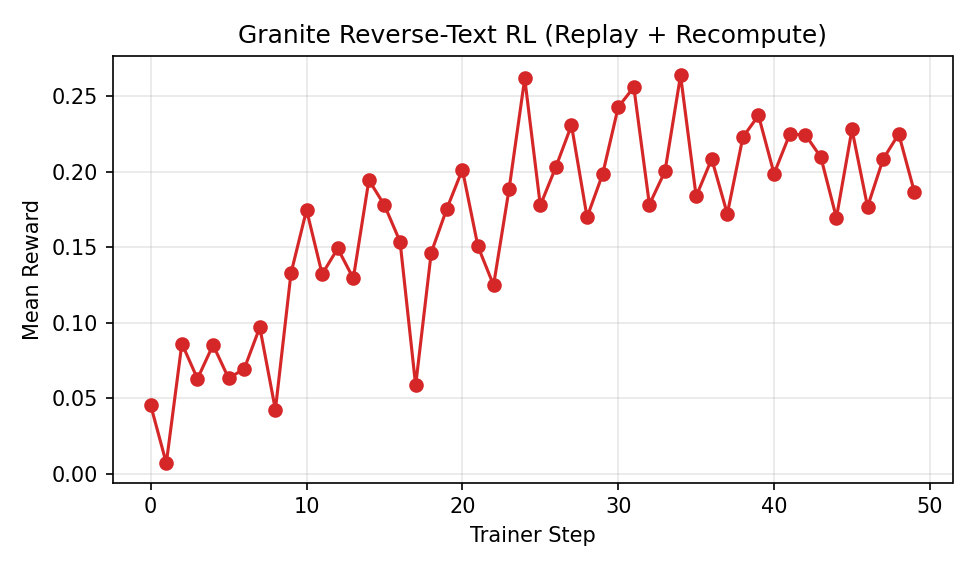
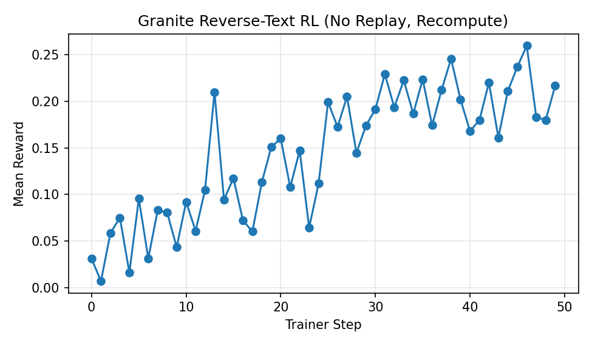
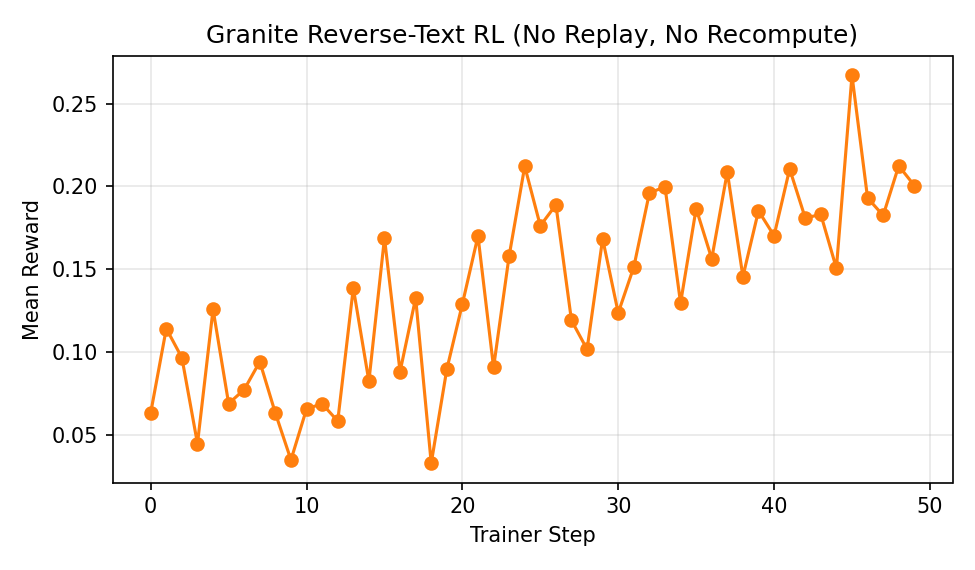

# Reverse Text Granite Experiments

## 1. Warm Start (Granite 3.0 1B SFT)
We warmed the public `ibm-granite/granite-3.0-1b-a400m-instruct` checkpoint on the reverse-text objective for 100 optimizer steps. Loss fell from ~5.79 at step 0 to 2.69 by step 99, providing a cleaner starting policy without exhausting GPU memory (peak 15.4 GiB). The resulting weights live in `outputs/granite_reverse_text_sft_100/weights/step_100` and on Hugging Face as `rewardhacker00/granite-reverse-text-sft-100`. Run diagnostics are archived under `outputs/logs/sft/granite_reverse_text_sft.log`.

## 2. RL Ablations on Reverse Text
The following runs begin from the SFT warm start and vary routing replay and logprob recomputation.

### 2.1 Router Replay + Logprob Recompute (50 steps)
- Config: Router replay enabled, `recompute_logprobs = true`, GRPO loss, 50 trainer steps.
- Location: outputs under `outputs/granite_reverse_text_rl_50`; logs copied to `outputs/logs/rl_long/`.
- Hugging Face: `rewardhacker00/granite-reverse-text-rl-50` (weights from `step_50`).
- Behaviour: Rewards plateau near 0.23 (peak 0.2639 @ step 34, mean 0.1663) while losses stay in the 1e-3 range; full eval on 1k prompts hits 0.227±0.083.

**Reward Trace**

| Step | Mean Reward |
| ---: | ----------: |
| 0 | 0.0454 |
| 1 | 0.0071 |
| 2 | 0.0863 |
| 3 | 0.0630 |
| 4 | 0.0854 |
| 5 | 0.0633 |
| 6 | 0.0696 |
| 7 | 0.0971 |
| 8 | 0.0425 |
| 9 | 0.1328 |
| 10 | 0.1748 |
| 11 | 0.1323 |
| 12 | 0.1493 |
| 13 | 0.1295 |
| 14 | 0.1946 |
| 15 | 0.1779 |
| 16 | 0.1538 |
| 17 | 0.0586 |
| 18 | 0.1465 |
| 19 | 0.1756 |
| 20 | 0.2015 |
| 21 | 0.1506 |
| 22 | 0.1250 |
| 23 | 0.1889 |
| 24 | 0.2619 |
| 25 | 0.1778 |
| 26 | 0.2033 |
| 27 | 0.2309 |
| 28 | 0.1700 |
| 29 | 0.1985 |
| 30 | 0.2429 |
| 31 | 0.2561 |
| 32 | 0.1784 |
| 33 | 0.2004 |
| 34 | 0.2639 |
| 35 | 0.1838 |
| 36 | 0.2086 |
| 37 | 0.1722 |
| 38 | 0.2230 |
| 39 | 0.2374 |
| 40 | 0.1988 |
| 41 | 0.2248 |
| 42 | 0.2247 |
| 43 | 0.2098 |
| 44 | 0.1696 |
| 45 | 0.2281 |
| 46 | 0.1769 |
| 47 | 0.2085 |
| 48 | 0.2251 |
| 49 | 0.1869 |

### 2.2 No Router Replay (Logprob Recompute On, 50 steps)
- Config: Router replay disabled, `recompute_logprobs = true`, 50 trainer steps matching Section 2.1 otherwise.
- Location: outputs under `outputs/granite_reverse_text_rl_noreplay_50`; logs mirrored to `outputs/logs/rl_noreplay/`.
- Hugging Face: `rewardhacker00/granite-reverse-text-rl-noreplay-50` (weights from `step_50`).
- Behaviour: Rewards trail the replay setup (mean 0.1436, peak 0.2597 @ step 46) but still climb steadily; full eval (1k prompts) averages 0.223±0.084.

**Reward Trace**

| Step | Mean Reward |
| ---: | ----------: |
| 0 | 0.0310 |
| 1 | 0.0068 |
| 2 | 0.0585 |
| 3 | 0.0749 |
| 4 | 0.0161 |
| 5 | 0.0953 |
| 6 | 0.0312 |
| 7 | 0.0834 |
| 8 | 0.0803 |
| 9 | 0.0433 |
| 10 | 0.0920 |
| 11 | 0.0607 |
| 12 | 0.1049 |
| 13 | 0.2098 |
| 14 | 0.0945 |
| 15 | 0.1174 |
| 16 | 0.0722 |
| 17 | 0.0601 |
| 18 | 0.1130 |
| 19 | 0.1510 |
| 20 | 0.1600 |
| 21 | 0.1078 |
| 22 | 0.1471 |
| 23 | 0.0643 |
| 24 | 0.1117 |
| 25 | 0.1992 |
| 26 | 0.1725 |
| 27 | 0.2050 |
| 28 | 0.1447 |
| 29 | 0.1738 |
| 30 | 0.1915 |
| 31 | 0.2291 |
| 32 | 0.1936 |
| 33 | 0.2227 |
| 34 | 0.1867 |
| 35 | 0.2236 |
| 36 | 0.1742 |
| 37 | 0.2124 |
| 38 | 0.2456 |
| 39 | 0.2019 |
| 40 | 0.1679 |
| 41 | 0.1799 |
| 42 | 0.2201 |
| 43 | 0.1610 |
| 44 | 0.2111 |
| 45 | 0.2370 |
| 46 | 0.2597 |
| 47 | 0.1832 |
| 48 | 0.1799 |
| 49 | 0.2167 |

### 2.3 No Router Replay (Logprob Recompute Off, 50 steps)
- Config: Router replay disabled, `recompute_logprobs = false`, 50 trainer steps mirroring the other ablations.
- Location: outputs under `outputs/granite_reverse_text_rl_noreplay_no_recompute_50`; logs mirrored to `outputs/logs/rl_noreplay_no_recompute/`.
- Hugging Face: `rewardhacker00/granite-reverse-text-rl-norecompute-50` (weights from `step_50`).
- Behaviour: Training rewards remain more volatile (mean 0.1372, peak 0.2671 @ step 45); the 1k-prompt eval lands at 0.231±0.085.

**Reward Trace**

| Step | Mean Reward |
| ---: | ----------: |
| 0 | 0.0634 |
| 1 | 0.1142 |
| 2 | 0.0966 |
| 3 | 0.0447 |
| 4 | 0.1258 |
| 5 | 0.0689 |
| 6 | 0.0774 |
| 7 | 0.0942 |
| 8 | 0.0631 |
| 9 | 0.0349 |
| 10 | 0.0657 |
| 11 | 0.0688 |
| 12 | 0.0583 |
| 13 | 0.1387 |
| 14 | 0.0824 |
| 15 | 0.1689 |
| 16 | 0.0882 |
| 17 | 0.1326 |
| 18 | 0.0329 |
| 19 | 0.0896 |
| 20 | 0.1291 |
| 21 | 0.1701 |
| 22 | 0.0907 |
| 23 | 0.1581 |
| 24 | 0.2122 |
| 25 | 0.1763 |
| 26 | 0.1889 |
| 27 | 0.1191 |
| 28 | 0.1017 |
| 29 | 0.1684 |
| 30 | 0.1237 |
| 31 | 0.1514 |
| 32 | 0.1961 |
| 33 | 0.1998 |
| 34 | 0.1296 |
| 35 | 0.1867 |
| 36 | 0.1564 |
| 37 | 0.2088 |
| 38 | 0.1456 |
| 39 | 0.1853 |
| 40 | 0.1703 |
| 41 | 0.2106 |
| 42 | 0.1810 |
| 43 | 0.1831 |
| 44 | 0.1506 |
| 45 | 0.2671 |
| 46 | 0.1931 |
| 47 | 0.1825 |
| 48 | 0.2125 |
| 49 | 0.2006 |

## 3. Evaluation Summary

**Full sweep (1000 examples x3)**

| Configuration | Full Eval Avg | Std Dev |
| --- | ---: | ---: |
| RL Replay + Recompute | 0.227 | 0.083 |
| RL No Replay + Recompute | 0.223 | 0.084 |
| RL No Replay + No Recompute | 0.231 | 0.085 |

