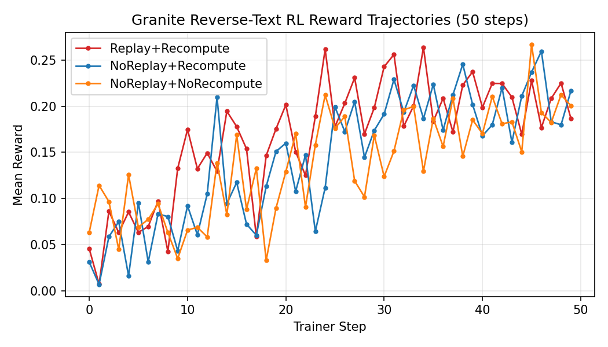

# Reverse Text Granite Experiments

## 1. Warm Start (Granite 3.0 1B SFT)
We warmed the public `ibm-granite/granite-3.0-1b-a400m-instruct` checkpoint on the reverse-text objective for 100 optimizer steps. Loss fell from ~5.79 at step 0 to 2.69 by step 99, providing a cleaner starting policy without exhausting GPU memory (peak 15.4 GiB). The resulting weights live in `outputs/granite_reverse_text_sft_100/weights/step_100` and on Hugging Face as `rewardhacker00/granite-reverse-text-sft-100`. Run diagnostics are archived under `outputs/logs/sft/granite_reverse_text_sft.log`.

## 2. RL Ablations on Reverse Text
Each variant starts from the SFT warm start and runs 50 GRPO steps on the reverse-text environment.

### 2.1 Router Replay + Logprob Recompute
- Outputs: `outputs/granite_reverse_text_rl_50`, logs under `outputs/logs/rl_long/`
- Hugging Face: `rewardhacker00/granite-reverse-text-rl-50`
- Training snapshot: mean reward 0.1663, peak 0.2639 at step 34
- Eval (1000 examples × 3 rollouts): 0.227 ± 0.083

### 2.2 No Router Replay (Logprob Recompute On)
- Outputs: `outputs/granite_reverse_text_rl_noreplay_50`, logs under `outputs/logs/rl_noreplay/`
- Hugging Face: `rewardhacker00/granite-reverse-text-rl-noreplay-50`
- Training snapshot: mean reward 0.1436, peak 0.2597 at step 46
- Eval (1000 examples × 3 rollouts): 0.223 ± 0.084

### 2.3 No Router Replay (Logprob Recompute Off)
- Outputs: `outputs/granite_reverse_text_rl_noreplay_no_recompute_50`, logs under `outputs/logs/rl_noreplay_no_recompute/`
- Hugging Face: `rewardhacker00/granite-reverse-text-rl-norecompute-50`
- Training snapshot: mean reward 0.1372, peak 0.2671 at step 45
- Eval (1000 examples × 3 rollouts): 0.231 ± 0.085

All detailed per-step rewards are saved in `outputs/analysis/granite_rl_*_rewards.csv`.

## 3. Evaluation Summary
- Quick smoke test (20 examples × 3 rollouts): replay+recompute 0.226, no-replay+recompute 0.224, no-replay+no-recompute 0.213 (`outputs/analysis/reverse_text_eval_summary.md`).
- Full sweep (1000 examples × 3 rollouts): replay+recompute 0.227, no-replay+recompute 0.223, no-replay+no-recompute 0.231 (`outputs/analysis/reverse_text_eval_summary_full.md`).

Logs for the large evals are stored in `outputs/logs/eval/eval_*_full.txt`.
