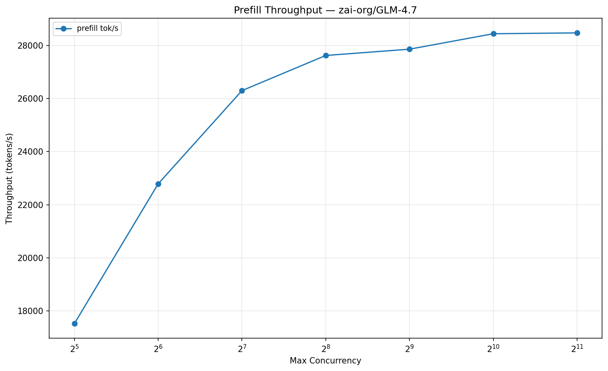
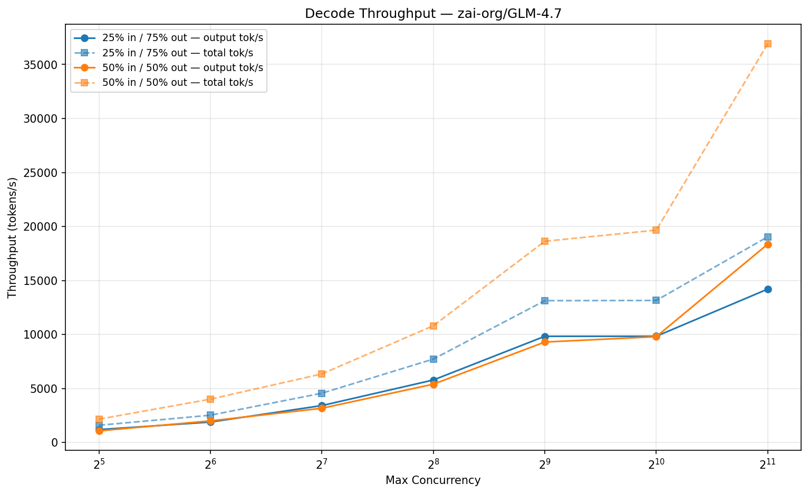

# Benchmark: zai-org/GLM-4.7

## Server Configuration

| Parameter | Value |
|-----------|-------|
| Model | zai-org/GLM-4.7 |
| TP | 8 |
| Max Model Len | 65,536 |
| KV Cache Tokens | 1,682,368 |
| KV Cache Dtype | auto |
| Prefix Caching | disabled |
| Chunked Prefill | enabled |
| Warmup | 10.0s |
| Measurement | 15.0s |
| Date | 2026-02-11 10:02 UTC |

## Prefill Throughput

| Concurrency | Input Tokens | Seq Len | Prefill tok/s |
|-------------|-------------|---------|---------------|
| 32 | 52,573 | 52,574 | 17,524 |
| 64 | 26,286 | 26,287 | 22,785 |
| 128 | 13,142 | 13,143 | 26,294 |
| 256 | 6,570 | 6,571 | 27,617 |
| 512 | 3,284 | 3,285 | 27,854 |
| 1,024 | 1,641 | 1,642 | 28,436 |
| 2,048 | 820 | 821 | 28,468 |

## Decode Throughput

### 25% input / 75% output

| Concurrency | Input | Output | Seq Len | Out tok/s | Total tok/s |
|-------------|-------|--------|---------|-----------|-------------|
| 32 | 13,143 | 39,431 | 52,574 | 1,201 | 1,602 |
| 64 | 6,571 | 19,716 | 26,287 | 1,900 | 2,533 |
| 128 | 3,285 | 9,858 | 13,143 | 3,425 | 4,568 |
| 256 | 1,642 | 4,929 | 6,571 | 5,794 | 7,729 |
| 512 | 821 | 2,464 | 3,285 | 9,839 | 13,137 |
| 1,024 | 410 | 1,232 | 1,642 | 9,842 | 13,158 |
| 2,048 | 205 | 616 | 821 | 14,208 | 19,051 |

### 50% input / 50% output

| Concurrency | Input | Output | Seq Len | Out tok/s | Total tok/s |
|-------------|-------|--------|---------|-----------|-------------|
| 32 | 26,287 | 26,287 | 52,574 | 1,084 | 2,168 |
| 64 | 13,143 | 13,144 | 26,287 | 2,010 | 4,020 |
| 128 | 6,571 | 6,572 | 13,143 | 3,176 | 6,355 |
| 256 | 3,285 | 3,286 | 6,571 | 5,405 | 10,816 |
| 512 | 1,642 | 1,643 | 3,285 | 9,307 | 18,636 |
| 1,024 | 821 | 821 | 1,642 | 9,804 | 19,667 |
| 2,048 | 410 | 411 | 821 | 18,369 | 36,918 |
