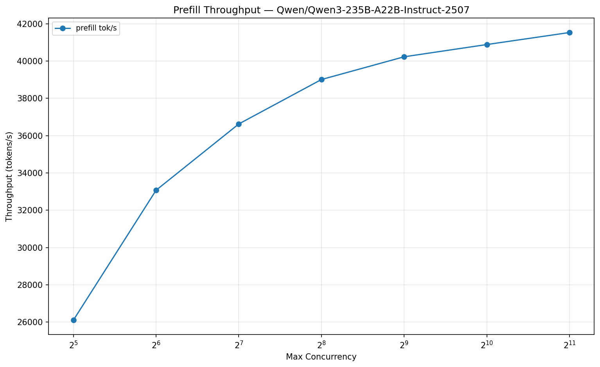
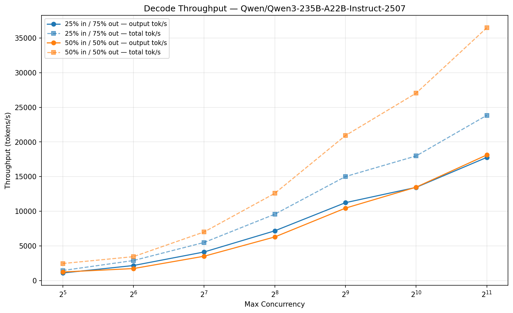

# Benchmark: Qwen/Qwen3-235B-A22B-Instruct-2507

## Server Configuration

| Parameter | Value |
|-----------|-------|
| Model | Qwen/Qwen3-235B-A22B-Instruct-2507 |
| TP | 8 |
| Max Model Len | 65,536 |
| KV Cache Tokens | 4,534,848 |
| KV Cache Dtype | fp8 |
| Prefix Caching | disabled |
| Chunked Prefill | enabled |
| Warmup | 10.0s |
| Measurement | 15.0s |
| Date | 2026-02-11 06:01 UTC |

## Prefill Throughput

| Concurrency | Input Tokens | Seq Len | Prefill tok/s |
|-------------|-------------|---------|---------------|
| 32 | 65,279 | 65,280 | 30,463 |
| 64 | 65,279 | 65,280 | 30,466 |
| 128 | 35,427 | 35,428 | 35,434 |
| 256 | 17,713 | 17,714 | 37,804 |
| 512 | 8,856 | 8,857 | 39,594 |
| 1,024 | 4,427 | 4,428 | 39,624 |
| 2,048 | 2,213 | 2,214 | 41,027 |

## Decode Throughput

### 25% input / 75% output

| Concurrency | Input | Output | Seq Len | Out tok/s | Total tok/s |
|-------------|-------|--------|---------|-----------|-------------|
| 32 | 16,320 | 48,960 | 65,280 | 1,071 | 1,428 |
| 64 | 16,320 | 48,960 | 65,280 | 1,728 | 2,304 |
| 128 | 8,857 | 26,571 | 35,428 | 3,880 | 5,175 |
| 256 | 4,428 | 13,286 | 17,714 | 7,156 | 9,545 |
| 512 | 2,214 | 6,643 | 8,857 | 11,523 | 15,377 |
| 1,024 | 1,107 | 3,321 | 4,428 | 13,856 | 18,509 |
| 2,048 | 553 | 1,661 | 2,214 | 19,212 | 25,701 |

### 50% input / 50% output

| Concurrency | Input | Output | Seq Len | Out tok/s | Total tok/s |
|-------------|-------|--------|---------|-----------|-------------|
| 32 | 32,640 | 32,640 | 65,280 | 1,472 | 2,944 |
| 64 | 32,640 | 32,640 | 65,280 | 2,370 | 4,741 |
| 128 | 17,714 | 17,714 | 35,428 | 2,894 | 5,789 |
| 256 | 8,857 | 8,857 | 17,714 | 5,700 | 11,405 |
| 512 | 4,428 | 4,429 | 8,857 | 10,289 | 20,594 |
| 1,024 | 2,214 | 2,214 | 4,428 | 13,589 | 27,226 |
| 2,048 | 1,107 | 1,107 | 2,214 | 18,696 | 37,527 |
