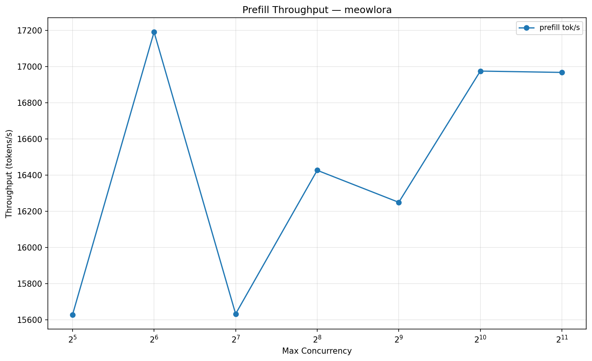
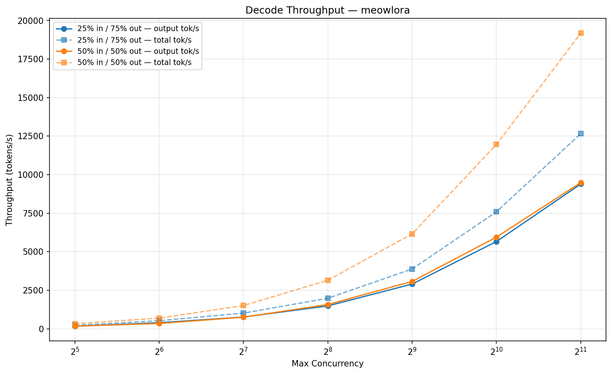

# Benchmark: meowlora

## Server Configuration

| Parameter | Value |
|-----------|-------|
| Model | meowlora |
| TP | 8 |
| Max Model Len | 65,536 |
| KV Cache Tokens | 1,500,000 |
| KV Cache Dtype | auto |
| Prefix Caching | disabled |
| Chunked Prefill | enabled |
| Warmup | 10.0s |
| Measurement | 15.0s |
| Date | 2026-02-11 11:43 UTC |

## Prefill Throughput

| Concurrency | Input Tokens | Seq Len | Prefill tok/s |
|-------------|-------------|---------|---------------|
| 32 | 46,874 | 46,875 | 15,627 |
| 64 | 23,436 | 23,437 | 17,192 |
| 128 | 11,717 | 11,718 | 15,632 |
| 256 | 5,858 | 5,859 | 16,427 |
| 512 | 2,928 | 2,929 | 16,250 |
| 1,024 | 1,463 | 1,464 | 16,975 |
| 2,048 | 731 | 732 | 16,968 |

## Decode Throughput

### 25% input / 75% output

| Concurrency | Input | Output | Seq Len | Out tok/s | Total tok/s |
|-------------|-------|--------|---------|-----------|-------------|
| 32 | 11,718 | 35,157 | 46,875 | 169 | 226 |
| 64 | 5,859 | 17,578 | 23,437 | 392 | 523 |
| 128 | 2,929 | 8,789 | 11,718 | 762 | 1,017 |
| 256 | 1,464 | 4,395 | 5,859 | 1,483 | 1,980 |
| 512 | 732 | 2,197 | 2,929 | 2,902 | 3,879 |
| 1,024 | 366 | 1,098 | 1,464 | 5,661 | 7,590 |
| 2,048 | 183 | 549 | 732 | 9,393 | 12,661 |

### 50% input / 50% output

| Concurrency | Input | Output | Seq Len | Out tok/s | Total tok/s |
|-------------|-------|--------|---------|-----------|-------------|
| 32 | 23,437 | 23,438 | 46,875 | 167 | 335 |
| 64 | 11,718 | 11,719 | 23,437 | 346 | 692 |
| 128 | 5,859 | 5,859 | 11,718 | 753 | 1,507 |
| 256 | 2,929 | 2,930 | 5,859 | 1,572 | 3,148 |
| 512 | 1,464 | 1,465 | 2,929 | 3,072 | 6,158 |
| 1,024 | 732 | 732 | 1,464 | 5,947 | 11,960 |
| 2,048 | 366 | 366 | 732 | 9,486 | 19,180 |
