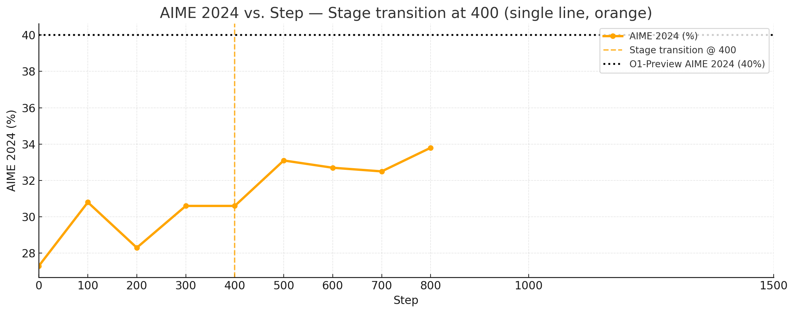

# DeepScaler

This is a reproduction of the [DeepScaleR](https://pretty-radio-b75.notion.site/DeepScaleR-Surpassing-O1-Preview-with-a-1-5B-Model-by-Scaling-RL-19681902c1468005bed8ca303013a4e2) experiments. They use RL to train from `Deepseek-R1-Distill-Qwen-1.5B` to 43.1% on AIME2024, surpassing OpenAI’s o1-preview with just 1.5B parameters.

## Setup

Install the environment using the `prime` CLI.

```bash
# TODO: Change to `prime env install ...` later
uv pip install -e ~/prime-environments/environments/deepscaler
```

Verify that the environment is installed correctly.

```bash
uv run python -c "import deepscaler"
```

## Evals


We get the following results:

## Training

A key insight from the paper is that they train in **stages of increasing context length**. In stages 1, 2 and 3, they train with context lengths of 8192, 16384 and 24576 tokens, respectively. We match their training setup here.

### Stage 1

```bash
bash scripts/tmux.sh -s stage1 -o outputs/stage1
```

```bash
# Run this in the `Inference` pane
uv run inference @ configs/deepscaler/stage1/rl/infer.toml --parallel.tp 2 --parallel.dp 3 --max-model-len 16384
```

```bash
# Run this in the `Trainer` pane
uv run rl \
  --trainer @ configs/deepscaler/stage1/rl/train.toml \
  --orchestrator @ configs/deepscaler/stage1/rl/orch.toml \
  --trainer-gpu-ids 6,7 \
  --output-dir outputs/stage1 \
  --wandb.project deepscaler \
  --wandb.name stage1-debug \
  --log.level debug
```

### Stage 2

```bash
bash scripts/tmux.sh -s stage2 -o outputs/stage2
```

```bash
mkdir -p outputs/stage2/checkpoints
cp -r outputs/stage1/checkpoints/step_400 outputs/stage2/checkpoints/step_400
mkdir -p outputs/stage2/weights
cp -r outputs/stage1/weights/step_398 outputs/stage2/weights/step_398
cp -r outputs/stage1/weights/step_399 outputs/stage2/weights/step_399
cp -r outputs/stage1/weights/step_400 outputs/stage2/weights/step_400
```

```bash
# Run this in the `Inference` pane
uv run inference @ configs/deepscaler/stage2/rl/infer.toml --parallel.tp 2 --parallel.dp 3 --max-model-len 32768
```

```bash
# Run this in the `Trainer` pane
uv run rl \
  --trainer @ configs/deepscaler/stage2/rl/train.toml \
  --orchestrator @ configs/deepscaler/stage2/rl/orch.toml \
  --trainer-gpu-ids 6,7 \
  --output-dir outputs/stage2 \
  --wandb.project deepscaler \
  --wandb.name stage2-debug \
  --ckpt.resume-step 400 \
  --log.level debug
```

### Stage 3

TBD.

## Evals

They evaluate on a series of math benchmarks, including Math500, AIME24, AMC23, Minerva Math and Olympiad Math. We will focus on `math500` and `aime2024` for the reproduction, as these are already implemented as evaluation environments on the Environment Hub and also the most prominent benchmarks. We uploaded the weight checkpoints to HF as `DeepSeek-R1-Distill-Qwen-1.5B-DeepScaleR-XXX` and evaluate the base model and each checkpoint.



| Model | AIME 2024 | MATH 500 | 
|-------|-----------|----------|
| DeepSeek-R1-Distill-Qwen-1.5B | 27.3% (16389±10200) | 81.4% (5450±7327) |
| DeepScaleR-100 | 30.8% (14510±9591) | 83.4% (4694±6311) |
| DeepScaleR-200 | 28.3% (11929±8630) | 83.2% (3610±4774) |
| DeepScaleR-300 | 30.6% (9898±7050) | 84.2% (3270±4027) |
| DeepScaleR-400 | 30.6% (9726±7077) | 83.6% (3283±4024) |
| DeepScaleR-500 | 30.0% (9121±6423) | 85.4% (2961±3426) |
| O1-Preview | 40.0% (N/A) | 81.4% (N/A) |

<details>
<summary>Raw results</summary>
<pre><code>
Base Model
Evaluated math500 in 1547.25s (Avg@1=0.8140, Pass@1: 0.8140, Completion Length: 5450.29 (±7327.93, ∈[266.00, 32734.00]), Truncated: 3.8%)
Evaluated aime2024 in 1546.06s (Avg@16=0.2729, Pass@8: 0.6130, Completion Length: 16389.57 (±10200.73, ∈[1643.00, 32699.00]), Truncated: 15.2%)

Step 100
Evaluated math500 in 1280.38s (Avg@1=0.8340, Pass@1: 0.8340, Completion Length: 4694.13 (±6311.37, ∈[225.00, 32729.00]), Truncated: 2.2%)
Evaluated aime2024 in 1279.09s (Avg@16=0.3083, Pass@8: 0.6363, Completion Length: 14510.24 (±9591.44, ∈[1606.00, 32696.00]), Truncated: 10.4%)

Step 200
Evaluated math500 in 942.63s (Avg@1=0.8320, Pass@1: 0.8320, Completion Length: 3610.20 (±4774.83, ∈[404.00, 32649.00]), Truncated: 0.8%)
Evaluated aime2024 in 942.34s (Avg@16=0.2833, Pass@8: 0.6043, Completion Length: 11929.71 (±8630.59, ∈[1770.00, 32701.00]), Truncated: 6.7%)

Step 300
Evaluated math500 in 737.77s (Avg@1=0.8420, Pass@1: 0.8420, Completion Length: 3270.25 (±4027.97, ∈[415.00, 32732.00]), Truncated: 0.4%)
Evaluated aime2024 in 736.54s (Avg@16=0.3063, Pass@8: 0.6350, Completion Length: 9898.05 (±7050.03, ∈[1606.00, 32696.00]), Truncated: 3.5%)

Step 400
Evaluated math500 in 727.78s (Avg@1=0.8360, Pass@1: 0.8360, Completion Length: 3283.45 (±4024.46, ∈[282.00, 32721.00]), Truncated: 0.4%)
Evaluated aime2024 in 726.83s (Avg@16=0.3063, Pass@8: 0.6567, Completion Length: 9726.12 (±7077.99, ∈[1266.00, 32686.00]), Truncated: 3.3%)

Step 500
Evaluated math500 in 660.66s (Avg@1=0.8540, Pass@1: 0.8540, Completion Length: 2961.01 (±3426.75, ∈[543.00, 32695.00]), Truncated: 0.6%)
Evaluated aime2024 in 658.95s (Avg@16=0.3000, Pass@8: 0.6460, Completion Length: 9121.69 (±6423.23, ∈[1323.00, 32687.00]), Truncated: 3.1%)
</code>
</pre>
</details>
<br/>

Start the inference server

```bash
bash scripts/tmux.sh
```

```bash
# Run this in the `Inference` pane
uv run inference --model.name ... --max-model-len 32768
```

```bash
uv run eval @ configs/deepscaler/eval.toml  --model.name ...
```