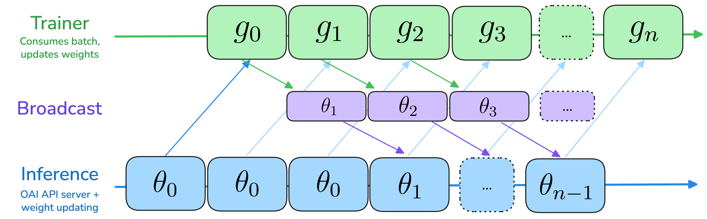

# Algorithms

This page covers the math and the configurable algorithmic components: how off-policy training works, the default loss and advantage functions, how to plug in your own, the filters applied between rollout and training, and how multi-turn rollouts get merged into training samples.

## Table of Contents

- [Async / off-policy training](#async--off-policy-training)
  - [Step semantics](#step-semantics)
  - [The default loss](#the-default-loss)
  - [Tuning `max_async_level`](#tuning-max_async_level)
- [Loss](#loss)
  - [Default loss](#default-loss)
  - [Custom loss](#custom-loss)
- [Advantage](#advantage)
  - [Default advantage](#default-advantage)
  - [Custom advantage](#custom-advantage)
  - [Length penalties](#length-penalties)
- [Filters](#filters)
- [Multi-turn trajectories](#multi-turn-trajectories)
  - [Extension property](#extension-property)
  - [Best-effort interleaving](#best-effort-interleaving)
  - [Discontinuous trajectories](#discontinuous-trajectories)

## Async / off-policy training

`prime-rl` is asynchronous by default. Inference is allowed to generate rollouts using a stale policy that is up to `k` steps behind the trainer, where `k = max_async_level`. Setting `k = 1` (the default) with matched trainer and inference step times produces fully-overlapped pipeline parallelism — neither side ever idles. Bump `k` higher when the weight-broadcast latency exceeds a single trainer step (e.g. cross-WAN decentralized runs) and the extra off-policy drift is acceptable.



### Step semantics

At step $n = 1, 2, 3, \dots$:

- **Trainer** produces policy $\pi_n$ with weights $\theta_n$ from rollouts $(x_n, y_n)$.
- **Inference** produces rollouts $(x_n, y_n)$ from policy $\pi_{\max(0,\,n - k)}$.

So at step $n$ the gap between the policy being trained and the policy that generated the data is at most $k$ steps. Step indices are 0-indexed so the bound holds at startup.

### The default loss

The default RL loss combines a token-level [AIPO](https://arxiv.org/abs/2505.24034)-style policy-gradient term (importance-ratio clipped from above, plus DPPO token-level masking) with the Kimi-K2.5 KL regularizer. For each prompt $x_j$ we sample a group of $G$ rollouts $\{y_i\}_{i=1}^G$, score them to get $s_i$, then optimize:

$$
\mathcal{L}(\theta) = -\,\mathcal{J}_{\text{PG}}(\theta) \;+\; \tau_{KL}\,\mathcal{L}_{KL}(\theta)
$$

where the policy-gradient term is

$$
\mathcal{J}_{\text{PG}}(\theta)
= \frac{1}{\sum_{j,i} |y_i^{(j)}|}
\sum_{j,i,t}
\min\!\left(\frac{\pi(y_{i,t}^{(j)}\mid x_j, y_{i,<t}^{(j)})}{\mu(y_{i,t}^{(j)}\mid x_j, y_{i,<t}^{(j)})}, \delta\right) \hat{A}^{(j)}_{i,t}
$$

and the KL regularizer penalizes drift between trainer and inference policies via the squared log importance ratio:

$$
\mathcal{L}_{KL}(\theta) = \frac{1}{\sum_{j,i} |y_i^{(j)}|}
\sum_{j,i,t} \log^2\!\left(\frac{\pi(y_{i,t}^{(j)}\mid x_j, y_{i,<t}^{(j)})}{\mu(y_{i,t}^{(j)}\mid x_j, y_{i,<t}^{(j)})}\right).
$$

$\mu$ is the policy that generated the rollout (inference), $\pi$ is the current policy (trainer), $\hat{A}_{i,t}$ is the token-level advantage, $\delta$ is the importance-sampling clipping ratio, and $\tau_{KL}$ is the KL temperature. The `min` clamps the importance ratio from above so a stale rollout assigning very low probability to a high-reward token doesn't produce a runaway gradient.

The knobs (under `[trainer.loss]` with `type = "default"`):

| Knob | Default | What it does |
|---|---|---|
| `dppo_mask_low` / `dppo_mask_high` | 0.2 / 0.2 | Lower / upper thresholds for DPPO-style token-level masking. |
| `adv_tau` | 1.0 | Temperature on the advantage term. Set to 0 for pure distillation (no RL signal). |
| `kl_tau` | 1e-3 | Temperature on the KL regularizer. Set to 0 to disable. |

### Tuning `max_async_level`

| `k` | Behavior |
|---|---|
| `0` | Fully synchronous — trainer and inference alternate. Lowest off-policy drift, lowest throughput. |
| `1` (default) | Pipelined — inference for step $n+1$ runs concurrently with trainer step $n$. Throughput-optimal when step times match. |
| `2` | Two-step async. Absorbs longer weight-broadcast latency, e.g. cross-WAN decentralized runs. |
| `≥ 3` | Increasing off-policy drift. Use only with confirmed throughput gain; watch `mismatch_kl/all/mean`. |

NCCL weight broadcast (`weight_broadcast.type = "nccl"`) requires `max_async_level = 1` — the validator will refuse otherwise.

## Loss

### Default loss

The default loss is the DPPO + KL formulation above. The trainer dispatches automatically based on the batch's training mode (set by the orchestrator via `orchestrator.training_mode`):

- `rl` mode → DPPO + KL with the advantage signal.
- `opd` mode → KL distillation against the teacher's per-token logprobs. The teacher must be a vLLM server (it's the only one that exposes `prompt_logprobs`).
- `sft` mode → standard token-level NLL on teacher-generated rollouts.

Set `[trainer.loss] type = "default"` and configure via the knobs above. SFT and OPD modes ignore the policy-gradient–specific fields.

### Custom loss

The loss is computed **per sequence**: you write a function that takes one sequence's tensors and returns a scalar loss. The trainer iterates and aggregates.

```python
# my_module.py
import torch
from prime_rl.trainer.rl.loss import LossInputs, LossOutputs

def ppo_clip_loss(inputs: LossInputs, clip_eps: float = 0.2) -> LossOutputs:
    ratio = torch.exp(inputs.trainer_logprobs - inputs.inference_logprobs)
    clipped = torch.clamp(ratio, 1 - clip_eps, 1 + clip_eps)
    surr1 = ratio * inputs.advantages
    surr2 = clipped * inputs.advantages
    loss = -torch.min(surr1, surr2)[inputs.loss_mask].sum()
    return LossOutputs(
        loss=loss,
        metrics={
            "clip_frac": (ratio != clipped)[inputs.loss_mask].float().mean(),
        },
    )
```

Wire it up:

```toml
[trainer.loss]
type = "custom"
import_path = "my_module.ppo_clip_loss"
kwargs = { clip_eps = 0.2 }
```

The dataclasses:

```python
@dataclass
class LossInputs:
    trainer_logprobs: Float[Tensor, "seq"]      # current policy
    inference_logprobs: Float[Tensor, "seq"]    # rollout-time policy
    teacher_logprobs: Float[Tensor, "seq"] | None  # only set in OPD mode
    advantages: Float[Tensor, "seq"]
    loss_mask: Bool[Tensor, "seq"]

@dataclass
class LossOutputs:
    loss: Float[Tensor, ""]
    metrics: dict[str, Tensor]
```

Anything you put in `metrics` is averaged across sequences and logged with the other trainer metrics.

## Advantage

### Default advantage

The default advantage is per-group reward minus per-group baseline (DR-GRPO without std normalization). For each prompt's group of `rollouts_per_example` rollouts, every token in rollout $i$ receives advantage $s_i - \bar{s}$ where $\bar{s}$ is the group mean.

This is intentionally simple — it does the right thing for most envs. Switch to a custom function when you need group-aware shaping (e.g. length penalties tied to turn count, sub-agent rollouts, or relative-rank shaping).

### Custom advantage

Advantages are computed **per group**. You write a function that takes one group of rollouts and returns one advantage scalar per rollout. The orchestrator handles groups of varying size automatically — partial-group training kicks in when some rollouts in a group errored.

```python
# my_module.py
import statistics
from prime_rl.orchestrator.advantage import AdvantageInputs, AdvantageOutputs

def normalized_advantage(inputs: AdvantageInputs, eps: float = 1e-8) -> AdvantageOutputs:
    rewards = [r["reward"] for r in inputs.rollouts]
    mean = statistics.fmean(rewards)
    std = statistics.pstdev(rewards) if len(rewards) > 1 else 0.0
    return AdvantageOutputs(advantages=[(r - mean) / (std + eps) for r in rewards])
```

```toml
[orchestrator.advantage]
type = "custom"
import_path = "my_module.normalized_advantage"
kwargs = { eps = 1e-8 }
```

`AdvantageInputs.rollouts` is a list of `verifiers.RolloutOutput`, so you have access to the full rollout (turns, tool calls, custom metadata) — not just the reward. Use this for anything reward-shaping-like that needs trajectory context.

### Length penalties

Two built-in length penalties can be layered on top of any advantage:

- `[orchestrator.length_penalty] type = "tokens"` — penalizes long completions in tokens, with configurable target and slope.
- `[orchestrator.length_penalty] type = "turns"` — penalizes long multi-turn rollouts by turn count.

See [Reference § orchestrator length penalties](reference.md#orchestrator) for the fields.

## Filters

Filters drop rollouts between scoring and training. Built-ins (composable):

| Filter | Effect |
|---|---|
| `gibberish` | Drops rollouts whose mean log-prob fall below a threshold — usually a sign of degenerate output. |
| `repetition` | Drops rollouts with high n-gram repetition. |
| `zero_advantage` | Drops rollouts whose advantage is zero, so the trainer doesn't waste tokens on them. |

The default `[orchestrator]` config already includes all three filters with their defaults. To override, set `filters` explicitly — the list replaces the defaults wholesale:

```toml
[[orchestrator.filters]]
type = "zero_advantage"

[[orchestrator.filters]]
type = "repetition"
threshold = 0.4
```

Filtered rollouts still appear in W&B distributions, just not in the trainer batch — useful for spotting whether filtering is doing its job.

## Multi-turn trajectories

Multi-turn rollouts (tool use, browser environments, long conversations) used to be stitched into a single fake "single-turn" sample, which silently corrupted the importance ratio when chat templates didn't roundtrip. Since [verifiers v0.1.8](https://github.com/PrimeIntellect-ai/verifiers/releases/tag/v0.1.8), `prime-rl` records each LLM request/response as an independent **trajectory step** and merges them at training time using best-effort interleaving.

### Extension property

A sequence of trajectory steps has the **extension property** when each successive step's prompt contains all previous prompts and completions as an exact prefix. The trainer relies on this property — when it holds:

- Multiple steps merge into one training sample.
- Compute scales as $O(T)$ in the trajectory length.

When it breaks (chat template strips past thinking, environment compacts context, an agent hands off to a sub-agent, etc.), the trainer starts a new training sample from that step:

- Graceful fallback to multiple samples — no corrupted data.
- Worst case (every step breaks extension) is $O(T^2)$.

### Best-effort interleaving

Concretely:

```
5-step trajectory where extension breaks at step 4:

steps 1–3: extension holds   → merged into Sample 1
step 4:    extension breaks  (e.g. thinking stripped from history)
steps 4–5: extension holds   → merged into Sample 2

result: 2 training samples instead of 5
```

The orchestrator enforces an **exact prefix invariant**: the prompt at turn $t$ must be the exact concatenation of prior messages exactly as the LLM originally generated them. If turn 2's prompt is `U1, A1', U2` while `A1' ≠ A1`, the orchestrator can't safely merge — either choice produces logprob drift between trainer and inference. Starting a fresh sample is the only correct behavior, so that's what happens.

A common source of breakage is models like Qwen3 whose chat templates strip past `<think>` blocks across user turns:

```python
from transformers import AutoTokenizer
tok = AutoTokenizer.from_pretrained("Qwen/Qwen3-0.6B")
messages = [
    {"role": "user", "content": "U1"},
    {"role": "assistant", "content": "<think>R1</think>A1"},
    {"role": "user", "content": "U2"},
]
tok.apply_chat_template(messages[:1], tokenize=False)
# <|im_start|>user
# U1<|im_end|>

tok.apply_chat_template(messages, tokenize=False)
# <|im_start|>user\nU1<|im_end|>\n<|im_start|>assistant\nA1<|im_end|>\n<|im_start|>user\nU2<|im_end|>
# (the <think>R1</think> from turn 2 is gone)
```

Workarounds: use a chat template that preserves thinking (we ship patched versions for many models, e.g. `PrimeIntellect/Qwen3-0.6B`), or enable `orchestrator.renderer.preserve_all_thinking = true` so the renderer re-emits past thinking blocks itself.

### Discontinuous trajectories

Some envs are discontinuous by design — e.g. a main agent delegating to a sub-agent and getting back only a summarized result, not the sub-agent's whole conversation. Best-effort interleaving handles this naturally: each agent's contiguous turns merge, the handoff starts a new sample. The trainer never sees fabricated extension where there is none.

For background on the design, see the verifiers [trajectories design note](https://github.com/PrimeIntellect-ai/verifiers/blob/main/notes/TRAJECTORIES.md). The `--trajectory-strategy branching` option is deprecated — best-effort interleaving covers all cases, falling back to separate samples (equivalent to old branching) when extension breaks.
