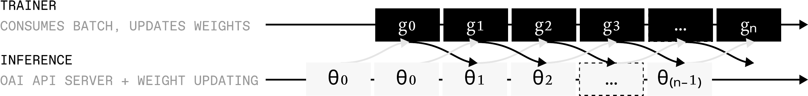

# Algorithms

This page covers the math and the configurable algorithmic components: the algorithm abstraction and its presets, how off-policy training works, the loss types and advantage functions, how to plug in your own, the filters applied between rollout and training, and how multi-turn rollouts get merged into training samples.

## Table of Contents

- [The Algorithm Abstraction](#the-algorithm-abstraction)
  - [Model References](#model-references)
  - [Presets](#presets)
  - [Customizing Components](#customizing-components)
  - [Per-Env Algorithms](#per-env-algorithms)
- [Async / Off-Policy Training](#async--off-policy-training)
- [Loss](#loss)
  - [Loss Types and Routing](#loss-types-and-routing)
  - [Default RL Loss](#default-rl-loss)
  - [Custom Loss](#custom-loss)
- [Advantage](#advantage)
  - [Default Advantage](#default-advantage)
  - [Custom Advantage](#custom-advantage)
  - [Reference-Scoring Strategies](#reference-scoring-strategies)
- [Filters](#filters)
- [Difficulty Pools](#difficulty-pools)
- [Online Difficulty Filtering](#online-difficulty-filtering)
- [Multi-Turn Trajectories](#multi-turn-trajectories)
  - [Extension Property](#extension-property)
  - [Best-Effort Interleaving](#best-effort-interleaving)
  - [Renderers](#renderers)
  - [Discontinuous Trajectories](#discontinuous-trajectories)

## The Algorithm Abstraction

A training algorithm in `prime-rl` is a bundle of three components, configured under `[orchestrator.algo]`:

1. **Sampling** (`algo.sampling`) — which model generates train rollouts. `source` is a [model reference](#model-references): `"policy"` (the live policy, the default) or an inline frozen hosted model. Group sizing stays on the env config (`group_size`).
2. **Advantage** (`algo.advantage`) — the per-token training signal, one concept at different granularities and evaluation sites. Group-relative strategies compute scalars on the orchestrator and ship numbers; reference-KL strategies query a reference model at batch-ship time (bounded concurrency) and ship its prefill logprobs for the trainer to evaluate against the live policy. The strategy determines which loss type consumes the action tokens (`rl` / `ce` / `ref_kl`).
3. **Loss routing** (`algo.loss`) — what happens to env-provided observation tokens in multi-turn rollouts (tool output, terminal responses): `observation = "none"` masks them out (the default), `"ce"` trains on them with weight `observation_weight`.

The trainer is algorithm-blind: routing ships per token on the wire (`loss_type` / `token_loss_types` / `token_loss_weights` on each training sample) and the trainer just executes loss types. Adding an algorithm never touches the dispatcher, packer, or trainer hot path.

### Model References

`prime-rl` hosts exactly one model: the trainable policy (`[orchestrator.model]`). Every other model an algorithm uses is an external OpenAI-compatible endpoint, declared *inline on the component that uses it*. A model reference is either the string `"policy"` (the live policy) or a frozen hosted model (`name` + `base_url`):

```toml
[orchestrator.algo]
name = "opd"

[orchestrator.algo.model]   # folds into advantage.model
name = "Qwen/Qwen3-32B"
base_url = ["http://localhost:8001/v1"]
```

Model *roles* are algorithm-local labels over these references — OPD may call its reference model a teacher, but no role exists outside the algorithm that defines it. The dispatcher, sink, and trainer branch on liveness alone, never on what an algorithm calls a model.

`algo.model` is shorthand for whichever component reference the preset leaves unresolved (`advantage.model` for `opd`, `sampling.source` for `sft_distill`) or a component default you didn't set; an explicit component reference that already equals it is accepted, a disagreeing one is an error. Set the component fields directly for multi-model setups.

Liveness is a property of the reference, not of any role: rollouts sampled from `"policy"` get version-salted prefix caches, carry sampling logprobs for importance ratios, and age off-policy as weights update; rollouts and scores from frozen models get a stable prefix cache and never go stale. Frozen models are externally hosted (`client.base_url` is required) — `prime-rl` never launches or updates them, and each env's algorithm builds its own client pool to the endpoints it declares.

### Presets

Pick a vetted preset by name:

```toml
[orchestrator.algo]
name = "grpo"  # the default
```

| Preset | Sampling | Advantage | Loss | What it is |
|---|---|---|---|---|
| `grpo` | policy | `group_norm` | `rl` on actions | Standard group-relative RL. |
| `opd` | policy | `ref_kl` | `ref_kl` on actions | On-policy distillation ([Thinking Machines](https://thinkingmachines.ai/blog/on-policy-distillation/)): the policy samples, per-token reverse KL against a reference model as the gradient signal. Needs an inline `model`. |
| `sft_distill` | *(set via `model`)* | `supervised` | `ce` on actions | Hard distillation: a frozen model generates rollouts, the policy trains with CE on its tokens. Needs an inline `model`. |
| `self_distill` | policy | `demo_ref_kl` | `ref_kl` on actions | SDFT ([arXiv:2601.19897](https://arxiv.org/abs/2601.19897)): the model is its own reference, conditioned on an expert demonstration. Defaults to the live policy (the paper's setting, no extra deployment); set an inline `model` to score under a frozen copy instead. |
| `echo` | policy | `group_norm` | `rl` on actions + weighted `ce` on observations | ECHO: standard GRPO plus a cross-entropy loss on env-observation tokens already present in the rollout (`observation_weight` is ECHO's λ). |

### Customizing Components

Every component can be overridden individually — preset fields you don't set are kept (for `sampling` / `loss`, field-by-field; `advantage` is a discriminated union, replaced wholesale when set):

```toml
[orchestrator.algo]
name = "echo"

[orchestrator.algo.loss]
observation_weight = 0.25  # keep echo's routing, change lambda

[orchestrator.algo.advantage]
type = "custom"
import_path = "my_module.normalized_advantage"
```

Component compatibility is validated at config time: frozen-model sampling cannot feed an advantage with the `rl` loss type (no policy sampling logprobs for importance ratios), `ref_kl` pointed at `"policy"` is rejected as degenerate (zero KL), and group-relative advantage with `group_size = 1` warns that every advantage collapses to zero.

### Per-Env Algorithms

All three components resolve per environment. Each env inherits `[orchestrator.algo]` unless it sets its own, so a single run can mix algorithms across envs — e.g. GRPO on math, ECHO on a terminal env:

```toml
[orchestrator.algo]
name = "grpo"

[[orchestrator.train.env]]
id = "math-env"     # inherits grpo

[[orchestrator.train.env]]
id = "terminal-env"
algo = { name = "echo" }
```

## Async / Off-Policy Training

`prime-rl` is asynchronous by default. The trainer and inference always run one step overlapped: while the trainer is producing $\pi_n$ from rollouts at step $n$, inference is already generating the rollouts for step $n+1$ using $\pi_{n-1}$. With matched trainer and inference step times this produces fully-overlapped pipeline parallelism — neither side ever idles.



At step $n = 1, 2, 3, \dots$:

- **Trainer** produces policy $\pi_n$ with weights $\theta_n$ from rollouts $(x_n, y_n)$.
- **Inference** produces rollouts $(x_n, y_n)$ from policy $\pi_{\max(0,\,n-1)}$.

Step indices are 0-indexed so the gap holds at startup — inference is exactly one step behind the trainer.

## Loss

### Loss Types and Routing

The trainer executes three fixed **loss types**; the orchestrator routes every token to one of them (action tokens to the advantage strategy's loss type, observation tokens per the env algorithm's `loss` config), and tokens of different loss types pack freely into the same micro batch:

- `rl` — the configured RL loss (`[trainer.loss]`): DPPO + KL by default, or a [custom loss](#custom-loss). Fed by the scalar advantage strategies (`group_norm`, `reward`, `custom`).
- `ce` — masked NLL. Used for frozen-model tokens (`supervised` / `sft_distill`) and env-observation tokens (`echo`).
- `ref_kl` — the DPPO machinery with the per-token reverse KL to a reference model ($\log \pi_{\text{ref}} - \log \pi$) as the policy-gradient signal (`opd`, `self_distill`). Requires `ref_logprobs` from a [reference-scoring strategy](#reference-scoring-strategies); the scoring model must be a vLLM server (it's the only one that exposes `prompt_logprobs`).

### Default RL Loss

The default RL loss is a DPPO policy-gradient term combined with a KL regularizer similar to Kimi-K2.5. For each prompt $x_j$ we sample a group of $G$ rollouts $\{y_i\}_{i=1}^G$, score them to get $s_i$, then optimize:

$$
\mathcal{L}(\theta) = -\,\mathcal{J}_{\text{PG}}(\theta) \;+\; \tau_{KL}\,\mathcal{L}_{KL}(\theta)
$$

where the policy-gradient term is

$$
\mathcal{J}_{\text{PG}}(\theta)
= \frac{1}{\sum_{j,i} |y_i^{(j)}|}
\sum_{j,i,t}
\min\!\left(\frac{\pi(y_{i,t}^{(j)}\mid x_j, y_{i,<t}^{(j)})}{\mu(y_{i,t}^{(j)}\mid x_j, y_{i,<t}^{(j)})}, \delta\right) \hat{A}^{(j)}_{i,t}
$$

and the KL regularizer penalizes drift between trainer and inference policies via the squared log importance ratio:

$$
\mathcal{L}_{KL}(\theta) = \frac{1}{\sum_{j,i} |y_i^{(j)}|}
\sum_{j,i,t} \log^2\!\left(\frac{\pi(y_{i,t}^{(j)}\mid x_j, y_{i,<t}^{(j)})}{\mu(y_{i,t}^{(j)}\mid x_j, y_{i,<t}^{(j)})}\right).
$$

$\mu$ is the policy that generated the rollout (inference), $\pi$ is the current policy (trainer), $\hat{A}_{i,t}$ is the token-level advantage, $\delta$ is the importance-sampling clipping ratio, and $\tau_{KL}$ is the KL temperature. The `min` clamps the importance ratio from above so a stale rollout assigning very low probability to a high-reward token doesn't produce a runaway gradient.

The knobs (under `[trainer.loss]` with `type = "default"`):

| Knob | Default | What it does |
|---|---|---|
| `dppo_mask_low` / `dppo_mask_high` | 0.2 / 0.2 | Lower / upper thresholds for DPPO-style token-level masking. |
| `adv_tau` | 1.0 | Temperature on the advantage term. Set to 0 for pure distillation (no RL signal). |
| `kl_tau` | 1e-3 | Temperature on the KL regularizer. Set to 0 to disable. |

Set `[trainer.loss] type = "default"` and configure via the knobs above. The `ce` and `ref_kl` loss types are fixed and unaffected by `[trainer.loss]`.

### Custom Loss

`[trainer.loss] type = "custom"` replaces the `rl` loss type. The loss is computed **per sequence**: you write a function that takes one sequence's tensors and returns a scalar loss. The trainer iterates and aggregates. `inputs.loss_mask` selects exactly the tokens routed to the `rl` loss type (for a plain GRPO run, all trainable tokens).

```python
# my_module.py
import torch
from prime_rl.trainer.rl.loss import LossInputs, LossOutputs

def ppo_clip_loss(inputs: LossInputs, clip_eps: float = 0.2) -> LossOutputs:
    ratio = torch.exp(inputs.trainer_logprobs - inputs.inference_logprobs)
    clipped = torch.clamp(ratio, 1 - clip_eps, 1 + clip_eps)
    surr1 = ratio * inputs.advantages
    surr2 = clipped * inputs.advantages
    loss = -torch.min(surr1, surr2)[inputs.loss_mask].sum()
    return LossOutputs(
        loss=loss,
        metrics={
            "clip_frac": (ratio != clipped)[inputs.loss_mask].float().mean(),
        },
    )
```

Wire it up:

```toml
[trainer.loss]
type = "custom"
import_path = "my_module.ppo_clip_loss"
kwargs = { clip_eps = 0.2 }
```

The dataclasses:

```python
@dataclass
class LossInputs:
    trainer_logprobs: Float[Tensor, "seq"]      # current policy
    inference_logprobs: Float[Tensor, "seq"]    # rollout-time policy
    ref_logprobs: Float[Tensor, "seq"] | None   # set by logprobs token scorers
    advantages: Float[Tensor, "seq"]
    loss_mask: Bool[Tensor, "seq"]              # tokens routed to this loss type
    loss_weights: Float[Tensor, "seq"] | None   # per-token loss weights (None = 1.0)

@dataclass
class LossOutputs:
    loss: Float[Tensor, ""]
    metrics: dict[str, Tensor]
```

Anything you put in `metrics` is averaged across sequences and logged with the other trainer metrics.

## Advantage

The advantage strategy is the `advantage` component of the [algorithm](#the-algorithm-abstraction) — every training signal is an advantage, varying in granularity (group-scalar vs. per-token) and evaluation site (orchestrator vs. trainer). `[orchestrator.advantage]` (and per-env `advantage = {...}`) is shorthand for `algo.advantage`. Types:

| Type | Loss type | Effect |
|---|---|---|
| `group_norm` | `rl` | Group-norm (GRPO): reward minus per-group baseline, optional length penalty. |
| `reward` | `rl` | Advantage = raw reward, no baseline. |
| `ref_kl` | `ref_kl` | On-policy distillation: per-token reverse KL to a reference model (`model`, an inline frozen hosted model), evaluated in the trainer from shipped reference logprobs. Group-relative scalars are still assigned (their sign steers the DPPO masking direction; the zero-advantage filter reads them). |
| `demo_ref_kl` | `ref_kl` | SDFT: per-token reverse KL to a demo-conditioned reference. No scalars — rollouts keep `advantage = None` (advantage-based filters never fire) and ship a neutral 0.0. |
| `supervised` | `ce` | Cross-entropy on the sampled tokens (`sft_distill`). The loss ignores scalars, but group-relative scalars are still assigned so reward-based filtering keeps working. |
| `custom` | `rl` | Your function (below); scalar per rollout, optionally per-token. |

### Default Advantage

The default advantage is per-group reward minus per-group baseline (DR-GRPO without std normalization). For each prompt's group of `group_size` rollouts, every token in rollout $i$ receives advantage $s_i - \bar{s}$ where $\bar{s}$ is the group mean.

This is intentionally simple — it does the right thing for most envs. Switch to a [custom advantage](#custom-advantage) when you need group-aware shaping that depends on trajectory metadata (sub-agent rollouts, relative-rank shaping, …).

Two built-in **length penalties** (`length_penalty` on the `group_norm` / `ref_kl` strategies) can be layered on top to discourage rambling:

- `[orchestrator.advantage.length_penalty] type = "tokens"` — penalizes long completions by weighted token cost.
- `[orchestrator.advantage.length_penalty] type = "turns"` — penalizes long multi-turn rollouts by turn count.


### Custom Advantage

Advantages are computed **per group**. You write a function that takes one group of rollouts and returns one advantage scalar per rollout. The orchestrator handles groups of varying size automatically — partial-group training kicks in when some rollouts in a group errored.

```python
# my_module.py
import statistics
from prime_rl.orchestrator.advantage import AdvantageInputs, AdvantageOutputs

def normalized_advantage(inputs: AdvantageInputs, eps: float = 1e-8) -> AdvantageOutputs:
    rewards = [r["reward"] for r in inputs.rollouts]
    mean = statistics.fmean(rewards)
    std = statistics.pstdev(rewards) if len(rewards) > 1 else 0.0
    return AdvantageOutputs(advantages=[(r - mean) / (std + eps) for r in rewards])
```

```toml
[orchestrator.advantage]
type = "custom"
import_path = "my_module.normalized_advantage"
kwargs = { eps = 1e-8 }
```

`AdvantageInputs.rollouts` is a list of `verifiers.RolloutOutput`, so you have access to the full rollout (turns, tool calls, custom metadata) — not just the reward. Use this for anything reward-shaping-like that needs trajectory context.

#### Per-token advantages

A custom function can also emit **per-token advantages** (process rewards, step-level credit assignment) via `AdvantageOutputs.token_advantages` — one optional list per rollout, aligned to that rollout's completion tokens. `None` entries (or omitting the field) broadcast the scalar over the sequence; prompt positions are padded internally and never trained.

```python
def step_weighted_advantage(inputs: AdvantageInputs) -> AdvantageOutputs:
    rewards = [r["reward"] for r in inputs.rollouts]
    baseline = statistics.fmean(rewards)
    scalars = [r - baseline for r in rewards]
    token_advantages = [
        [scalar * w for w in my_token_weights(rollout)]  # one float per completion token
        for scalar, rollout in zip(scalars, inputs.rollouts)
    ]
    return AdvantageOutputs(advantages=scalars, token_advantages=token_advantages)
```

The scalar `advantages` are still required — advantage-based filters and metrics read them. Each list must match the rollout's completion token count exactly (for multi-turn envs that's the merged completion, including interleaved observation tokens), and the rollout must map to a single training sample — both are validated loudly at group finalization. Signals that depend on the live policy's weights (like OPD's reverse KL) cannot be precomputed here; those are reference-scoring strategies evaluated in the trainer.

### Per-Env Advantage

`advantage` can be set per training environment. Each env inherits the top-level `[orchestrator.advantage]` when it doesn't set its own, so mixed-env runs can give each env its own advantage computation:

```toml
[orchestrator.advantage]
type = "group_norm"  # the default every env inherits unless it overrides

[[orchestrator.train.env]]
id = "math-env"   # inherits the default above

[[orchestrator.train.env]]
id = "agent-env"
advantage = { type = "custom", import_path = "my_module.normalized_advantage" }
```

### Reference-Scoring Strategies

The `ref_kl` / `demo_ref_kl` strategies have an async ship-time half: at batch-ship time they query their reference model (`model`, a [model reference](#model-references)) with bounded concurrency (`max_concurrent`, default 32) and attach per-token reference logprobs to each sample:

- `ref_kl` — score each sample's own context under the reference model via prefill; fills `ref_logprobs` for the `ref_kl` loss type (on-policy distillation). `model = "policy"` is rejected (the KL would be identically zero).
- `demo_ref_kl` — SDFT: rebuild the prompt with an expert demonstration woven into the last user message (`template`, with `{question}` / `{demonstration}` placeholders), score the policy's completion under that demo-conditioned context. `model = "policy"` scores under the live policy itself — the SDFT setting, no extra deployment. The demonstration is read from the example's `info[demo_key]`, falling back to a top-level rollout field of the same name (e.g. `answer`); single-step trajectories only.

```toml
[orchestrator.algo.advantage]
type = "demo_ref_kl"
model = "policy"
demo_key = "demonstration"
max_concurrent = 64
```

Only batch survivors get scored — rollouts that are filtered or cancelled never cost reference compute. The time shows up as `time/scoring` in the step timing.

## Filters

Filters drop rollouts between scoring and training. Built-ins (composable):

| Filter | Effect |
|---|---|
| `gibberish` | Drops rollouts whose mean log-prob fall below a threshold — usually a sign of degenerate output. |
| `repetition` | Drops rollouts with high n-gram repetition. |
| `zero_advantage` | Drops rollouts whose advantage is zero, so the trainer doesn't waste tokens on them. |

The default `[orchestrator]` config already includes all three filters with their defaults. To override, set `filters` explicitly — the list replaces the defaults wholesale:

```toml
[[orchestrator.filters]]
type = "zero_advantage"

[[orchestrator.filters]]
type = "repetition"
threshold = 0.4
```

Filtered rollouts still appear in W&B distributions, just not in the trainer batch — useful for spotting whether filtering is doing its job.

## Difficulty Pools

Difficulty pools gradually retire problems the model has solved or never solves. After each rollout, the average reward across a problem's group is compared to two thresholds:

- `buffer.easy_threshold` — at or above this, the problem moves into the `easy` pool and is no longer sampled.
- `buffer.hard_threshold` — at or below this, the problem moves into the `hard` pool and is no longer sampled.
- Otherwise the problem stays in `normal` and remains in the sampling rotation.

Pool assignments persist across checkpoints (`easy_examples.jsonl` / `hard_examples.jsonl` under each step's orchestrator checkpoint). When you resume — or want to broaden the curriculum mid-run — `buffer.easy_fraction` / `buffer.hard_fraction` randomly lift that fraction of pooled problems back into `normal` so they re-enter sampling.

```toml
[orchestrator.buffer]
easy_threshold = 0.95
hard_threshold = 0.05
easy_fraction = 0.0   # default; bump on resume to bring some easy problems back
hard_fraction = 0.0   # default; bump on resume to bring some hard problems back
```

Watch `pool/{env}/{easy,normal,hard}` (current pool ratios) and `evicted_examples/{env}/{easy,hard}` (per-step eviction rate).

## Online Difficulty Filtering

Online difficulty filtering (ODF) drops collapsed-advantage groups on the way *into* the buffer. Set `buffer.online_difficulty_filtering = true` (default `false`) to enable:

- Average reward across the group is **0.0** (every rollout failed) → drop the group, count under `filtered_rollouts/{env}/hard`.
- Average reward **1.0** (every rollout succeeded) → drop, count under `filtered_rollouts/{env}/easy`.
- Otherwise → into the buffer.

These are exactly the groups whose within-group advantage collapses to zero — DR-GRPO produces no gradient signal for them, so the trainer would burn step time on tokens it can't learn from.

```toml
[orchestrator.buffer]
online_difficulty_filtering = true
```

**Tradeoff: trainer stability vs. inference speed.** With ODF on, every rollout that reaches the trainer carries non-zero advantage — each trainer step's effective batch is predictable and the gradient signal is denser. The cost is paid on the inference side: rollouts get produced and then thrown away, so the orchestrator has to oversample to keep the trainer fed. If the orchestrator is your bottleneck (`time/wait_for_batch` high on the trainer), ODF can starve the loop. Bump `orchestrator.oversampling_factor` so inference produces enough groups per step to absorb the drops.

ODF is orthogonal to the [pools](#difficulty-pools): ODF reacts to the *current* group's reward distribution, the pools track the *running* per-problem average. Many configs use both — ODF for per-step density, pools for long-horizon curriculum cleanup.

## Multi-Turn Trajectories

Multi-turn rollouts (tool use, browser environments, long conversations) used to be stitched into a single fake "single-turn" sample, which silently corrupted the importance ratio when chat templates didn't roundtrip. Since [`verifiers` v0.1.8](https://github.com/PrimeIntellect-ai/verifiers/releases/tag/v0.1.8), `prime-rl` records each LLM request/response as an independent **trajectory step** and merges them at training time using best-effort interleaving — with [renderers](#renderers) as the mechanism that keeps the merge safe by construction.

### Extension Property

A sequence of trajectory steps has the **extension property** when each successive step's prompt contains all previous prompts and completions as an exact prefix. The trainer relies on this property — when it holds:

- Multiple steps merge into one training sample.
- Compute scales as $O(T)$ in the trajectory length.

When it breaks (chat template strips past thinking, environment compacts context, an agent hands off to a sub-agent, etc.), the trainer starts a new training sample from that step:

- Graceful fallback to multiple samples — no corrupted data.
- Worst case (every step breaks extension) is $O(T^2)$.

### Best-Effort Interleaving

Concretely:

```
5-step trajectory where extension breaks at step 4:

steps 1–3: extension holds   → merged into Sample 1
step 4:    extension breaks  (e.g. thinking stripped from history)
steps 4–5: extension holds   → merged into Sample 2

result: 2 training samples instead of 5
```

The orchestrator enforces an **exact prefix invariant**: the prompt at turn $t$ must be the exact concatenation of prior messages exactly as the LLM originally generated them. If turn 2's prompt is `U1, A1', U2` while `A1' ≠ A1`, the orchestrator can't safely merge — either choice produces logprob drift between trainer and inference. Starting a fresh sample is the only correct behavior, so that's what happens.

### Renderers

Best-effort interleaving works because the renderer guarantees the exact-prefix invariant *by construction* — it never re-renders prior turns, so it can't lose tokens to chat-template normalization, BPE retokenization drift, or thinking stripping. A renderer turns a model's chat template into a Python object that can:

- `render_ids(messages)` — tokenize messages to ids the inference engine accepts.
- `parse_response(completion_ids)` — recover structured `(content, reasoning_content, tool_calls)` from sampled ids.
- `bridge_to_next_turn(prev_prompt_ids, prev_completion_ids, new_messages)` — extend the previous turn's tokens verbatim with the new environment turn, instead of re-rendering history.

When `bridge_to_next_turn` succeeds, the trainer sees the exact token stream the sampler produced; when it can't be proven safe (e.g. the renderer is `DefaultRenderer` and the template's stop sequence is unknown), it returns `None` and the orchestrator falls back to a full re-render — which triggers the new-sample fallback above.

A common source of breakage in the absence of a hand-coded renderer is models like Qwen3 whose chat templates strip past `<think>` blocks across user turns:

```python
from transformers import AutoTokenizer
tok = AutoTokenizer.from_pretrained("Qwen/Qwen3-0.6B")
messages = [
    {"role": "user", "content": "U1"},
    {"role": "assistant", "content": "<think>R1</think>A1"},
    {"role": "user", "content": "U2"},
]
tok.apply_chat_template(messages[:1], tokenize=False)
# <|im_start|>user
# U1<|im_end|>

tok.apply_chat_template(messages, tokenize=False)
# <|im_start|>user\nU1<|im_end|>\n<|im_start|>assistant\nA1<|im_end|>\n<|im_start|>user\nU2<|im_end|>
# (the <think>R1</think> from turn 2 is gone)
```

Hand-coded renderers ship for `qwen3`, `qwen3-vl`, `qwen3.5`, `glm5`, `glm4.5`, `minimax-m2`, `deepseek-v3`, `kimi-k2`, `kimi-k2.5`, `nemotron-3`, `gpt-oss`; anything else falls back to `DefaultRenderer` (a generic `apply_chat_template` wrapper). Pick one via:

```toml
[orchestrator.renderer]
name = "auto"   # detect from tokenizer; pass an explicit name for fine-tunes
```

For the full design rationale (failure modes ruled out, empirical token-identity comparison against `apply_chat_template`, when to write a hand-coded renderer), see [the renderers writeup on the Prime Intellect blog](https://www.primeintellect.ai/blog/renderers) — the canonical reference.

### Discontinuous Trajectories

Some envs are discontinuous by design — e.g. a main agent delegating to a sub-agent and getting back only a summarized result, not the sub-agent's whole conversation. Best-effort interleaving handles this naturally: each agent's contiguous turns merge, the handoff starts a new sample. The trainer never sees fabricated extension where there is none.
