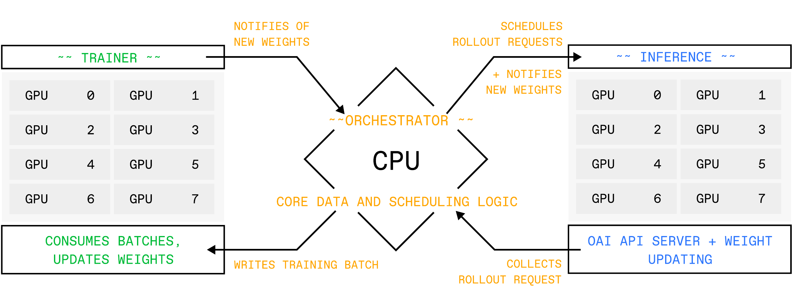

# Architecture Overview

The main use case of PRIME-RL is RL training. Three main abstractions facilitate RL training: the **orchestrator**, the **trainer**, and the **inference** service.

- The [**Orchestrator**](orchestrator.md) is a lightweight CPU process that handles the core data and scheduling logic, serving as an intermediary between the trainer and inference service.
- The [**Trainer**](trainer.md) is responsible for producing an updated policy model given rollouts and advantages.
- The [**Inference**](inference.md) service is a standard OpenAI-compatible server with a vLLM backend for fast rollout generation.

For details on the RL algorithms, see [Pipeline RL](pipeline-rl.md) and [Async RL](async-rl.md).
