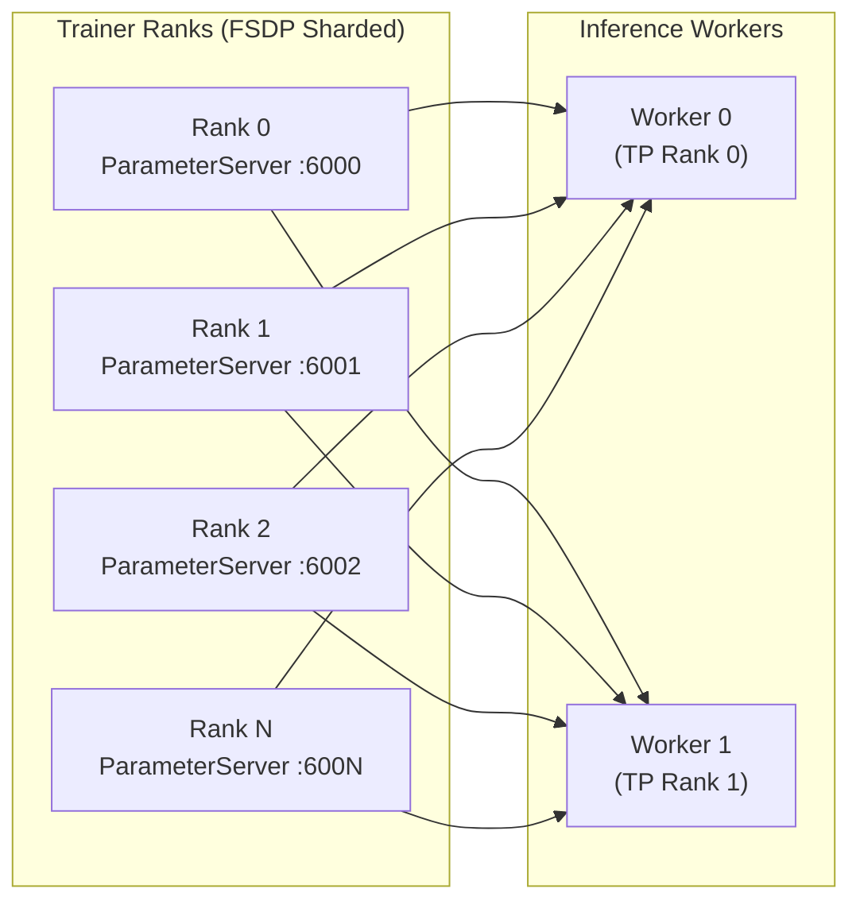
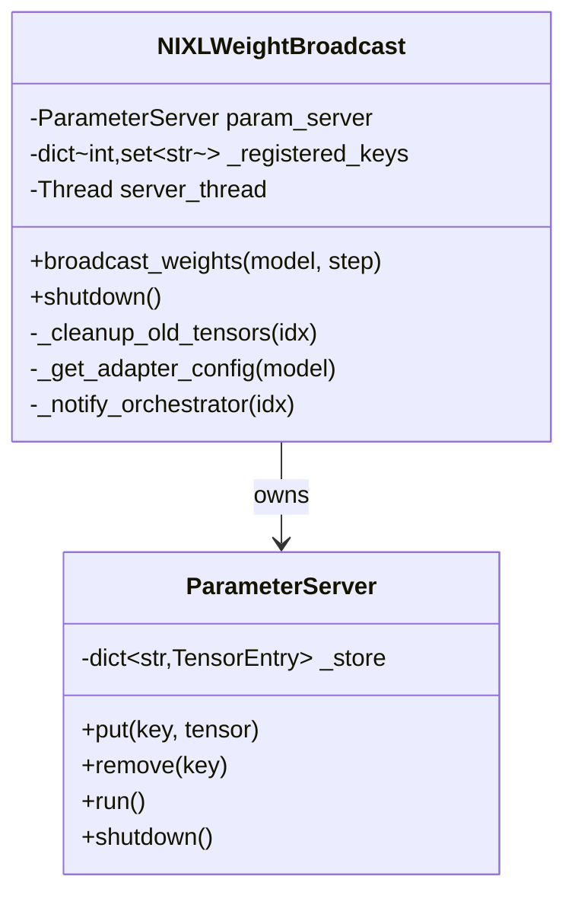
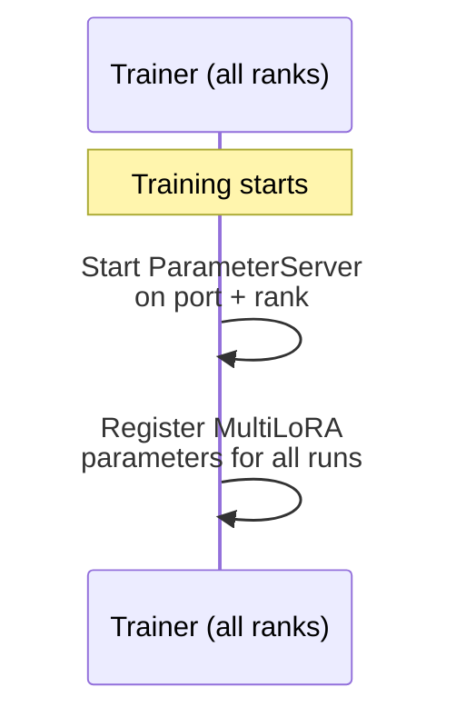
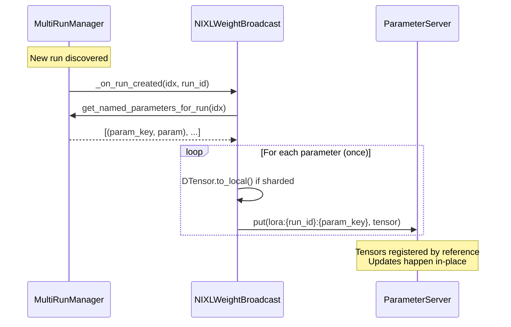
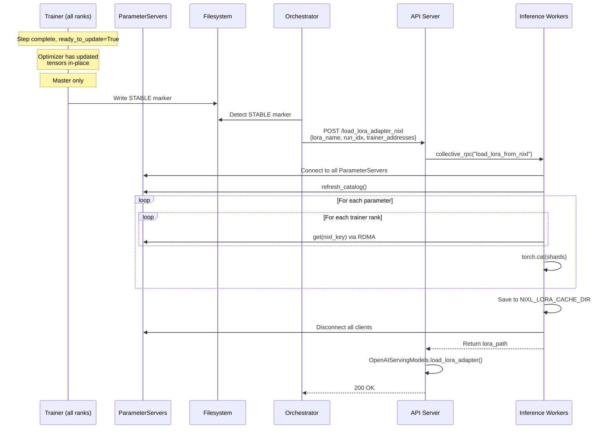

# NIXL Weight Broadcast for LoRA

Internal documentation for the NIXL-based LoRA weight broadcast system.

## Overview

NIXL weight broadcast is an alternative to filesystem-based LoRA weight distribution that uses RDMA (Remote Direct Memory Access) for high-performance tensor transfers. Instead of writing safetensors to a shared filesystem and having inference servers read them, trainer ranks expose weights via NIXL ParameterServers and inference workers fetch them directly via RDMA.

### Motivation

- **Lower latency**: RDMA transfers are faster than NFS reads, especially for large adapters
- **Reduced filesystem pressure**: No safetensors writes/reads on shared storage
- **Direct memory access**: Weights transfer GPU-to-GPU without CPU staging

### When to Use

- LoRA training with FSDP sharding
- High-frequency weight updates where filesystem becomes a bottleneck
- Deployments with RDMA-capable networking (InfiniBand, RoCE)

## Architecture

### Fan-In Topology

Each inference worker connects to ALL trainer ParameterServers to fetch FSDP shards:



### Why Fan-In?

LoRA weights are FSDP-sharded across trainer ranks (not replicated). Each trainer rank holds only a shard of each parameter. To reconstruct full weights for vLLM:

1. **Option A (rejected)**: Gather all shards to master, then broadcast to inference
   - Adds gather overhead on trainer side
   - Master becomes bottleneck

2. **Option B (implemented)**: Each inference worker fetches from all trainers
   - Trainer is passive (just serves data)
   - Parallelizes fetching across inference workers
   - No coordination needed on trainer side

## Component Details

### Trainer Side



**Key files:**
- `src/prime_rl/trainer/rl/broadcast/nixl.py` - NIXLWeightBroadcast class
- `src/prime_rl/transport/nixl/parameter_server.py` - NIXL ParameterServer

**Port allocation:**
```
Rank 0: base_port + 0 = 6000
Rank 1: base_port + 1 = 6001
...
Rank N: base_port + N
```

**Server naming:**
```
Rank 0: {server_name}_0 = "lora_param_server_0"
Rank 1: {server_name}_1 = "lora_param_server_1"
...
```

### Inference Side

```mermaid
classDiagram
    class NIXLLoRAWorker {
        +load_lora_from_nixl(lora_name, run_idx, trainer_addresses, timeout) str
        -_fetch_and_save_weights(lora_name, run_idx, clients) str
    }

    class ParameterClient {
        -nixl_agent agent
        -dict catalog
        +get(key)
        +batch_get(keys)
        +refresh_catalog()
        +disconnect()
    }

    class OpenAIServingModels {
        +load_lora_adapter(request) ErrorResponse|str
    }

    NIXLLoRAWorker ..> ParameterClient : creates temporarily
    Note for NIXLLoRAWorker "Worker fetches weights and returns path.<br/>Server calls OpenAIServingModels.load_lora_adapter()"
```

**Key files:**
- `src/prime_rl/inference/vllm/worker/nixl.py` - NIXLLoRAWorker class
- `src/prime_rl/transport/nixl/parameter_client.py` - NIXL ParameterClient

## Data Flow

### Initialization Sequence



### Run Creation (One-Time Registration)



### Weight Broadcast (Signaling Only)



## Key Naming Convention

Tensors are registered once and updated in-place, so keys do not include step:

```
lora:{run_idx}:{peft_key}
```

Examples:
```
lora:0:base_model.model.layers.0.self_attn.q_proj.lora_A.weight
lora:0:base_model.model.layers.0.self_attn.q_proj.lora_B.weight
```

The current step is stored in the STABLE marker path on the filesystem.

## Adapter Config

The inference worker generates `adapter_config.json` from:
- **lora_alpha**: Provided in the `/load_lora_adapter_nixl` request (from orchestrator's `model.lora.alpha`)
- **r** (rank): Inferred from lora_A tensor shape
- **target_modules**: Extracted from weight keys

## Trainer-Orchestrator Communication

When the trainer signals weight readiness, it writes `nixl_info.json` alongside the STABLE marker:

```json
{
  "run_idx": 0,
  "host": "192.168.1.10",
  "base_port": 6000,
  "world_size": 8
}
```

The inference pool computes trainer addresses as `[(host, base_port + rank) for rank in range(world_size)]`.

## FSDP Shard Reassembly

### How Sharding Works

With FSDP, each rank holds a shard of each parameter. For a LoRA A matrix with shape `[4096, 64]` sharded across 8 ranks:

```
Rank 0: [0:512, :]    -> shape [512, 64]
Rank 1: [512:1024, :] -> shape [512, 64]
...
Rank 7: [3584:4096, :] -> shape [512, 64]
```

### Reassembly Logic

```python
def _reassemble_shards(shards, param_key, shard_meta):
    # If placements indicate sharding
    if shard_meta.get("placements") and "Shard" in shard_meta["placements"]:
        # Find sharded dimension by comparing local vs global shape
        # Default to dim 0 (most common for FSDP)
        return torch.cat(shards, dim=0)
    else:
        # Replicated - all shards identical
        return shards[0]
```

## Configuration

### Trainer Config

```toml
[weight_broadcast]
type = "nixl"
port = 6000  # Base port, each rank uses port + rank
server_name = "lora_param_server"  # Base name, each rank appends _rank
```

### Orchestrator Config

```toml
[weight_broadcast]
type = "nixl"
timeout = 30.0  # Connection timeout in seconds

[model.lora]
name = "my_lora"  # Used as lora_name for inference
alpha = 32.0     # Used as lora_alpha for adapter_config.json
```

### Validation Rules

- `type = "nixl"` requires LoRA to be enabled (`model.lora` must be set)
- Trainer and inference `server_name` must match

## HTTP Endpoints

### `/load_lora_adapter_nixl` (POST)

Fetch LoRA weights via NIXL and load into vLLM. Creates fresh connections, fetches weights, saves to disk, and loads via vLLM's standard LoRA mechanism.

**Flow:**
1. Workers connect to all trainer ParameterServers via NIXL
2. Workers fetch FSDP shards and reassemble full weights
3. Workers save weights to `{NIXL_LORA_CACHE_DIR}/{lora_name}/adapter_model.safetensors`
4. Server calls `OpenAIServingModels.load_lora_adapter()` with the saved path
5. Workers disconnect from ParameterServers

**Request:**
```json
{
    "lora_name": "run_0_step_1000",
    "run_idx": 0,
    "trainer_addresses": [
        ["192.168.1.10", 6000],
        ["192.168.1.10", 6001],
        ["192.168.1.11", 6000],
        ["192.168.1.11", 6001]
    ],
    "lora_alpha": 32.0,
    "timeout": 30.0
}
```

**Response:**
```json
{"status": "ok"}
```

**Environment Variables:**
- `NIXL_LORA_CACHE_DIR`: Directory for cached LoRA adapters (default: `/tmp/nixl_lora_cache`)

## Client Helpers

Located in `src/prime_rl/utils/client.py`:

The `InferencePool.update_weights()` signature is unchanged - it handles both filesystem and NIXL modes internally based on the config passed at construction:

```python
async def update_weights(self, weight_dir: Path | None, lora_name: str | None = None, step: int = 0) -> None:
    """Update weights on all inference servers."""
```

The `StaticInferencePool` is configured at construction with the broadcast config:

```python
StaticInferencePool(
    clients=...,
    admin_clients=...,
    weight_broadcast_config=config.weight_broadcast,  # NIXLWeightBroadcastConfig or FileSystemWeightBroadcastConfig
    lora_alpha=32.0,
)
```

For NIXL mode, the pool reads `nixl_info.json` from `weight_dir` and computes trainer addresses internally.

## File Layout

```
src/prime_rl/
├── trainer/rl/
│   ├── config.py                    # NIXLWeightBroadcastConfig
│   └── broadcast/
│       ├── __init__.py              # setup_weight_broadcast()
│       ├── base.py                  # WeightBroadcast ABC
│       ├── filesystem.py            # FileSystemWeightBroadcast
│       ├── nccl.py                  # NCCLWeightBroadcast
│       └── nixl.py                  # NIXLWeightBroadcast  [NEW]
├── inference/
│   ├── config.py                    # WeightBroadcastConfig with nixl
│   └── vllm/
│       ├── server.py                # /init_nixl_client, /load_lora_adapter_nixl
│       └── worker/
│           ├── filesystem.py
│           ├── nccl.py
│           └── nixl.py              # NIXLLoRAWorker  [NEW]
├── transport/nixl/
│   ├── parameter_server.py          # ParameterServer (existing)
│   └── parameter_client.py          # ParameterClient (existing)
└── utils/
    └── client.py                    # init_nixl_clients(), load_lora_adapter_nixl()
```

## Debugging

### Check ParameterServer Status

On trainer node:
```python
# In NIXLWeightBroadcast instance
print(f"Server name: {self.server_name}")
print(f"Port: {self.port}")
print(f"Registered keys: {self.param_server.keys()}")
```

### Check Client Connections

On inference node:
```python
# In NIXLLoRAWorker instance
for i, client in enumerate(self.nixl_clients):
    print(f"Client {i}: {client.server_name} at {client.server_ip}:{client.server_port}")
    print(f"  Catalog keys: {len(client.keys())}")
```

### Common Issues

1. **Connection timeout**: Check that trainer ParameterServers are running and ports are accessible
2. **Key not found**: Ensure `run_id` and `step` match what trainer broadcast
3. **Shard reassembly mismatch**: Check that all trainer ranks have same world_size in metadata
4. **LoRA loading fails**: Verify adapter_config has correct `target_modules`

### Logs to Watch

Trainer:
```
INFO - ParameterServer 'lora_param_server_0' initialized on port 6000
INFO - Registered tensor 'lora:run_0:1000:...' with shape (512, 64)
```

Inference:
```
INFO - Connecting to trainer rank 0: server=lora_param_server_0 at 192.168.1.10:6000
INFO - Connected to 8 trainer ParameterServers
INFO - Loading LoRA adapter 'run_0_step_1000' from NIXL (run_id=run_0, step=1000)
INFO - Fetching 128 LoRA parameters from 8 trainer ranks
INFO - Successfully loaded LoRA adapter 'run_0_step_1000' from NIXL
```

## Future Improvements

1. **Parallel shard fetching**: Currently fetches sequentially; could parallelize across trainer ranks
2. **Incremental updates**: Only transfer changed parameters instead of full state dict
3. **Direct GPU loading**: Skip tempdir/safetensors and load directly into vLLM model
4. **Connection pooling**: Reuse NIXL connections across multiple load operations
