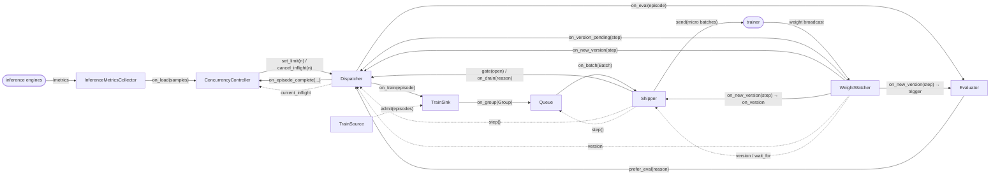

# Orchestrator

The orchestrator process is a set of components under `src/prime_rl/orchestrator/`.
Each one lives in one file, takes its settings as plain constructor arguments, and
talks to its neighbours only through hooks bound with `bind(...)`. The TOML schema stays
the user's contract: a component's settings can change without a config change. The
`Orchestrator` builds them in `setup()`, connects every edge in `wire()`, and `start()`
runs their tasks until the pipeline drains. It has no loop and no pipeline logic of its
own, so every component constructs alone and replays in a unit test
(`tests/unit/orchestrator`, with fakes in `fakes.py`).

## Data

Three types flow through the pipeline (`types.py`):

- **`vf.Episode`** is the only thing the `Dispatcher` emits. Every dispatched attempt
  becomes exactly one episode: the one the environment returned, or one the dispatcher
  synthesizes (no traces, `ok = False`, one error) for a request that failed or an
  attempt the pipeline cancelled. A cancelled attempt carries an error of type
  `Cancelled` whose message is the reason (`stale`, `overload`, `superseded`); the
  queue stamps the same error on queued episodes it voids. Provenance is on the episode
  itself: `env.name`, `group.id`, and `run.work` with the dispatch step and policy span.
- **`Group`** is one task's rollouts, complete: exactly the episodes the dispatcher owed
  for it. The `TrainSink` builds it (score, curriculum admission, compile) and fills
  `samples`, the trainer payload by trace id, for the traces that train. `admitted` is
  the curriculum's verdict. `Group.split(n)` lets a cut land exactly on `batch_size`
  traces; the remainder stays queued.
- **`Batch`** (train) is a step plus every group that finished since the last cut,
  whether it ships or not; **`Epoch`** (eval) is an env, a step, and its groups.

`metrics.Episodes(groups)` is the one view over them. Each of `clean`, `sampled`,
`admitted`, `by_env()` and `by_agent()` returns another `Episodes` narrowed by a
predicate, so a caller composes the subset it means — `Episodes(batch.groups).sampled`
is what trained, `.clean` is an eval epoch's effective set — and reads stats or
`train_metrics()` / `eval_metrics()` off it. Nothing tracks selection state in sets: it
is derived from `Group.admitted`, `Group.samples` and the episodes' errors.

## Components

Inbound is what others call on a component. Outbound is what it calls through hooks.
A hook is a plain callable; a provider is a hook that returns state (`step()`,
`version()`) so no component holds a reference to another's fields.

| Component | File | Settings | Inbound | Outbound hooks |
|---|---|---|---|---|
| `Dispatcher` | `dispatcher.py` | `dispatch_per_minute`, `max_off_policy_steps`; the admission burst window, fraction and floor are constants in the file | `start`, `stop`, `set_limit(n)`, `cancel_inflight(n)`, `gate(open)`, `switch_mode(mode)`, `on_version_pending(step)`, `on_new_version(step)`, `drain_train(reason)`, `cancel_eval_step(step)` | `step()`, `version()`, `on_train(episode)`, `on_eval(episode)`, `on_episode_complete(env, kind, tokens, seconds)`, `monitors` |
| `ConcurrencyController` | `concurrency.py` | `ConcurrencyConfig` (`[orchestrator.concurrency]`) | `record_episode(...)`, `observe(samples)` | `set_limit(n)`, `get_inflight()`, `on_overload(excess)` |
| `InferenceMetricsCollector` | `inference_metrics.py` | `collect_inference_metrics`, `inference_metrics_roles` (orchestrator only; evals always log) | `probe`, `start`, `stop` | `on_load(samples)`, `monitors` |
| `TrainSink` | `train_sink.py` | none | `ingest(episode)` | `on_group(Group)`, `admit(episodes) -> bool` |
| `Queue` | `queue.py` | `batch_size`, `max_off_policy_steps` | `put(group)` | `step()`, `on_batch(Batch)` |
| `Shipper` | `shipper.py` | the orchestrator config: it builds its own `BatchPacker`, batch sender, `CheckpointManager` and heartbeat, and loads the resume checkpoint | `on_batch(Batch)`, `on_version(step)`, `save_final()`, `close()` | `version()`, `wait_for_version(v, reason)`, `gate(open)`, `on_drain(reason)`, `monitors` |
| `Evaluator` | `evaluator.py` | `max_steps`, `eval.retrigger_on_resume`, the resume step, `upload_epochs` | `trigger(step)`, `ingest(episode)`, `restore(episode)` | `prefer_eval(reason)`, `monitors` |
| `TrainSource` / `EvalSource` | `train_source.py`, `eval_source.py` | env configs | `next_task(step)`, `on_result(group)`, `trigger(step)`, `state_dict()` | none |
| `WeightWatcher` | `watcher.py` | none | `sync_startup(step, timeout)`, `apply(step)`, `wait_for(v)`, `start`, `stop`, `version` | `on_version_pending[]`, `on_new_version[]` |
| `PeriodicLogger` | `periodic_logger.py` | `log.interval` | `register(status=, gauges=)`, `start`, `stop` | `monitors` |
| `LiveStream` | `live.py` | none | `dispatched(meta)`, `delta(meta, delta)`, `retired(meta)`, `flush()` | `monitors` (owned by the `Dispatcher`) |

Providers the components expose for others to bind: `Shipper.step()` (the batch being
collected), `WeightWatcher.version` (the policy inference serves),
`Dispatcher.current_inflight`. Every component with a view of the pipeline also offers
`status()` (a console fragment) and `gauges()` (a metrics dict) for the `PeriodicLogger`.

## Wiring

`Orchestrator.wire()` binds every edge. Solid arrows carry data or commands, dashed
arrows are providers the target reads (`step()`, `version()`, `current_inflight`).

The `PeriodicLogger` is not on the graph: it only reads. Every component registers a
`status()` and/or `gauges()` provider with it, and it writes one line and one metrics
row per tick.

Two rules keep the graph honest. State crosses a boundary only through a provider
(`step`, `version`): nothing writes another component's fields. And a component never
imports another component's class except to type a constructor argument (`TrainSink`
takes the envs, `Shipper` takes the train source).

## Lifecycle

**Setup order** (`Orchestrator.setup`): tokenizer, inference clients, monitors, run
identity, env managers, resume step, env servers, train source, the shipper (with its
packer, batch sender and checkpoint load), inference readiness, frozen generation
sources and algorithms, weight receiver, then every other component, `wire()`, the
first metrics probe, and finally the startup rendezvous
`watcher.sync_startup(v0 or v{resume_step})`. Everything that needs closing registers
on one `AsyncExitStack` as it comes up, so a setup that fails halfway tears down exactly
what it built, newest first.

**Start condition.** `start()` spawns the `Dispatcher` and `WeightWatcher` tasks, the
`PeriodicLogger` and the event-loop lag monitor once `sync_startup` has returned, so
inference serves the incoming policy before the first rollout is dispatched. The
`ConcurrencyController` starts from its derived or configured cap; the `Shipper`
starts the step clock.

**Steady state.** The `Dispatcher` fills permits and delivers episodes; the
`TrainSink` finishes groups; the `Queue` sweeps and cuts; the `Shipper` ships batch
`step` once inference serves `v{step - 1 - max_off_policy_steps}` and closes the
dispatch gate while the lead is larger than `max_off_policy_steps`; the
`WeightWatcher` applies each broadcast and fans out the new version. One knob bounds
staleness end to end: the dispatcher cancels in-flight groups past it, the queue voids
queued ones, and the gate keeps the orchestrator from running further ahead of the
trainer than it.

**Stop conditions**, in `Orchestrator.run()`:

- The `Shipper` sets `draining` after shipping step `max_steps`, or when a resumed
  step is already past it. It calls `Dispatcher.drain_train`, which stops train
  scheduling and cancels in-flight train episodes; triggered eval epochs complete.
- The orchestrator then waits for `Dispatcher.is_idle`: nothing in flight, no eval
  work queued or mid-schedule, every episode delivered.
- After the drain it waits for inference to serve `v{max_steps}`, so the trainer's last
  broadcast finds its receiver, then tears down: metrics collector, periodic logger,
  monitors finalize, the shipper's final checkpoint, and the exit stack under
  `SHUTDOWN_TIMEOUT_S`.
- A component task that exits or raises before the drain ends the run with that
  error. A signal cancels `run()` and takes the forced-cleanup path: no monitor
  finalize, but the final checkpoint still saves.
- Without `max_steps` the run has no stop condition of its own and ends on a signal.

## Eval runner

`uv run eval` and the SFT online eval reuse the same components with the train side
absent: `Dispatcher(train_envs=None)`, `ConcurrencyController` without `on_overload`
(eval episodes are never cancelled on load), `InferenceMetricsCollector`, `Evaluator`
with `upload_epochs=True`, and a `PeriodicLogger`. `EvalRunner.run_epoch` triggers
the evaluator and waits on its `changed` event until no fired env is pending. The
online eval adds a `WeightWatcher` and applies each broadcast with `watcher.apply`.
