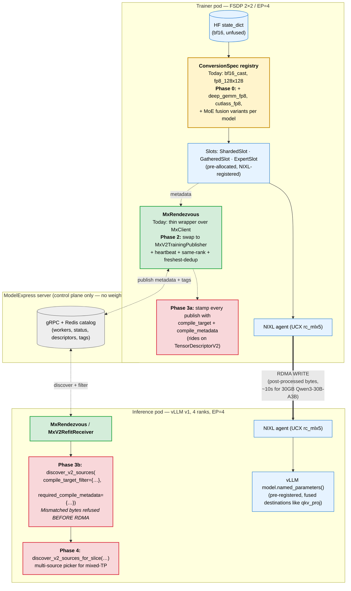

# prime-rl × ModelExpress — Status of the post-#2389 work and how it addresses the MoE / kernel / quant pain points

> **Related docs in this directory**:
> - [`post-pr2389-kernel-compile-plan.md`](./post-pr2389-kernel-compile-plan.md) — the full RFC with phase-by-phase design rationale
> - [`build-notes-2026-05-28.md`](./build-notes-2026-05-28.md) — image-build experience, cluster observations, vLLM native RL APIs reframing
>
> This doc is the executive summary: where prime-rl × MX stands today, what the failure classes are, and where in the follow-up plan each one gets resolved.

**Scope**: status of the ModelExpress + NIXL weight-refit integration in prime-rl, the three classes of failure observed on MoE models (kernel-target mismatches, fused-vs-unfused gates across kernels, quantization + packing mismatches), and the four-phase follow-up plan that resolves them.

**TL;DR**: [PR #2389](https://github.com/PrimeIntellect-ai/prime-rl/pull/2389) lands the first cut of MX-driven NIXL refit in prime-rl and runs at ~10s/cycle on GB200. The three failure classes reduce to one root cause — prime-rl's weight-conversion registry has only two entries, and there is no `compile_target` tag on published bytes that distinguishes DeepGemm vs Cutlass vs other layouts. Two follow-up PRs are in flight that fix this without changing prime-rl's transfer architecture, plus a ~80-LOC-per-kernel extension that can land independently of either PR.

---

## 1. Current state

### 1.1 PR #2389 — what it does

[PR #2389](https://github.com/PrimeIntellect-ai/prime-rl/pull/2389) adds a third weight-broadcast type to prime-rl: `weight_broadcast.type = "nixl_mx"`. The data flow per refit cycle is:

1. **Trainer side** — for each step's state-dict tensor, run a *trainer-side conversion* (today: `bf16_cast` or `fp8_128x128`) that produces the destination layout vLLM expects, with fusion (e.g. `q_proj/k_proj/v_proj → qkv_proj`) and quant already applied. Land the bytes into pre-allocated NIXL-registered buffers (`ShardedSlot` / `GatheredSlot` / `ExpertSlot`).
2. **Rendezvous** — register with ModelExpress (MX) so the inference side knows where to pull from. Lightweight — just metadata; the bytes never go through MX.
3. **NIXL RDMA push** — trainer writes directly into the inference workers' pre-registered parameter buffers over RDMA. Sub-second for a 30 GB model on GB200 cross-node.
4. **Inference side** — vLLM workers receive a `/update_weights` HTTP from the orchestrator, synchronize, and resume serving.

### 1.2 Validation status

Validation has run on a GB200 cluster:

| Component | State |
|---|---|
| Workload | Qwen3-30B-A3B-Instruct-2507, FSDP 2×2, EP=4, 32/128 experts per rank, FLASHINFER attention |
| Image | `nvcr.io/nvidian/dynamo-dev/prime-rl-mx-on-nixl:v0.5.2` |
| Steady-state refit | ~10 s/cycle, reward=1.0000, off-policy=0 |
| Errors | Zero NIXL errors (no `REMOTE_DISCONNECT`, no `NOT_ALLOWED`, no stale-READY) |
| Tested cycles | 4/4 clean, plus 1 trainer restart cycle (clean exit on `max_steps`, k8s respawned, resumed cleanly) |

PR #2389 is a real working baseline — not a prototype that falls over on first push.

### 1.3 Two GB200-specific runtime patches folded in

Two issues on the multi-NIC fabric required patches to the trainer's NIXL setup:

- **Same-rank-only peer filter** — on GCP GB200 the four RDMA NICs (`rdma-0..3`) are separate L3 subnets, so trainer rank N can only safely peer with inference rank N. Cross-subnet pairs fail.
- **Freshest-per-rank dedup** — when MX has multiple entries at the same `worker_rank` (e.g. after a pod restart), the freshest entry by `updated_at` must be picked, not the first one. Otherwise the inference side picks a stale entry and the NIXL `add_remote_agent` call refuses with `NIXL_ERR_NOT_ALLOWED`.

Both are applied today as a runtime monkey-patch in the configmap (`patch_nixl_mx.py`). The [Phase 2 draft PR](https://github.com/KavinKrishnan/prime-rl/pull/1) bakes them into the rendezvous class so they are no longer runtime shims.

### 1.4 What PR #2389 does not yet do (where the failure classes live)

Two specific gaps map directly to the observed failure classes:

| Gap | Failure class |
|---|---|
| The conversion registry (`prime_rl/trainer/models/conversions/__init__.py`) has exactly **two entries**: `bf16_cast` and `fp8_128x128`. Anything else raises `NotImplementedError` at startup. | Quantization and packing mismatches — if the target inference engine wants DeepGemm K-major scale interleaving, Cutlass FP8, MXFP4, a non-128 block size, etc., prime-rl cannot produce those bytes at all. |
| There is no `compile_target` tag on published tensors. Receivers cannot tell whether the bytes were compiled for DeepGemm, Cutlass, or anything else. | MoE-specific corruption + fused-vs-unfused-gate mismatches — when trainer and receiver disagree on the layout, the result is silent byte misinterpretation instead of a clean error. The receiver loads the wrong layout and rollouts are corrupted, often without an obvious crash. |

These are the same root cause expressed three ways: *prime-rl currently assumes the trainer and inference side agree on one layout, baked in at config time, with no runtime check*. Heterogeneous fleets or kernel-target disagreements break it silently.

---

## 2. The follow-up effort

The follow-up work is captured in the [post-#2389 RFC](https://github.com/KavinKrishnan/prime-rl/blob/kavink/post-2389-kernel-compile-plan/docs/proposals/post-pr2389-kernel-compile-plan.md). It has four phases and a clear strategic direction.

### Strategic direction

The design stays on the **trainer-side post-processed transfer** model: the trainer compiles weights into the destination kernel's exact layout, RDMA-writes them straight into the inference worker's pre-registered parameter buffers, and the inference side does no compute on receipt. This is what prime-rl does today; the `ConversionSpec` / `ShardedSlot` / `ExpertSlot` / `GatheredSlot` structure is the right shape.

The design does *not* move to a scratch-buffer + `model.load_weights()` pattern. The internal NemoRL + Dynamo integration prototype uses that pattern as a workaround for a vLLM-specific quirk (`stacked_params_mapping` does HF→fused name remapping at load time, so the trainer can publish HF-raw names and the receiver figures it out). It works, but it adds receive-side compute (~50-200 ms per refit on FP8 casts) and is not needed for prime-rl, which already does fusion + quant trainer-side and writes directly into pre-allocated fused buffers.

### Four phases

| Phase | What | Where | Status |
|---|---|---|---|
| **Phase 2** | Bake the two GB200 runtime patches into `MxRendezvous` permanently; add a `HeartbeatThread` so crashed workers don't leave stale READY entries; swap the in-tree rendezvous over to the published v2 ModelExpress client. | [`KavinKrishnan/prime-rl#1`](https://github.com/KavinKrishnan/prime-rl/pull/1) | Draft PR open, 11/11 unit tests green |
| **Phase 3a** | Add `compile_target` and `compile_metadata` fields to ModelExpress's `TensorDescriptorV2`. Trainer stamps every publish with what layout it produced — `deep_gemm_fp8`, `cutlass_fp8`, `block_size=128`, `gate_fusion=gate_up_swiglu`, etc. | [`ai-dynamo/modelexpress#349`](https://github.com/ai-dynamo/modelexpress/pull/349) | Draft PR open, 6/6 unit tests green |
| **Phase 3b** | Receivers filter sources by `compile_target` + `compile_metadata` *before* RDMA. Mismatched bytes are refused at discovery; no more silent corruption. | Same PR | 4/4 unit tests green |
| **Phase 4** | Multi-source slice picker for the mixed-TP case (e.g. trainer TP=4 publishing to inference TP=8). Each receiver discovers which subset of publisher ranks covers its slice. | Same PR | 8/8 unit tests green |
| **Phase 0 (parallel)** | prime-rl-only: extend the conversion registry from two entries to N. **No MX dependency. Can land independently of the four phases above.** | Open work (see §4 below) | — |

### How each phase maps to the three failure classes

| Failure class | What fixes it |
|---|---|
| Quantization and packing issues (`NotImplementedError`) | **Phase 0**: extend `prime_rl/trainer/models/conversions/` with the kernel-specific layouts required. ~80 LOC per kernel. |
| MoE expert layout differences across kernels | **Phase 0** (new `ConversionSpec` per (model × kernel)) + **Phase 3a/3b** to surface mismatches as clean errors. |
| Some gates are fused vs not | **Phase 0** (per-(model × kernel) `ConversionSpec` defining `sources` + `cat_dim` differently) + **Phase 3a/3b** so the trainer's `compile_metadata.gate_fusion` tag travels and is filtered on. |

In all three cases, **Phase 0 is the immediate unblock** — Phase 3 is the safety net that prevents silent corruption when there is a mismatch.

---

## 3. The architecture, with what's new highlighted



Legend: 🟦 today's PR #2389 surface, 🟨 Phase 0 (immediate unblock), 🟩 Phase 2, 🟥 Phase 3 / 4.

The data plane (RDMA write of post-processed bytes from trainer NIC to inference NIC) stays exactly as it is today. Everything new lives in the **metadata plane** (what gets stamped on the publish) and the **registry** (what conversions are available trainer-side).

---

## 4. Phase 0 — extending the conversion registry

This is independent of both PRs in flight. The conversion registry is plug-in:

```
prime_rl/trainer/models/conversions/
├── __init__.py              # registry, select_default_conversion()
├── bf16_cast.py             # registered as "bf16_cast"  ← today
└── fp8_blockwise.py         # registered as "fp8_128x128" ← today
```

To add support for a new kernel layout, drop in a new file:

```python
# prime_rl/trainer/models/conversions/deep_gemm_fp8.py
from prime_rl.trainer.models.conversions import register

def _convert(src, dst, scale):
    # src: bf16 HF-format tensor
    # dst: pre-allocated FP8 destination buffer (kernel's expected layout)
    # scale: paired scale buffer if requires_scale=True
    ...

register("deep_gemm_fp8", _convert, requires_scale=True)
```

The default-conversion picker in `__init__.py:select_default_conversion` reads the inference model's `config.json` and chooses based on `quantization_config`. Today it knows two cases; extend the if/elif chain for new ones.

**For MoE specifically — the gate-fusion choice lives in the `ConversionSpec` definitions per model.** Example pattern in `prime_rl/trainer/models/qwen3_moe/converting_qwen3_moe.py`:

```python
ConversionSpec(
    dst="mlp.experts.gate_up_proj.weight",    # fused destination
    sources=("mlp.experts.gate_proj.weight",  # source 1
             "mlp.experts.up_proj.weight"),   # source 2
    cat_dim=0,                                # concat along dim 0
)
```

For an unfused-gate kernel target, a parallel set of `ConversionSpec`s would emit `gate_proj` and `up_proj` separately. The framework supports multiple `ConversionSpec` sets via the `Conversion` selector in `MaybeQuantize`.

Total scope per kernel target: ~80 LOC for the conversion function + per-model `ConversionSpec` additions for the required models.

Once Phase 3a lands in MX and Phase 2 lands in prime-rl, every publish automatically carries the `compile_target` tag (e.g. `"deep_gemm_fp8"`) and `compile_metadata` (e.g. `{"block_size": 128, "scale_layout": "K-major", "gate_fusion": "unfused"}`), and any inference worker expecting a different layout refuses the source cleanly at discovery instead of corrupting rollouts.

---

## 5. Information required to write the missing conversion entries

Two inputs are required per kernel target before the missing conversion entries can be written:

1. **Inference engine + quant config target**. Examples: "vLLM 0.7 + DeepGemm grouped-GEMM MoE FP8 block-128", "vLLM 0.7 + Cutlass MoE FP8 with K-major scales", "Triton MoE with unfused gates and BF16". The exact kernel name + scale layout determines the required output format.
2. **Model architectures involved**. Existing conversion specs cover Qwen3, Qwen3-MoE, GLM-MoE-DSA, Nemotron-H, MiniMax-M2, and Laguna. Any model not yet in `prime_rl/trainer/models/` requires an additional ~150 LOC for the model adapter.

---

## 6. References

**Branches and PRs**

- Upstream: [PrimeIntellect-ai/prime-rl#2389](https://github.com/PrimeIntellect-ai/prime-rl/pull/2389)
- Phase 2 draft: [KavinKrishnan/prime-rl#1](https://github.com/KavinKrishnan/prime-rl/pull/1) — `MxRendezvous` heartbeat + dedup + same-rank filter
- Phase 3+4 draft: [ai-dynamo/modelexpress#349](https://github.com/ai-dynamo/modelexpress/pull/349) — `compile_target` + multi-source slice picker
- RFC: [`KavinKrishnan/prime-rl:kavink/post-2389-kernel-compile-plan`](https://github.com/KavinKrishnan/prime-rl/blob/kavink/post-2389-kernel-compile-plan/docs/proposals/post-pr2389-kernel-compile-plan.md) — the full post-#2389 plan
- Build notes: [`KavinKrishnan/prime-rl:kavink/post-2389-kernel-compile-plan/docs/proposals/build-notes-2026-05-28.md`](https://github.com/KavinKrishnan/prime-rl/blob/kavink/post-2389-kernel-compile-plan/docs/proposals/build-notes-2026-05-28.md) — image-build experience, cluster observations, and the vLLM-native-RL-APIs reframing
- Inline review on upstream PR: six inline + one summary, posted at PR HEAD `79ea824d8` — covering cross-subnet `add_remote_agent`, freshest-per-rank dedup, missing heartbeat, hardcoded 1200s timeout, unconditional `update_mla_absorbed_weights`, HSDP barrier ordering

**Code locations in prime-rl**

- Conversion registry: `src/prime_rl/trainer/models/conversions/__init__.py`
- Existing conversions: `src/prime_rl/trainer/models/conversions/{bf16_cast,fp8_blockwise}.py`
- `ConversionSpec` definition: `src/prime_rl/trainer/models/conversion_spec.py`
- Per-model `ConversionSpec` registrations: `src/prime_rl/trainer/models/<model>/converting_<model>.py`
- Slots: `src/prime_rl/trainer/models/slots.py`
- NIXL+MX trainer broadcast: `src/prime_rl/trainer/rl/broadcast/nixl_mx.py`
- NIXL+MX inference worker: `src/prime_rl/inference/vllm/worker/nixl_mx.py`
- Rendezvous: `src/prime_rl/transport/mx_rendezvous.py`
- Transport plan: `src/prime_rl/transport/transport_plan.py`

**Cluster**

- GB200 dev cluster, dedicated namespace
- Image (today): `nvcr.io/nvidian/dynamo-dev/prime-rl-mx-on-nixl:v0.5.2`
- Source-baked Phase 2 + Phase 3 image: `nvcr.io/nvidian/dynamo-dev/prime-rl-mx-on-nixl:v0.7.1-kavin-phase2-phase3`
- ModelExpress server: deployed in the same namespace, Redis-backed
