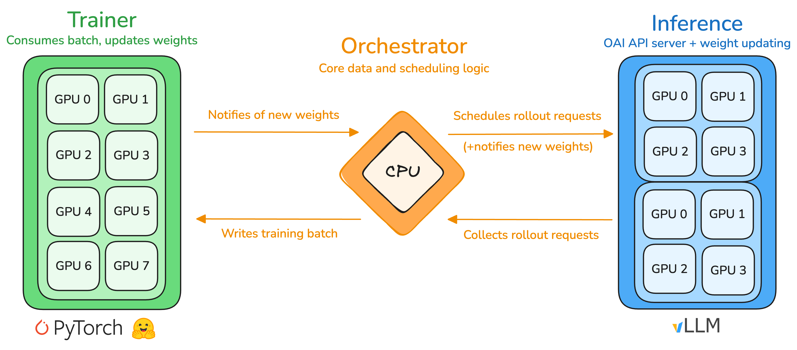

# RL

The main usecase of PRIME-RL is RL training. Three main abstractions facilitate RL training: the **orchestrator**, the **trainer**, and the **inference** service.



We demonstrate how to train in the toy [`reverse-text`](https://app.primeintellect.ai/dashboard/environments/primeintellect/reverse-text) environment. We train a small SFT-warmed up (see [SFT](#sft)) model ([`PrimeIntellect/Qwen3-0.6B-Reverse-Text-SFT`](https://huggingface.co/PrimeIntellect/Qwen3-0.6B-Reverse-Text-SFT)) to learn to reverse a small chunk of text. Training is extremely quick (~5min on 2x4090) because we allow a maximum context of 128 tokens. We use this run for development and in CI.

To check all available configuration options, run `uv run rl --help`.

### Single-Node Training

First, start a pre-layouted `tmux` session to view the logs from all submodules.

```bash
bash scripts/tmux.sh
```

Then, start the training with the `rl` entrypoint 

```bash
# Run this in the `Trainer` pane
uv run rl \
  --trainer @ examples/reverse_text/rl/train.toml \
  --orchestrator @ examples/reverse_text/rl/orch.toml \
  --inference @ examples/reverse_text/rl/infer.toml
```

By default, this command will spin up and tear down the inference server with each invocation. For development purposes it is often useful to start the inference server once and keep it alive across experiments to avoid suffering the vLLM startup time repeatedly.

```bash
# Run this in the `Inference` pane
uv run inference @ examples/reverse_text/rl/infer.toml
```

Then, you can repeatedly restart the trainer and orchestrator in the `Trainer` pane.

```bash
# Run this in the `Trainer` pane
uv run rl \
  --trainer @ examples/reverse_text/rl/train.toml \
  --orchestrator @ examples/reverse_text/rl/orch.toml
```

You can also choose to start each submodule manually. To do so, use the `inference`, `orchestrator` and `trainer` entrypoints.

```bash
# Run this in the `Inference` pane
uv run inference @ examples/reverse_text/rl/infer.toml
```

```bash
# Run this in the `Orchestrator` pane
uv run orchestrator @ examples/reverse_text/rl/orch.toml
```

```bash
# Run this in the `Trainer` pane
uv run trainer @ examples/reverse_text/rl/train.toml
```

### Multi-Node Training

> PRIME-RL is fully compatible with SLURM job scheduling which is convenient for multi-node deployments. We will soon add docs for this.

> We currently require shared file system for multi-node RL training.

To faciliate multi-node RL training, ensure that all nodes have access to a shared file system and that the node that will run the inference server is reachable from the orchestrator via a private or public IP address. Then, set the following environment variables on all nodes:

```bash
# Export this on all nodes
export OUTPUT_DIR=... # Path to directory in shared file system
export INFERENCE_SERVER_IP=... # Reachable IP address of the inference node
export INFERENCE_SERVER_API_KEY=... # API key for the inference server
```

Then, start the inference server on one node.

```bash
uv run inference @ examples/reverse_text/rl/infer.toml --api-key $INFERENCE_SERVER_API_KEY
```

And finally, start the trainer and orchestrator on the remaining nodes.

```bash
uv run rl \
  --trainer @ examples/reverse_text/rl/train.toml \
  --orchestrator @ examples/reverse_text/rl/orch.toml \
  --orchestrator.client.base-url http://$INFERENCE_SERVER_IP:8000/v1 \
  --orchestrator.client.api-key-var INFERENCE_SERVER_API_KEY \
  --output-dir $OUTPUT_DIR
```

**Multi-Node Trainer**

We rely on `torch.distributed` for multi-node trainer deployments ([docs](https://docs.pytorch.org/docs/stable/elastic/run.html)).

The `torchrun` entrypoint can be used in multi-node distributed training. It will set up the correct number processes on each node and set up inter-node communication. 

For this to work, you need to decide which node will be the master node. On this node, find the private IP with `ip a | grep 10.` or `ip a | grep 192.`.

Then, on each node run 

```bash
export RDZV_ENDPOINT=10.15.42.1:1234
```

*Replace `10.15.42.1` with the private IP address of your master node and `1234` with any open port on the master node.*

Then,  to start the training a training across two full nodes, run the following commands

```bash
# Node 0
uv run  torchrun \
    --nnodes=2 \
    --nproc_per_node 8 \
    --node-rank 0 \
    --rdzv_endpoint=$RDZV_ENDPOINT \
    src/prime_rl/trainer/rl/train.py
```

```bash
# Node 1
uv run  torchrun \
    --nnodes=2 \
    --nproc_per_node 8 \
    --node-rank 1 \
    --rdzv_endpoint=$RDZV_ENDPOINT \
    src/prime_rl/trainer/rl/train.py
```

**Multi-Node Inference**

We rely on vLLM's internal load balancing for data parallel deployment ([docs](https://docs.vllm.ai/en/v0.10.0/serving/data_parallel_deployment.html)).

First, ensure that your nodes are in the same private network and can reach each other. If not, a simple solution is to set up a VPN using [Tailscale](https://tailscale.com). Follow their documentation to setup a VPN on each node. Then, configure the GLOO and NCCL network interface

```bash
export GLOO_SOCKET_IFNAME=eth0
export NCCL_SOCKET_IFNAME=eth0
```

*For example, if you have colocated nodes this is often an Ethernet interface `eth0`. If you use Tailscale VPN, it typically installs a new network interface `tailscale0`.*

Choose one of your nodes to be the head node. On this node, find the private IP with `ip a | grep 10.` or `ip a | grep 192.`

```bash
export DATA_PARALLEL_ADDRESS=10.15.42.1
```

*Replace `10.15.42.1` with the private IP address of your head node.*

Then, to run TP=4 and DP=4 with DP ranks 0 and 1 on the head node and DP ranks 2 and 3 on the second node

```bash
# Node 0  (With IP <reachable-ip>)
uv run inference \
	--data-parallel-size 4 \
	--tensor-parallel-size 4 \
	--data-parallel-size-local 2 \
	--data-parallel-address $DATA_PARALLEL_ADDRESS \
	--data-parallel-rpc-port 13345
```

```bash
# Node 1
uv run inference \
	--data-parallel-size 4 \
	--tensor-parallel-size 4 \
	--data-parallel-size-local 2 \
	--data-parallel-address $DATA_PARALLEL_ADDRESS \
	--data-parallel-rpc-port 13345 \
	--data-parallel-start-rank 2 \
	--headless
```

*We have found that restarting the server might require cleaning the RPC port with `fuser -k 13345/tcp` used for communication between the head node and the headless engine cores.*