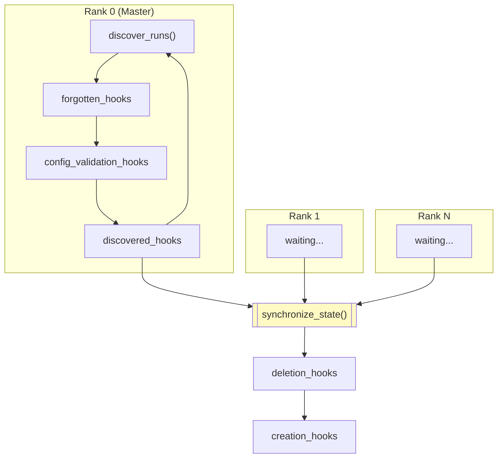

# LoRA & Multi-Adapter Training

## MultiRunManager

The `MultiRunManager` object is a global singleton that manages the parameters and components for multiple concurrent training runs within a single trainer process. This allows multiple orchestrator deployments to share the same trainer.

When `max_concurrent_runs > 1`, the trainer can train multiple runs in parallel. Each run:

- Has its own LoRA adapter parameters
- Has its own optimizer and scheduler
- Saves its own checkpoints
- Tracks its own training progress (step, tokens, samples)
- Loads its own orchestrator configuration

## Run Discovery

Runs are discovered by scanning the output directory for the pattern `run_*`. Each run must contain a valid orchestrator config at `{run_dir}/control/orch.toml` before they are added to the active runs. When the maximum number of runs is reached, new `run_*` directories will not be picked up until old ones are deleted.

```
{output_dir}/
├── run_abc123/
│   ├── control/
│   │   ├── orch.toml
│   │   ├── config_validation_error.txt
│   │   └── evicted.txt
│   ├── checkpoints/
│   │   └── step_100/
│   ├── rollouts/
│   │   └── step_100/
│   └── broadcast/
│       └── step_100/
├── run_def456/
│   └── ...
└── ...
```

## Run Eviction

The master proc on the trainer can evict a run using the `evict_run(idx: int, reason: str)` method. This is useful when the trainer detects an issue with a run that requires it to be stopped.

On the trainer side, the next `discover_runs()` call will filter out the evicted run. On the orchestrator side, the orchestrator checks for `evicted.txt` at the start of each iteration and raises a `RuntimeError` with the eviction reason.

## LoRA Module Registration

LoRA modules register themselves with `MultiRunManager` for parameter management:

```python
multi_run_manager.get_named_parameters_for_run(idx)
multi_run_manager.get_state_dict_for_run(idx)
multi_run_manager.reset_run_parameters(idx)
```

## Hooks

The `MultiRunManager` supports several types of hooks for different lifecycle events. Deletion hooks are always called before creation hooks.


