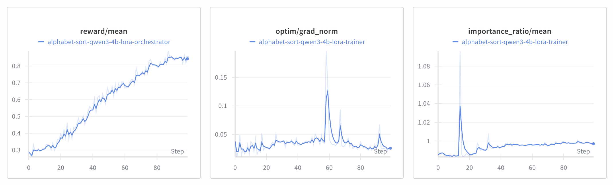

# Alphabet Sort

In this example, we demonstrate how to train `Qwen3-4B-Instruct-2507` to sort names alphabetically using LoRA. Unlike other examples, this task doesn't require SFT warmup as the base model already understands the conversation format. We proceed directly to multi-turn RL against the [`kalomaze/alphabet-sort`](https://app.primeintellect.ai/dashboard/environments/kalomaze/alphabet-sort) environment.

> The commands in this example were designed to be run on 2 GPUs (one trainer and one inference GPU). It is possible to run on less or more GPUs using different deployment strategies. If you run on a different setup, you may need to adjust the start commands.

## Setup

Install the environment:
```bash
prime env install kalomaze/alphabet-sort
```

Verify installation:
```bash
uv run python -c "import alphabet_sort"
```

Start the tmux session:
```bash
bash scripts/tmux.sh
```

## Task

This multi-turn conversation task requires the model to:
- Sort names alphabetically by first OR last name (randomly chosen per episode)
- Maintain a cumulative sorted list across exactly 3 turns
- Tag new names with `// new name!` marker
- Handle 1-4 names per turn

We use non-default settings to increase difficulty: 3 fixed turns (instead of 1-3) and up to 4 names per turn (instead of 1-5). The `similarity_power=8` setting scales rewards as similarity^8, heavily penalizing even small errors.

## Baseline Evaluation

Start the inference server:
```bash
# In the `Inference` pane
uv run inference --model.name Qwen/Qwen3-4B-Instruct-2507
```

Evaluate the base model:
```bash
# In the `Trainer` pane
uv run vf-eval alphabet-sort \
  -m Qwen/Qwen3-4B-Instruct-2507 \
  -b http://localhost:8000/v1 \
  -n 20 \
  --max-tokens 768 \
  --env-args '{"min_turns": 3, "max_turns": 3, "min_names_per_turn": 1, "max_names_per_turn": 4, "similarity_power": 8, "power_per_turn": false}'
```

We got an **average reward of ~0.26** across 20×3 rollouts, with a **perfect score rate of ~15%**. The model shows high variance and struggles on most examples, with the high similarity power (8) heavily penalizing even small errors.

## RL

We train with LoRA (rank 32, alpha 64) for 100 steps at batch size 512 (64×8 rollouts) with context length 2048. By default, LoRA weights are merged into the base model at each checkpoint.


*Check out the logs on [W&B](https://wandb.ai/primeintellect/alphabet-sort-lora/groups/alphabet-sort-extended-4b/workspace?nw=nwuserandrewpi).*
```bash
# In the `Trainer` pane
uv run rl \
  --trainer @ examples/alphabet_sort/rl/train.toml \
  --orchestrator @ examples/alphabet_sort/rl/orch.toml \
  --inference @ examples/alphabet_sort/rl/infer.toml \
  --model.name Qwen/Qwen3-4B-Instruct-2507 \
  --wandb.project ... \
  --wandb.name ...
```

This will write a weight checkpoint in `outputs/weights/step_100`.

## Evals

Serve the trained model:
```bash
# In the `Inference` pane
uv run inference --model.name <path_to_checkpoint>
```

Evaluate:
```bash
# In the `Trainer` pane
uv run vf-eval alphabet-sort \
  -m <model_name> \
  -b http://localhost:8000/v1 \
  -n 20 \
  --max-tokens 768 \
  --env-args '{"min_turns": 3, "max_turns": 3, "min_names_per_turn": 1, "max_names_per_turn": 4, "similarity_power": 8, "power_per_turn": false}'
```

Way better! Our model now gets an **average reward of ~0.96** with a **perfect score rate of ~88%**.