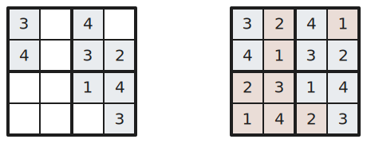
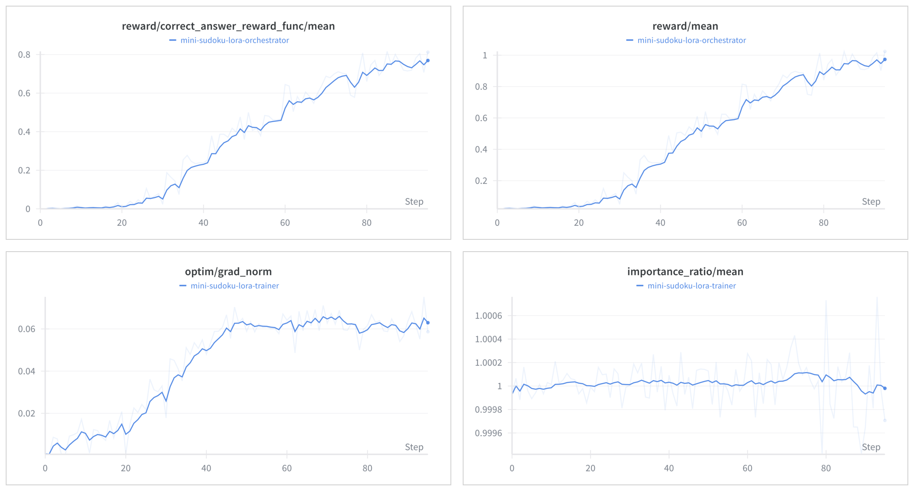

# Mini Sudoku

In this example, we train [`Qwen3-0.6B`](https://huggingface.co/Qwen/Qwen3-0.6B) using LoRA and reinforcement learning to solve mini-sudoku puzzles using the single-turn [`metavind/mini-sudoku`](https://app.primeintellect.ai/dashboard/environments/metavind/mini-sudoku) environment. Unlike standard sudoku, mini-sudoku uses a 4x4 grid with 2x2 blocks and numbers 1-4.

<p align="center">
  
</p>

> This example runs on a single H100 GPU with `micro_batch_size=8`.

## Task

The model must solve mini-sudoku puzzles such that each row, each column, and each of the four 2x2 blocks contains all numbers 1-4 exactly once. We limit the total tokens to `1536` and use `medium` difficulty samples from the environment, which contain 5-8 empty cells. This config requires logical reasoning without being trivially easy or extremely difficult to solve for a model with a small number of parameters like `Qwen3-0.6B`.

<table>
  <tr>
    <th>Input Format</th>
    <th>Expected Answer</th>
  </tr>
  <tr>
    <td><pre>3 _ 4 _
4 _ 3 2
_ _ 1 4
_ _ _ 3</pre></td>
    <td><pre>3 2 4 1
4 1 3 2
2 3 1 4
1 4 2 3
</pre></td>
  </tr>
</table>

## Setup

Install the environment using `prime`:

```bash
prime env install metavind/mini-sudoku
```

Verify your installation by trying to import the environment:

```bash
uv run python -c "import mini_sudoku"
```

Start the `tmux` session which provides a pre-configured layout where we will run all experiments:

```bash
bash scripts/tmux.sh
```

## Baseline Evaluation

Before training, we want to get a baseline score and test how well `Qwen3-0.6B` does out-of-the-box in the `mini-sudoku` environment so that we can quantify our training effect. To do so, first start a local inference server to serve `Qwen3-0.6B`:

```bash
# Run this in the `Inference` pane
uv run inference --model.name Qwen/Qwen3-0.6B
```

Then, use the `vf-eval` entrypoint to evaluate the model in the `mini-sudoku` environment. We evaluate on all 96 test examples with 4 rollouts each:

```bash
# Run this in the `Trainer` pane
uv run vf-eval mini-sudoku \
  -m Qwen/Qwen3-0.6B \
  -b http://localhost:8000/v1 \
  -n 96 \
  --max-tokens 1536
```

We focus primarily on the `correct_answer_reward_function` which is equal to `1` when the model responds with the correct answer. The base model has an average of **0.031** which means it can only solve **3%** of the puzzles. We notice that the model has an inefficient reasoning process and as a result is often unable to figure out the answer due to the limit on tokens. Just to get a better baseline, we double the `max-tokens` to `3072`, and get **24.7%** correct answers.

## RL

We train with LoRA (rank 16, alpha 32) for 96 steps. The training uses a batch size of 256, micro batch size of 8 for single GPU training, and 16 rollouts per example at a sequence length of 1536 tokens.



```bash
# Run this in the `Trainer` pane
uv run rl \
  --trainer @ examples/mini_sudoku/rl/train.toml \
  --orchestrator @ examples/mini_sudoku/rl/orch.toml \
  --inference @ examples/mini_sudoku/rl/infer.toml \
  --model.name Qwen/Qwen3-0.6B \
  --wandb.project ... \
  --wandb.name ...
```

This will write a weight checkpoint in `outputs/weights/step_96`. Upload it to HF to be able to use it as the final model for evaluation:

```bash
uv run hf upload <user>/Qwen3-0.6B-MiniSudoku-RL outputs/weights/step_96
```

We have uploaded the final model as [metavind/Qwen3-0.6B-MiniSudoku-RL](https://huggingface.co/metavind/Qwen3-0.6B-MiniSudoku-RL).

## Evals

Let's see how our final RL checkpoint performs on the evaluation set:

```bash
# Run this in the `Inference` pane
uv run inference --model.name metavind/Qwen3-0.6B-MiniSudoku-RL
```

```bash
# Run this in the `Trainer` pane
uv run vf-eval mini-sudoku -m metavind/Qwen3-0.6B-MiniSudoku-RL -b http://localhost:8000/v1 -n 96 --max-tokens 1536
```

Way better! We get an average correct answer reward of **0.844** which is an **84.4%** solve rate.

After RL training, our model solves the puzzles with an 84% success rate, demonstrating strong improvement in efficient, logical reasoning compared to the baseline. Here is an example response:

```
<think>
Okay, let's see. I need to solve this 4x4 Sudoku puzzle. The given numbers in the rows and columns are:

Row 1: 4 1 _ 2  
Row 2: 2 3 _ _  
Row 3: _ 2 1 4  
Row 4: _ _ _ _

First, I should check each row, column, and 2x2 block to find where the missing numbers go.

Starting with Row 1: 4 1 _ 2. The existing numbers here are 4, 1, 2. Missing numbers are 3. So the blank in position 3 must be 3. So Row1 becomes 4 1 3 2.

Now Row2: 2 3 _ _. Existing numbers are 2,3. Missing are 1 and 4. Let's look at column 3. Column 3 currently has row1:3, row2: ?, row3:1, row4: ?. So existing numbers in column3 are 3,1. Missing are 2 and 4. But row2 column3 can be 4 or 2. But row2 column3's value must be 4 because row2's missing are 1 and 4. So column3: row2 must be 4. Therefore, row2 column3 is 4. Now row2 becomes 2 3 4 _.

Now row2: 2 3 4 _. The existing numbers are 2,3,4. Missing is 1. So row2 column4 must be 1. So row2 is 2 3 4 1.

Now row3: _ 2 1 4. Existing numbers are 2,1,4. Missing is 3. So row3 column1 must be 3. So row3 is 3 2 1 4.

Now row4: _ _ _ _. Existing numbers are ?, ?, ?, ?. Let's check column1. Column1 has row1:4, row2:2, row3:3. Missing is 1. So row4 column1 must be 1. So row4: 1 _ _ _. Now, row4's existing numbers are 1. Missing are 2,3,4. Let's check column2. Column2: row1:1, row2:3, row3:2. Missing is 4. So row4 column2 must be 4. Therefore, row4: 1 4 _ _. Now row4's existing numbers are 1,4. Missing are 2,3. Let's check column3. Column3: row1:3, row2:4, row3:1. Missing is 2. So row4 column3 must be 2. Therefore, row4: 1 4 2 _.

Now row4 column4 must be the remaining number. The existing numbers in row4 are 1,4,2. Missing is 3. So row4 column4: 3. So row4 is 1 4 2 3.

Let me check all rows, columns, and blocks.

Row1: 4 1 3 2 correct.

Row2: 2 3 4 1 correct.

Row3: 3 2 1 4 correct.

Row4: 1 4 2 3 correct.

Columns:

Column1: 4,2,3,1 correct.

Column2: 1,3,2,4 correct.

Column3: 3,4,1,2 correct.

Column4: 2,1,4,3 correct.

Blocks:

First block (rows 1-2, columns 1-2): 4,1; 2,3 correct.

Second block (rows 1-2, columns 3-4): 3,2; 4,1 correct.

Third block (rows 3-4, columns 1-2): 3,2; 1,4 correct.

Fourth block (rows 3-4, columns 3-4): 1,4; 2,3 correct.

Yes, all checks out. So the final grid is:

4 1 3 2  
2 3 4 1  
3 2 1 4  
1 4 2 3
</think>

<answer>
4 1 3 2  
2 3 4 1  
3 2 1 4  
1 4 2 3
</answer>
```

The above response shows the model learns to fill cells through reasoning about sudoku constraints. It also validates sudoku rules across all rows, columns and blocks before finalizing its answer, indicating good instruction following ability.
