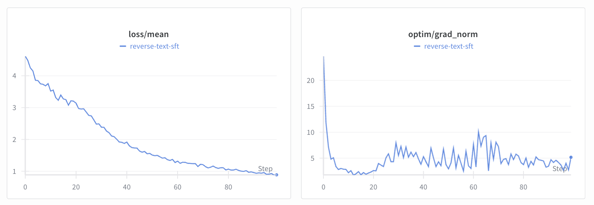
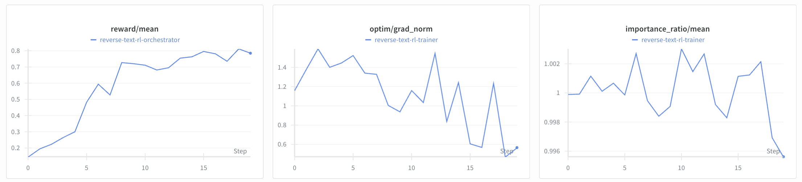

# Reverse Text

We demonstrate how to train the TorchTitan debug MoE checkpoint `Jackmin108/debug-moe-0.5B` to reverse a small chunk of text. We will use a SFT warmup to learn the skill of text reversal on longer documents and then a quick RL run (with routing replay enabled) to reverse smaller chunks of text in the [`reverse-text`](https://app.primeintellect.ai/dashboard/environments/primeintellect/reverse-text) environment. We use a similar setup in our CI at the moment and for development.

> **H100-only:** `Jackmin108/debug-moe-0.5B` ships TorchTitan grouped-GEMM kernels (`torch._grouped_mm`) that require compute capability 9.0. Run the commands below on H100 (or newer) GPUs. If you are on A100s, switch to a dense checkpoint or patch the router implementation yourself to disable grouped GEMMs.

> The commands in this example were designed to be run on 2 GPUs (one trainer and one inference GPU). It is possible to run on less or more GPUs using different deployment strategies. If you run on a different setup, you may need to adjust the start commands.

## Setup

Ensure that the environment is installed (should be included in `pyproject.toml`)

```bash
uv run python -c "import reverse_text"
```

First, let's start a `tmux` session which we will use throughout the experiment.

```bash
bash scripts/tmux.sh
```

Let's check how well `Jackmin108/debug-moe-0.5B` does out-of-the-box on the `reverse-text` environment. 

```bash
# Run this in the `Inference` pane
uv run inference --model.name Jackmin108/debug-moe-0.5B
```

```bash
# Run this in the `Trainer` pane
uv run vf-eval reverse-text -m Jackmin108/debug-moe-0.5B -b http://localhost:8000/v1 -n 20 --max-tokens 1024
```

This is of course just a quick vibe check and no full-fledged evaluation, but we can see that the model struggles with this task. In this specific instance, we got an **average reward of ~0.05** across the 20x3 rollouts with the MoE base as well. Let's do some training!

## SFT

We fine-tune `Jackmin108/debug-moe-0.5B` ([HF](https://huggingface.co/Jackmin108/debug-moe-0.5B)), a TorchTitan mixture-of-experts checkpoint, on `willcb/R1-reverse-wikipedia-paragraphs-v1-1000` ([HF](https://huggingface.co/datasets/willcb/R1-reverse-wikipedia-paragraphs-v1-1000)) which contains 1K examples of reversals of small paragraphs. Because this is an MoE checkpoint we enable routing replay later, keep `trust_remote_code = true`, and run on H100 so the grouped expert kernels are available.


*Screenshot + linked W&B run originate from the earlier Qwen3 example; the overall trajectory should look similar, but expect the absolute numbers to differ with Phi.*

To train on a single H100, run

```bash
# In the `Trainer` pane
uv run sft @ examples/reverse_text/sft/train.toml \
  --wandb.project ... \
  --wandb.name ... \
  --weights
```

The example config already sets `model.moe_use_grouped_mm = true` so TorchTitan uses the grouped GEMM fast path on H100. If you need to debug on unsupported hardware, override at runtime:

```bash
uv run sft @ examples/reverse_text/sft/train.toml --no-model.moe-use-grouped-mm --weights
```

To train on multiple GPUs, run

```bash
# In the `Trainer` pane
uv run torchrun \
  --nproc-per-node ... \
  src/prime_rl/trainer/sft/train.py @ examples/reverse_text/sft/train.toml \
  --wandb.project ... \
  --wandb.name ... \
  --weights
```

This should write a weight checkpoint in `outputs/weights/step_100`. Upload it to HF to be able to use it as the base model for RL. For example, we pushed the debug run in this repo to [`rewardhacker00/Debug-MoE-Reverse-Text-SFT`](https://huggingface.co/rewardhacker00/Debug-MoE-Reverse-Text-SFT) and the RL config references it by default. Swap the repo ID for your own upload if you produce a different warmup checkpoint:

```bash
HF_TOKEN=... uv run huggingface-cli upload <user>/Debug-MoE-Reverse-Text-SFT outputs/weights/step_100 .
```

## RL

For the RL we will only do 20 steps at 8x16 rollouts, for a total batch size of 128 and sequence length 128. Because the base is an MoE, we enable routing replay (configured in `rl/train.toml` and re-asserted on the CLI below) so the trainer can reuse the routing decisions recorded during rollout. Despite the extra bookkeeping, the run still finishes quickly thanks to the short context.


*Same caveat: this screenshot/log is from the original dense-model walkthrough, but it remains a helpful shape reference for debugging.*

```bash
# Run this in the `Trainer` pane
uv run rl \
  --trainer @ examples/reverse_text/rl/train.toml \
  --orchestrator @ examples/reverse_text/rl/orch.toml \
  --inference @ examples/reverse_text/rl/infer.toml \
  --model.name rewardhacker00/Debug-MoE-Reverse-Text-SFT \
  --trainer.use-routing-replay \
  --trainer.recompute-logprobs \
  --wandb.project ... \
  --wandb.name ...
```

This will write a weight checkpoint in `outputs/weights/step_20`. As before, let's upload it to HF.

```bash
uv run hf upload <user>/Debug-MoE-Reverse-Text-RL outputs/weights/step_20
```

We have not published a reference RL checkpoint for this configuration. Expect the RL curves to differ slightly from the screenshots.

## Evals

Let's see how our final RL checkpoints perform on the `reverse-text` environment.

```bash
# Run this in the `Inference` pane
uv run inference --model.name <user>/Debug-MoE-Reverse-Text-RL
```

```bash
# Run this in the `Trainer` pane
uv run vf-eval reverse-text -m <user>/Debug-MoE-Reverse-Text-RL -b http://localhost:8000/v1 -n 20 --max-tokens 1024
```

Way better! In our dry runs with router replay enabled, we observed average rewards in the 0.7–0.8 range; your numbers may vary slightly depending on rollout variance and checkpoint selection.

## Granite 1B Quickstart

Use the Granite 3.0 1B MoE checkpoint for a fast end-to-end smoke test. Adjust `max_steps` inside `examples/reverse_text/sft/granite_train.toml` if you need a longer warmup.

```bash
uv run sft @ examples/reverse_text/sft/granite_train.toml \
  --output-dir outputs/granite_reverse_text_sft \
  --weights
```

Upload the warmup weights to your Hugging Face namespace (replace `<user>` with your handle).

```bash
HF_TOKEN=... uv run huggingface-cli upload <user>/granite-reverse-text-sft outputs/granite_reverse_text_sft/weights/step_5 .
```

Kick off RL with routing replay enabled via the Granite configs.

```bash
uv run rl \
  --trainer @ examples/reverse_text/rl/granite_train.toml \
  --orchestrator @ examples/reverse_text/rl/granite_orch.toml \
  --inference @ examples/reverse_text/rl/granite_infer.toml
```

When training finishes, push the final policy checkpoint.

```bash
HF_TOKEN=... uv run huggingface-cli upload <user>/granite-reverse-text-rl outputs/weights/step_20 .
```

### Disable Routing Replay

If you want to compare against a pure GRPO baseline without routing replay/logprob recompute, switch to the `_no_replay` configs:

```bash
uv run rl \
  --trainer @ examples/reverse_text/rl/granite_train_no_replay.toml \
  --orchestrator @ examples/reverse_text/rl/granite_orch_no_replay.toml \
  --inference @ examples/reverse_text/rl/granite_infer.toml
```

When it finishes, upload the resulting checkpoint (by default `outputs/weights/step_20`).

```bash
HF_TOKEN=... uv run huggingface-cli upload <user>/granite-reverse-text-rl-noreplay outputs/weights/step_20 .
```

