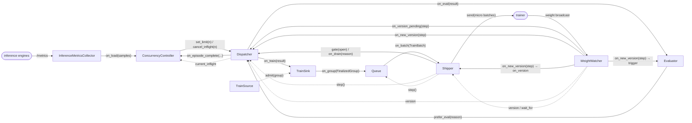

# Orchestrator engine

The orchestrator process is a set of components. Each one lives in one file, takes one
config, and talks to its neighbours only through hooks bound with `bind(...)`. The
`Orchestrator` builds them in `setup()`, connects every edge in `wire()`, and `start()`
runs their tasks until the pipeline drains. It has no loop and no pipeline logic of its
own, so every component constructs alone and replays in a unit test
(`tests/unit/orchestrator`, with fakes in `fakes.py`).

## Components

Inbound is what others call on a component. Outbound is what it calls through hooks.
A hook is a plain callable; a provider is a hook that returns state (`step()`,
`version()`) so no component holds a reference to another's fields.

| Component | File | Config | Inbound | Outbound hooks |
|---|---|---|---|---|
| `Dispatcher` | `dispatcher.py` | `DispatcherConfig` (`[orchestrator.dispatcher]`, `[dispatcher]` in eval) | `start`, `stop`, `set_limit(n)`, `cancel_inflight(n)`, `gate(open)`, `switch_mode(mode)`, `on_version_pending(step)`, `on_new_version(step)`, `drain_train(reason)`, `cancel_eval_step(step)` | `step()`, `version()`, `on_train(result)`, `on_eval(result)`, `on_episode_complete(env, kind, tokens, seconds)`, `monitors` |
| `ConcurrencyController` | `concurrency.py` | `ConcurrencyConfig` (`[orchestrator.concurrency]`) | `record_episode(...)`, `observe(samples)` | `set_limit(n)`, `get_inflight()`, `on_overload(excess)` |
| `InferenceMetricsCollector` | `inference_metrics.py` | `InferenceMetricsConfig` (`[orchestrator.inference_metrics]`) | `probe`, `start`, `stop` | `on_load(samples)`, `monitors` |
| `TrainSink` | `train_sink.py` | none | `ingest(result)` | `on_group(FinalizedGroup)`, `admit(group) -> bool` |
| `Queue` | `queue.py` | `QueueConfig` (derived from `batch_size`, `token_batch_size`, `max_off_policy_steps`, `constant_trainer_batch_size`, `seq_len`) | `put(group)` | `step()`, `on_batch(TrainBatch)` |
| `Shipper` | `shipper.py` | `ShipperConfig` (derived from `max_steps`) | `on_batch(TrainBatch)`, `on_version(step)`, `resume(step, progress)`, `save_final()` | `version()`, `wait_for_version(v, reason)`, `gate(open)`, `on_drain(reason)`, `monitors` |
| `Evaluator` | `evaluator.py` | `EvaluatorConfig` (derived from `max_steps`, `eval.retrigger_on_resume`, the resume step) | `trigger(step)`, `ingest(result)`, `restore(episode)` | `prefer_eval(reason)`, `monitors` |
| `EvalSink` | `eval_sink.py` | none | `ingest(result) -> EvalBatch \| None` | none (owned by the `Evaluator`) |
| `TrainSource` / `EvalSource` | `train_source.py`, `eval_source.py` | env configs | `next_task(step)`, `on_result(group)`, `trigger(step)`, `state_dict()` | none |
| `WeightWatcher` | `watcher.py` | none | `sync_startup(step, timeout)`, `apply(step)`, `wait_for(v)`, `start`, `stop`, `version` | `on_version_pending[]`, `on_new_version[]` |
| `PeriodicLogger` | `periodic_logger.py` | `log.interval` | `register(status=, gauges=)`, `start`, `stop` | `monitors` |
| `CheckpointManager` | `ckpt.py` | `CheckpointConfig` | `save(step, progress, train_source_state)`, `load(step)` | none |

Providers the components expose for others to bind: `Shipper.step()` (the batch being
collected), `WeightWatcher.version` (the policy inference serves),
`Dispatcher.current_inflight`. Every component with a view of the pipeline also offers
`status()` (a console fragment) and `gauges()` (a metrics dict) for the `PeriodicLogger`.

## Wiring

`Orchestrator.wire()` binds every edge. Solid arrows carry data or commands, dashed
arrows are providers the target reads (`step()`, `version()`, `current_inflight`).

The `PeriodicLogger` is not on the graph: it only reads. Every component registers a
`status()` and/or `gauges()` provider with it, and it writes one line and one metrics
row per tick.

Two rules keep the graph honest. State crosses a boundary only through a provider
(`step`, `version`): nothing writes another component's fields. And a component never
imports another component's class except to type a constructor argument (`TrainSink`
takes the envs, `Evaluator` owns its `EvalSink`).

## Lifecycle

**Setup order** (`Orchestrator.setup`): tokenizer, inference clients, monitors, run
identity, env managers, resume step, packer and batch sender, env servers, train source
and checkpoint load, inference readiness, frozen generation sources and algorithms,
weight receiver, then every component, `wire()`, the first metrics probe, and finally
the startup rendezvous `watcher.sync_startup(v0 or v{resume_step})`.

**Start condition.** `start()` spawns the `Dispatcher` and `WeightWatcher` tasks, the
`PeriodicLogger` and the event-loop lag monitor once `sync_startup` has returned, so
inference serves the incoming policy before the first rollout is dispatched. The
`ConcurrencyController` starts from its derived or configured cap; the `Shipper`
starts the step clock.

**Steady state.** The `Dispatcher` fills permits and delivers results; the
`TrainSink` finishes groups; the `Queue` sweeps and cuts; the `Shipper` ships when
inference serves at least `v{step - 1 - TARGET_LAG}` and closes the dispatch gate
while the lead is larger than `TARGET_LAG`; the `WeightWatcher` applies each broadcast
and fans out the new version.

**Stop conditions**, in `Orchestrator.run()`:

- The `Shipper` sets `draining` after shipping step `max_steps`, or when a resumed
  step is already past it. It calls `Dispatcher.drain_train`, which stops train
  scheduling and cancels in-flight train episodes; triggered eval epochs complete.
- The orchestrator then waits for `Dispatcher.is_idle`: nothing in flight, no eval
  work queued or mid-schedule, every result delivered.
- After the drain it waits for inference to serve `v{max_steps}`, so the trainer's last
  broadcast finds its receiver, then tears down: metrics collector, periodic logger,
  monitors finalize, the shipper's final checkpoint, and `stop()` on every component
  under `SHUTDOWN_TIMEOUT_S`.
- A component task that exits or raises before the drain ends the run with that
  error. A signal cancels `run()` and takes the forced-cleanup path: no monitor
  finalize, but the final checkpoint still saves.
- Without `max_steps` the run has no stop condition of its own and ends on a signal.

## Eval runner

`uv run eval` and the SFT online eval reuse the same components with the train side
absent: `Dispatcher(train_envs=None)`, `ConcurrencyController` without `on_overload`
(eval episodes are never cancelled on load), `InferenceMetricsCollector`, `Evaluator`
with `upload_epochs=True`, and a `PeriodicLogger`. `EvalRunner.run_epoch` triggers
the evaluator and waits on its `changed` event until no fired env is pending. The
online eval adds a `WeightWatcher` and applies each broadcast with `watcher.apply`.
